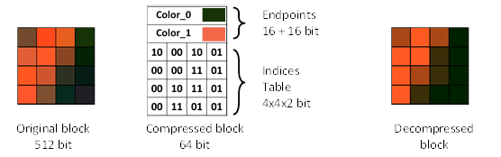

# Shrinking Old Game Texture Sizes by 10%, at ~60GB/s

!!! info "On a single core, and a 4 year old machine..."

!!! info "Without a loss in quality."

Part 1 of `Texture Compression in Nx2.0`.

So I'm in the process of building an [archive format] (👈 WIP) suitable for game modding as part
of the [Reloaded3] project.

I aim for the following primary use cases:

1. **Read Only FileSystem**: Something suitable in a [reloaded redirector] / [usvfs] style project.  
    - Hooking NT / POSIX API calls to trick processes into reading files from another place.  
    - Except we're reading from an archive.  
    - If we load/decompress on all threads, we load data faster, using less disk space.  
2. **File Downloads**: Mods need fast file downloads.  
    - Support streaming/partial download of archive contents.  
    - Minimize file size.  
    - User downloads less, mod site needs less traffic.  
    - Everyone is happy.  
3. **As a game archive format**: Replace old games' native archives with the new format.  
    - Through hooking, we can replace a native archive format with our own.  
    - For size, performance, and just because you can.  
4. **Medium Term Archival**: I want to save some mods on disk for future use.  
    - Basically as a general purpose archive format.  
    - For non-[Reloaded3] software, to archive currently disabled mods to save disk space.  
    - The archive format extracts data so fast, extraction is as fast as your storage drive.  
    - So like 8GiB/s on a modern NVMe.  

The last one, mainly to seek adoption.

Today, we're going to be unraveling one of the tricks to achieve one of these goals;
***faster texture loads and smaller sizes via texture transformation***.

I'll ***speedrun*** you through the basics of the simplest (BC1 / DXT1) transform, and how you can 
write similar transforms to improve compression ratios of known data.

!!! tip "I'll keep it simple, no prior compression theory/experience required."

As an appetizer, quick demo follows below.

<!-- more -->

## A Quick Demo

!!! info "The most popular is BC1 texture format for older games is BC1 (a.k.a. DXT1)."

So to gather a bunch of textures to test with quickly, I needed to find a bunch of mods with
texture files just laying around.

So knowing that Skyrim is a good place to look as mod downloads often just have loose DDSes lying
around, I went on the [Nexus Mods Game Page][nexus-skyrimse] for `Skyrim SE`
and downloaded a bunch of mods, sorting by `Most Downloaded` & `Textures`.

```
.
├── 202x-architecture-10.01
├── 202x-landscape-10.01
├── 3dnpc-loose-latest
├── book-of-silence-se-1.9.1
├── embers-xd-3.0.8
├── glorious-doors-of-skyrim-1.1
├── majestic-mountains-402
├── noble-skyrim-2k
├── ruins-clutter-improved-se-3.2
├── skyland-aio-4.32
└── skyrim-flora-overhaul-with-grass
```

!!! info "Original data contains 1943 files, totalling 6.84GiB."

### Before

If we compress the files as-is; we get the following file sizes:

| Tool      | Size     | Ratio  |
| --------- | -------- | ------ |
| zlib      | 4.77 GiB | 69.77% |
| zstd 22   | 4.23 GiB | 61.91% |
| bzip3 16m | 3.83 GiB | 56.00% |
| kanzi 7   | 3.85 GiB | 56.32% |
| 7z        | 3.83 GiB | 56.05% |

### After

If we apply the lossless transform described below, we get:

| Tool      | Size     | Ratio  |
| --------- | -------- | ------ |
| zlib      | 4.29 GiB | 62.70% |
| zstd 22   | 3.89 GiB | 56.95% |
| bzip3 16m | 3.51 GiB | 51.39% |
| kanzi 7   | 3.53 GiB | 51.67% |
| 7z        | 3.69 GiB | 54.03% |

### Savings

With the following savings:

| Tool  | Savings (GiB) | Savings (%) |
| ----- | ------------- | ----------- |
| zlib  | 0.48          | 10.06       |
| zstd  | 0.34          | 8.04        |
| bzip3 | 0.32          | 8.36        |
| kanzi | 0.32          | 8.31        |
| 7z    | 0.14          | 3.66        |

Other classic formats, BC2 (DXT2/3) and BC3 (DXT4/5) yield very similar savings.

### Speed

!!! info "On a single core of a 5900X, with 3200MHz CL16 RAM."

| Operation     | Implementation  | Speed (GiB/s) |
| ------------- | --------------- | ------------- |
| Transform BC1 | AVX2 (Assembly) | 58.329        |
| Transform BC1 | SSE2 (Assembly) | 56.302        |

| Operation       | Implementation  | Speed (GiB/s) |
| --------------- | --------------- | ------------- |
| Untransform BC1 | AVX2 (Assembly) | 54.211        |
| Untransform BC1 | SSE2 (Assembly) | 47.392        |

## The Technical Details

!!! info "Okay, let's get to the nitty gritty."

First you want to understand the data we're dealing with, so let's have a look at the BC1
block format.

### Anatomy of the BC1 (DXT1) Block

!!! info "This is a very simple format."

<figure markdown="span">
  
  <figcaption>Illustration Borrowed from a <a href ="https://sv-journal.org/2014-1/06/en/index.php?lang=en">Russian Journal</a>.</figcaption>
</figure>

Or, alternatively, in text form:

```
Offset:  0       2       4   4       6       8
         +-------+-------+   +-------+-------+
Data:    |Colour0|Colour1|   | I0-I3 | I4-I8 |
         +-------+-------+   +-------+-------+
```

The format consists of blocks of 16 pixels.
Each block with the size of 8 bytes, consisting of:

- 4 bytes colours (2x RGB565 values)
- 4 bytes of packed indices (16x 2-bit indices)

Each index contains one of the following values:

- 00: Colour0
- 01: Colour1
- 10: `2/3 * Colour0` + `1/3 * Colour1` 
- 11: `1/3 * Colour0` + `2/3 * Colour1`

Basically, it's 2 colours, and we mix them together.

### Understanding Compressors

!!! info "To improve compression ratios, we first need to understand compressors."

Common modern LZ-based compression algorithms like ZStandard, bzip3, kanzi etc. ***generally***
perform the following steps.

!!! note "Actual compression implementations may vary from the below"

    But this should give you the general idea of the basic concepts.

!!! note "Order of these steps may vary from compressor to compressor"

#### Step A: Matching patterns in previous data

!!! tip "Basically: `Copy X bytes from Y bytes ago`"

As bytes, compressed data may look something similar to this:

```
                    Offset (points back 6 bytes)
                    │  ┌  Length (copy 5 bytes)
                    ↓  ↓
[B2 C7 D8 E9 F3 AA 06 05]
 ↑____________↑     
 Copy these 5 bytes
```

After the copy you get:

```
     Existing Data    New Data
     ↓                ↓
[B2 C7 D8 E9 F3 AA] [B2 C7 D8 E9 F3]
```

!!! tip "LZ based compressors have a maximum `offset` and `length` they can match back."

    In this silly example it's 255 bytes, since we used bytes.  
    In more modern compressors, that number will be quite a bit higher than that.

!!! note "This is an oversimplification"

    Modern formats will use more complex encodings as shown, but this gets the idea across.

#### Step B: Replace symbols (bytes) with a smaller number of bits.

!!! info "Sometimes referred to as `entropy coding`, `huffman coding`, `range coding`, `arithmetic coding`, etc."

    Depending on the context and algorithm.

Basically this means replacing each byte with a number of bits based on the probability
of that given byte.

Suppose we have the following sentence: `hello deer`.

| Character | Count | Probability |
| --------- | ----- | ----------- |
| 'e'       | 3     | 0.33        |
| 'l'       | 2     | 0.22        |
| 'd'       | 1     | 0.11        |
| 'h'       | 1     | 0.11        |
| 'o'       | 1     | 0.11        |
| 'r'       | 1     | 0.11        |
| ' '       | 1     | 0.11        |

Normally when writing text, you'd use `1 byte per character` meaning that ***this sentence with 10
characters is 10 bytes***.

However, with entropy coding, you can assign an arbitrary number of bits to each character
based on their probability:

| Character | Count | Probability | Huffman Code (Bits) |
| --------- | ----- | ----------- | ------------------- |
| 'e'       | 3     | 0.33        | 00                  |
| 'l'       | 2     | 0.22        | 01                  |
| 'd'       | 1     | 0.11        | 100                 |
| 'h'       | 1     | 0.11        | 101                 |
| 'o'       | 1     | 0.11        | 110                 |
| 'r'       | 1     | 0.11        | 111                 |
| ' '       | 1     | 0.11        | 010                 |

!!! info "This is an example of a `huffman code`."

The message can then be encoded as `101 00 01 01 110 010 100 00 00 111`, 
which is 23 bits (3 bytes).

#### So how do we make the data more compressible?

!!! tip "It's very simple!"

We:

- [Make the data have more matches](#step-a-matching-patterns-in-previous-data)
- [Make certain symbols more probable](#step-b-replace-symbols-bytes-with-a-smaller-number-of-bits)

Literally the two above.

We need to somehow rearrange the BC1 blocks such that the data is more compressible.

## The Trick (BC1 Transform)

!!! info "Now we're going to put it all together"

<figure markdown="span">
    <video loop autoplay>
        <source src="../../../assets/its-all-coming-together.mp4">
    </video>
    <figcaption>From `The Emperor's New Groove`, © Disney</figcaption>
</figure>

Recall, the [BC1 block](#anatomy-of-the-bc1-dxt1-block) has the following layout:

```
Offset:  0       2       4   4       6       8
         +-------+-------+   +-------+-------+
Data:    |Colour0|Colour1|   | I0-I3 | I4-I8 |
         +-------+-------+   +-------+-------+
```

We can rearrange the blocks into two continuous streams such that it looks like this:

```
+-------+-------+-------+     +-------+  } colours section
|C0  C1 |C2  C3 |C4  C5 | ... |CN CN+1|  } (4 bytes per block: 2x RGB565)
+-------+-------+-------+     +-------+
+-------+-------+-------+     +-------+  } Indices section
| Idx0  | Idx1  | Idx2  | ... | IdxN  |  } (4 bytes per block: 16x 2-bit)
+-------+-------+-------+     +-------+
```

Basically, we grouped all the bytes that belong to the colours together,
and all of the packed indices together.

!!! question "But why does this work?"

    We will refer to the previous sections to answer this.

### How we improved pattern matching.

Recall that compressors [repeat data previously found in the file](#step-a-matching-patterns-in-previous-data) (pattern matching).

!!! tip "By grouping the colours together, we have unlocked potential new opportunities for matching longer patterns"

It's best to illustrate by an example.

Suppose we have an image that looks something like this:

<figure markdown="span">
  { width="300" }
  <figcaption>Just a solid colour</figcaption>
</figure>

Or something similar to this, for example a texture for your player skin with lots of repeating
colours, or a gentle gradient.

When the texture is split up into blocks (going from top left to bottom right), the data may look
something like:

```
byte range   field   bytes        notes

  [0-2]      colour0 0xD4EA       (color: #D74F52)
  [2-4]      colour1 0xD4EA       (color: #D74F52)
  [4-8]      indices 0x7AF31DC4   (random bytes, for illustration)
```

Meaning our data looks like this in memory/file:

```
 [Block 0]                  [Block 1]
 colour 0                   colour 0
 │     colour 1             │      colour 1
 │     │     indices        │      │     indices (different than last)
 ↓     ↓     ↓              ↓      ↓     ↓
[D4 EA D4 EA C4 1D F3 7A]   [D4 EA D4 EA AA BB CC DD]
```

When we're doing the matching of previous bytes in block 1 and beyond, we can only
match 4 bytes at a time, because the repeating `colour` bytes are interrupted by `indices` bytes.

By grouping the colours and indices together, there's a higher chance something like this is more
unlikely.

!!! note "Note: This is a slight oversimplification."

    In most proper encoders, the indices here would be the same in practice, because we're dealing
    with a solid colour in this example.

    However if you consider a more complex texture which has a solid colour with small amounts
    of added details such as:

    - Wood
    - Skin

    And similar, the indices field will vary significantly between blocks.

### How we improved entropy coding.

!!! info "How we [made the data less random](#step-b-replace-symbols-bytes-with-a-smaller-number-of-bits)"

Recall how I just wrote:

> indices field will vary significantly between blocks.

If all we're storing is the same bytes in the new files, just rearranged, how is the data any
`'less random'`?

It's pretty simple. ***When doing `entropy coding`, the compressor will periodically reset the
`entropy table` (i.e. currently assigned 'codes')***. Can happen either due to memory
constraints, adapting to ever changing data, or for any other reason.

<figure markdown="span">
  { width="300" }
  <figcaption>Human Skin Texture <a href="https://www.texturecan.com/details/574/"> [Source]</a></figcaption>
</figure>

Note the following in the texture above:

- The colours are very similar
- But there's a lot of detail when you zoom in

What this means is that the colours in the blocks are going to be very similar, as we're
repeating them continuously over and over again. ***However***, the indices will vary
greatly between each other in order to represent the finite details.

So:

- ✅ Colours (Very not random)
- ❌ Indices (Very random)

When we separate the colours and indices; the colours can be compressed even better,
because the 'noise' from the indices will not pollute the data during `entropy coding`.

### Oversimplified Explanation

!!! info "Separating 🍎 (apples) from 🍊 (oranges) can result in improved compression"

It's very simple. Apples 🍎 are more similar to Apples, Oranges 🍊 are more similar to Oranges.

## Performing the Transform Quickly (with SIMD)

!!! info "I experimented with various implementations"

    To find the fastest way to do this.

Below I'll show the SSE implementation, as it's the simplest of the bunch and can be ran on any
x86_64 processor:

```rust
/// # Safety
///
/// - input_ptr must be valid for reads of len bytes
/// - output_ptr must be valid for writes of len bytes
/// - len is at least divisible by 32
/// - pointers should be properly aligned for SSE operations
#[allow(unused_assignments)]
#[target_feature(enable = "sse2")]
pub unsafe fn shufps_unroll_2(mut input_ptr: *const u8, mut output_ptr: *mut u8, len: usize) {
    debug_assert!(len % 32 == 0);

    let mut indices_ptr = output_ptr.add(len / 2);
    let mut end = input_ptr.add(len);
    asm!(
        // Modern CPUs fetch instructions in 32 byte blocks (or greater), not 16 like the
        // CPUs of older. So we can gain a little here by aligning heavier than Rust would.
        ".p2align 5",
        "2:",

        // Load 2 blocks (32 bytes)
        "movdqu {xmm0}, [{src_ptr}]",
        "movdqu {xmm1}, [{src_ptr} + 16]",
        "add {src_ptr}, 32",   // src += 2 * 16

        // Shuffle to separate colors and indices
        "movaps {xmm2}, {xmm0}", // copy xmm0 as we'll lose it later 
        "shufps {xmm2}, {xmm1}, 0x88", // Group all colors (0b10001000)
        "shufps {xmm0}, {xmm1}, 0xDD", // Group all indices (0b11011101)

        // Store colors and indices
        "movdqu [{colors_ptr}], {xmm2}",
        "add {colors_ptr}, 16",   // colors_ptr += 2 * 8
        "movdqu [{indices_ptr}], {xmm0}",
        "add {indices_ptr}, 16",   // indices_ptr += 2 * 8

        "cmp {src_ptr}, {end}",
        "jb 2b",

        src_ptr = inout(reg) input_ptr,
        colors_ptr = inout(reg) output_ptr,
        indices_ptr = inout(reg) indices_ptr,
        end = inout(reg) end,
        xmm0 = out(xmm_reg) _,
        xmm1 = out(xmm_reg) _,
        xmm2 = out(xmm_reg) _,
        options(nostack)
    );
}
```

We load 4 blocks (32 bytes), two blocks into each register.  
We do a shuffle between the registers to put all colours in one, indices in the other.
And we write to destination.  

Done.

-----

To maximize performance, you would [unroll the loop] (in this case, optimal unroll is `unroll_4`).  
And for AVX2, there's just one extra permute, to move data across 'lanes'.

BC2 and BC3 formats are fairly similar, just a bit more complex since there's bigger blocks
(16 bytes), and more fields; but the ideas are the same. Split the components into separate streams.

## Future Stuff

!!! info "I'm currently working on a BC7 implementation of this."

*BC7 is much more complex* (1), will take some time, and will have its own blog post.
{ .annotate }

1.  BC7 is kind of like `'BC1 on steroids'`

It should hopefully probably take 2-ish weekends of my 'free' time (40-50 hours of code).  
[(Remember: All of this is basically charity work)](../../index.md#the-reality).

When I'm done, it should be be the first ***open source*** lossless BC7 transform (to my awareness).  
The effort is already ongoing, and it's been a roller coaster ride.

Other future posts might cover:

- 'High Compression' Variant of the BC1-BC3 transform.
    - By employing additional tricks that improve ratio further at cost of time.
    - Sacrifice a bit of speed for compression ratio (file downloads).
- Custom texture header (that expands to `.DDS`).
    - To save space, and due to alignment issues with `.DDS`.

------

The current code for the transforms can be found at [dxt-lossless-transform] (GitHub).
It is a heavy work in progress currently, and is not finalized code.

[archive format]: https://sewer56.dev/sewer56-archives-nx/
[Reloaded3]: https://reloaded-project.github.io/Reloaded-III/
[reloaded redirector]: https://reloaded-project.github.io/reloaded.universal.redirector/
[usvfs]: https://github.com/ModOrganizer2/usvfs
[nexus-skyrimse]: https://www.nexusmods.com/skyrimspecialedition/mods/?tags_yes[]=1066&BH=1
[Russian Journal]: https://sv-journal.org/2014-1/06/en/index.php?lang=en
[dxt-lossless-transform]: https://github.com/Sewer56/dxt-lossless-transform
[unroll the loop]: https://en.wikipedia.org/wiki/Loop_unrolling#Simple_manual_example_in_C