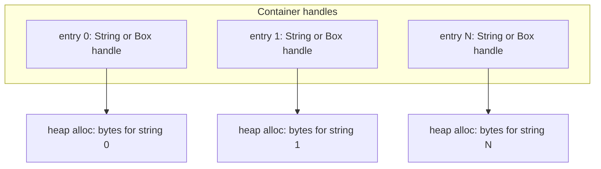
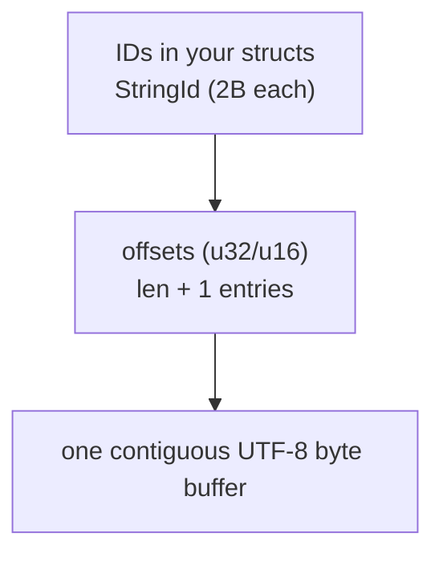

# Sometimes I Need to Keep a Lot of Immutable Strings Around, So I Built lite-strtab

!!! info "This post is about a very specific problem."

    Storing many short, long-lived strings in an immutable (read-only) container.<br/>
    All while keeping memory overhead low and lookup performance practical.

Every once in a while I run into the same problem: I have a lot of strings to keep,
and I want to save a bunch of memory.

Think of stuff like:

- A `catalog` or `database` snapshot you download to see what is available
- Your game's localisation strings
- Static lists of paths, endpoints, or keys

Something you load once, keep around for a while, and query every once in a while.

<!-- more -->

## Motivation

!!! tip "I've been building a lightweight LLM library recently"

    Mostly so I can:

    - Keep all my repositories up to date as I evolve project templates
    - Provide ***basic*** tech support when I am asleep

As you may know, I have solo dev'd 200+ projects (very few are forks).

![Screenshot showing 200+ solo GitHub projects][github-repo-count-200-plus-image]

My more recent ones made in the last 2-3 years share a common layout/template.<br/>
[And even a nice Rust manual!][reloaded-rust-manual]

However, keeping all of these repositories up to date has been difficult; you make
one template change, and now off you go patching 30+ repos. Oof!

Tech support is a similar story; I'm mostly a solo dev, and questions from users
needing help are a daily occurrence, all hours of the day. Unfortunately that
means I can't always respond right away 😔; I may be 💤.

!!! info "I usually aim to respond within 10 minutes."

    If I don't reply immediately, I might forget. Even though it's all unpaid work.

So I've been investing in building some LLM tooling to help me with these aspects.

!!! info "Why existing tools don't work for me"

    OpenCode idles at 300MB of private bytes, and 500MB during usage.
    And that's in server mode ***WITHOUT the TUI***.

    Other non-native tools; almost all built on TS or Python, are similar.<br/>
    Including those built by nearly half a trillion companies (e.g. `claude`).

I'm going for ~1MB instead.

## Where the Strings Come In

I wanted to parse [models.dev/api.json][models-dev-api-json], because I need
knobs like `env` vars and `api` endpoints.
I also want to keep that in memory for broad model/provider support.

That unfortunately includes ***unsized*** string data; and with that caveats arise.
It is best to illustrate by example.

!!! info "Unless stated otherwise, assume 64-bit machine everywhere."

### My Data Structure

I start with a structure-of-arrays layout to save memory on struct padding etc.

It looks approximately like (simplified):

```rust
/// Runtime lookup catalog with split provider and model tables.
#[derive(Debug, Clone)]
pub struct ModelCatalog {
    /// Provider key lookup table.
    provider_table: HashTable<PackedProviderTableEntry>,
    /// Model key lookup table.
    model_table: HashTable<PackedModelTableEntry>,
    /// Indexed by index from provider_table (provider_idx)
    provider_api_urls: Box<[Box<str>]>,
    provider_env_var_pool: Box<[TinyVec<[Box<str>; 1]>]>,
    provider_entries: Box<[PackedProviderEntry]>,
    /// Indexed by index from model_table (model_config_idx)
    model_entries: Box<[PackedModelEntry]>,
    model_config_entries: Option<Box<[PackedModelConfigEntry]>>,
}

/// Packed model-table entry.
#[bitfield(u64)] // 8 byte struct! Amended by macro.
#[derive(Clone, Copy, PartialEq, Eq, Hash)]
pub(crate) struct PackedModelTableEntry {
    #[bits(48)]
    hash48: u64, // 48 bit hash
    model_config_idx: u16,
}

/// Packed provider-table entry.
#[bitfield(u64)] // 8 byte struct! Amended by macro.
#[derive(Clone, Copy, PartialEq, Eq, Hash)]
pub(crate) struct PackedProviderTableEntry {
    #[bits(48)]
    hash48: u64, // 48 bit hash
    provider_idx: u16,
}

/// Packed provider metadata row.
#[derive(Clone, Copy, PartialEq, Eq, Hash)]
pub(crate) struct PackedProviderEntry {
    provider_type: ProviderType, // 8 bits
}
```

### The Problems

I'll go block-by-block.

#### 1. `Box<str>` handle tax

```rust
provider_api_urls: Box<[Box<str>]>,
```

On 64-bit, each `Box<str>` handle is 16 bytes (`ptr + len`).

In this snapshot, `env` name length is median `16` (mean `16.47`), so for example:

```text
"DEEPSEEK_API_KEY" payload: 16 bytes
Box<str> handle: 16 bytes
```

In other words, the handle itself can be as big as the heap allocation.

#### 2. Padding from heap allocations

!!! info "Each regular 'String' is a separate heap allocation."

    And with every allocation there is extra overhead:

    - **Padding/alignment:** a `12`-byte payload may occupy a `16`-byte size-class bucket.
    - **Internal metadata:** allocator bookkeeping adds bytes beyond payload size.

Exact behaviour varies with allocator & platform.

In short, if you allocate short objects, like a 12 byte string; don't be surprised
if a little bit more is actually used due to allocator internals.

#### 3. Heap locality is not guaranteed

Even within a single array like `Box<[Box<str>]>`, each `Box<str>` points to
its own heap allocation, and those allocations are not guaranteed to be adjacent
or in the same region.

```text
# Example 1: unrelated allocation can interleave
api_url("https://...")     -> 48B bucket @ 0x...9000
other allocation           -> 48B bucket @ 0x...9040  # unrelated value inserted in between
doc_url("https://docs...") -> 48B bucket @ 0x...9080
```

```text
# Example 2: very similar env keys can split by size class
env[0]("DEEPSEEK_API_KEY")  # 16 chars -> 16B-class bucket @ 0x...7000
env[1]("DEEPINFRA_API_KEY") # 17 chars -> next size-class bucket @ 0x...b000
```

This hurts cache locality; may require additional paging, etc.

!!! tip "This is also why a 'bump allocator' or 'arena' is not the play here"

#### 4. Small arrays are expensive

```rust
provider_env_var_pool: Box<[TinyVec<[Box<str>; 1]>]>,
```

`api.json` snapshot (`96` providers):

- `87` providers have `1` env key
- `5` providers have `2`
- `4` providers have `3`

So, most providers have a single `env` entry; but because >1 is possible, we need
to support that case too. However, this isn't so trivial.

- `TinyVec<[Box<str>; 1]>` uses 32 bytes per array/slice entry; and sometimes spills to heap (for 2+ keys).
- `TinyVec<[Box<str>; 3]>` uses 56 bytes per array/slice entry; but usually only 1 entry is used.
- `Box<[Box<str>]>` uses 16 bytes per array/slice entry, but also an extra 16 entry for slice info itself on heap.

Now consider the fact that the median/mean env name length is... ***16 bytes***.
***Way more memory is used for the handles than for the data.***

A regular string reference is expensive enough; but with small arrays, doubly so!!

| layout                   | bytes per 1-key row (requested) | total usable bytes (`96` providers, glibc) |
| ------------------------ | ------------------------------: | -----------------------------------------: |
| `TinyVec<[Box<str>; 1]>` |                            `32` |                                    `3,568` |
| `TinyVec<[Box<str>; 3]>` |                            `56` |                                    `5,384` |
| `Box<[Box<str>]>`        |                `32` (`16 + 16`) |                                    `4,056` |

## The Core Idea

!!! note "`lite-strtab` is kind of like a 'string interner', or 'arena allocator', but with slightly different tradeoffs."

    Think of first interning all the strings, and then 'freezing' the table for read-only access. This 'freezing' performs some optimizations.

`lite-strtab` stores all UTF-8 bytes in one contiguous buffer and keeps one
offset table.<br/>
(`len + 1` entries, with a final sentinel).

Lookup is straightforward:

1. Read `offsets[i]` and `offsets[i + 1]`
2. Slice `bytes[start..end]`
3. Return `&str`

No per-string heap allocation, and IDs can be compact (`StringId<u16>` etc.).

```rust
use lite_strtab::StringTableBuilder;

let mut builder = StringTableBuilder::new();
let hello = builder.try_push("hello")?;
let world = builder.try_push("world")?;

let table = builder.build();
assert_eq!(table.get(hello), Some("hello"));
assert_eq!(table.get(world), Some("world"));
# Ok::<(), lite_strtab::Error>(())
```

## Memory Layout Diagrams

### Before: one allocation per string



### After: one byte buffer + compact offsets



```text
offsets: [0, 5, 10]
bytes:   [h e l l o w o r l d]

id 0 -> bytes[0..5]  -> "hello"
id 1 -> bytes[5..10] -> "world"
```

### Handle and offset size comparison

| Setting    | Reference Size | Limits what?          | Practical limit in `lite-strtab`      |
| ---------- | -------------- | --------------------- | ------------------------------------- |
| `String`   | 24 bytes       | N/A                   | Owned, growable string handle         |
| `Box<str>` | 16 bytes       | N/A                   | Owned, immutable string handle        |
| `I = u8`   | 1 byte         | String count          | Up to `256` strings (`0..=255`)       |
| `I = u16`  | 2 bytes        | String count          | Up to `65,536` strings (`0..=65,535`) |
| `I = u32`  | 4 bytes        | String count          | Up to `4,294,967,296` strings         |
| `O = u16`  | 2 bytes        | Total UTF-8 byte size | Up to `65,535` total bytes            |
| `O = u32`  | 4 bytes        | Total UTF-8 byte size | Up to about `4 GiB` total bytes       |

!!! tip "Most common setup: `I = u16` + `O = u32`"

This means 4GiB of UTF-8 data, and 64Ki entries.
So every time you store a reference to a string inside a struct, it uses 2 bytes, instead of 16/24.
This gives you massive memory savings when combined with arrays of strings.

## Improvement with lite-strtab

!!! info "Not final code, current plan."

Start with the new `ModelCatalog` shape:

```rust
/// Simplified layout, focusing on string-bearing fields.
pub struct ModelCatalog {
    provider_table: HashTable<PackedProviderTableEntry>,
    model_table: HashTable<PackedModelTableEntry>,

    // provider_idx is reused as the key
    provider_api_urls: StringTable, // defaults: O = u32 (offset), I = u16 (StringId)

    // env keys are grouped per provider in this table
    provider_env_keys: StringTable,
    provider_env_ranges: Box<[PackedEnvRange]>,

    provider_entries: Box<[PackedProviderEntry]>,
    model_entries: Box<[PackedModelEntry]>,
    model_config_entries: Option<Box<[PackedModelConfigEntry]>>,
}

#[bitfield(u16)] // each range entry is 16 bits (2 bytes)
#[derive(Clone, Copy, PartialEq, Eq, Hash)]
pub struct PackedEnvRange {
    #[bits(14)]
    start: u16, // first env key index in provider_env_keys
    #[bits(2)]
    count: u8, // number of env keys (0..=3)
}
```

This means:

- `provider_idx` -> API URL is direct (`provider_api_urls[provider_idx]`)
- `provider_idx` -> env keys is `provider_env_ranges[provider_idx]` -> `(start, count)` in `provider_env_keys`

### 1. API URL indexing Memory Savings

Before:

```rust
provider_api_urls: Box<[Box<str>]>,
```

After:

```rust
provider_api_urls: StringTable,
```

The existing `provider_idx` (u16) from the hashtable is now the key into the
`StringTable`, so the effective per-entry metadata is 6 bytes (2-byte index + 4-byte offset).

Formula notes:

- `96` = number of providers in this snapshot.
- `16` = one `Box<str>` handle on 64-bit (`ptr + len`).
- `2 + 4` = compact metadata model (`u16` index + `u32` offset).
- Ratio column is `after / before`.

On this snapshot (`96` providers):

| Step                           | Formula        |     Bytes |   Ratio |
| ------------------------------ | -------------- | --------: | ------: |
| Before (`Box<str>` handles)    | `96 * 16`      | `1,536 B` | `1.00x` |
| After (`StringTable` metadata) | `96 * (2 + 4)` |   `576 B` | `0.38x` |
| Saved                          | `1,536 - 576`  |   `960 B` |     `-` |

This table only counts the indexing/reference layer, not UTF-8 payload bytes.

### 2. Environment Variable Memory Savings

Before:

```rust
provider_env_var_pool: Box<[TinyVec<[Box<str>; 1]>]>,
```

After:

```rust
provider_env_ranges: Box<[PackedEnvRange]>,
provider_env_keys: StringTable,
```

The existing `provider_idx` (u16) from the hashtable is now the key into the
`provider_env_ranges`, which gives us offset+length into `StringTable`.

Formula notes:

- `32` = one `TinyVec<[Box<str>; 1]>` row.
- `16` = one `Box<str>` handle on 64-bit.
- `87 / 5 / 4` are the provider counts with `1 / 2 / 3` env keys.
- `X` is allocator overhead from spill allocations (size-class rounding + metadata).
- Ratio values in comparison are `after / before`.

Given `96` providers, `109` total env keys:

Before (`TinyVec`) path breakdown:

| Component                         | Formula             |     Bytes |
| --------------------------------- | ------------------- | --------: |
| Per-provider rows                 | `96 * 32`           | `3,072 B` |
| Spilled handles (2-key providers) | `5 * (2 * 16)`      |   `160 B` |
| Spilled handles (3-key providers) | `4 * (3 * 16)`      |   `192 B` |
| Total requested                   | `3,072 + 160 + 192` | `3,424 B` |
| Allocator overhead from spills    | `+X`                |  `+144 B` |
| Total usable on glibc             | `3,424 + 144`       | `3,568 B` |

After (`PackedEnvRange + StringTable`) breakdown:

| Component                       | Formula           |   Bytes |
| ------------------------------- | ----------------- | ------: |
| Provider ranges                 | `96 * 2`          | `192 B` |
| Per-env-key index+len component | `109 * 2`         | `218 B` |
| Per-env-key offset component    | `109 * 4`         | `436 B` |
| Total requested (`after`)       | `192 + 218 + 436` | `846 B` |

Comparison:

| Layout                                 |     Bytes | Saved vs after |   Ratio |
| -------------------------------------- | --------: | -------------: | ------: |
| Before (`TinyVec`, requested)          | `3,424 B` |      `2,578 B` | `0.25x` |
| Before (`Box<[Box<str>]>`)             | `3,280 B` |      `2,434 B` | `0.26x` |
| After (`PackedEnvRange + StringTable`) |   `846 B` |            `-` | `1.00x` |

### 3. Heap Savings

From benchmark results (`malloc_usable_size`, Linux/glibc):

| Dataset   | `lite-strtab` | `Box<[Box<str>]>` | `Vec<String>` |  Saving |   Ratio |
| --------- | ------------: | ----------------: | ------------: | ------: | ------: |
| `EnvKeys` |     `2,240 B` |         `2,728 B` |     `2,888 B` | `488 B` | `0.82x` |
| `ApiUrls` |     `4,352 B` |         `4,672 B` |     `4,736 B` | `320 B` | `0.93x` |
| **TOTAL** |     `6,592 B` |         `7,400 B` |     `7,624 B` | `808 B` | `0.89x` |

### 4. Combined impact

| Layer (derived from sections)     |     Before |     After |    Saving |   Ratio |
| --------------------------------- | ---------: | --------: | --------: | ------: |
| `1. API URL indexing`             |  `1,536 B` |   `576 B` |   `960 B` | `0.38x` |
| `2. Env indexing` (best baseline) |  `3,424 B` |   `846 B` | `2,578 B` | `0.25x` |
| `3. Heap` (**TOTAL**)             |  `7,400 B` | `6,592 B` |   `808 B` | `0.89x` |
| **TOTAL (1 + 2 + 3)**             | `12,360 B` | `8,014 B` | `4,346 B` | `0.65x` |

You might think. Damn, this person just did all this work just to save 4K...<br/>
***Yes.***

We'll save in other places in the future too 😉, but I might aswell
write the library now, instead of later going to old code and rewrite
it for the library.

## Benchmarks

!!! tip "Full benchmark tables and dataset details ([full README][lite-strtab-readme])"

    This is a short summary of the crate info.

!!! info "Memory numbers are measured with glibc `malloc_usable_size` on Linux."

    This accounts for allocator induced alignment and metadata overhead,
    which is useful for real-world memory accounting.

Datasets used:

- **YakuzaKiwami**: 4,650 relative game paths, 238,109 bytes
- **EnvKeys**: 109 environment variable names, 1,795 bytes
- **ApiUrls**: 90 API URLs, 3,970 bytes

### String reference cost in structs

!!! tip "You can store references to strings very very cheaply!!"

| Dataset      | `StringId<u16>` (`StringTable`) | `Box<str>` fields (`Box<[Box<str>]>`) | `String` fields (`Vec<String>`) |
| ------------ | ------------------------------: | ------------------------------------: | ------------------------------: |
| YakuzaKiwami |                       `9,300 B` |                            `74,400 B` |                     `111,600 B` |
| EnvKeys      |                         `218 B` |                             `1,744 B` |                       `2,616 B` |
| ApiUrls      |                         `180 B` |                             `1,440 B` |                       `2,160 B` |

For 4,650 strings...

**`Box<[Box<str>]>`**:

- **Struct field:** 16 B × 4,650 = 74 KB

**`lite-strtab`**:

- **Struct field:** 2 B × 4,650 = 9 KB

String references in your structs cost **2 bytes instead of 16-24**.

### Heap allocation size

!!! tip "Due to less alignment, we also save some space on the heap"

| Dataset      | `lite-strtab` | `Box<[Box<str>]>` | `Vec<String>` |
| ------------ | ------------: | ----------------: | ------------: |
| YakuzaKiwami |   `256,736 B` |       `272,528 B` |   `272,640 B` |
| EnvKeys      |     `2,240 B` |         `2,728 B` |     `2,888 B` |
| ApiUrls      |     `4,352 B` |         `4,672 B` |     `4,736 B` |

| Dataset      | `lite-strtab` | `Box<[Box<str>]>` | `Vec<String>` |
| ------------ | ------------: | ----------------: | ------------: |
| YakuzaKiwami |          `1x` |           `1.06x` |       `1.06x` |
| EnvKeys      |          `1x` |           `1.22x` |       `1.29x` |
| ApiUrls      |          `1x` |           `1.07x` |       `1.09x` |

A neat side effect to more manual alignment control.

### Read performance (YakuzaKiwami, sequential pass + AHash)

| Access          | Representation              | avg time (us) | avg thrpt (GiB/s) |
| --------------- | --------------------------- | ------------- | ----------------- |
| `get`           | `Vec<String>`               | 13.561        | 16.352            |
| `get`           | `Box<[Box<str>]>`           | 13.002        | 17.056            |
| `get`           | `lite-strtab`               | 13.368        | 16.589            |
| `get`           | `lite-strtab (null-padded)` | 13.714        | 16.171            |
| `get_unchecked` | `Vec<String>`               | 13.448        | 16.490            |
| `get_unchecked` | `Box<[Box<str>]>`           | 12.812        | 17.308            |
| `get_unchecked` | `lite-strtab`               | 13.207        | 16.790            |
| `get_unchecked` | `lite-strtab (null-padded)` | 13.828        | 16.037            |

In practice, this is near parity for a realistic read-and-process workload.

### Assembly-level lookup cost (x86_64, release)

As an extra note. Even though we don't have `ptr+len` handles, deriving them is
not that expensive 😉.

Here's x86_64 instruction counts for getting a `&str`.

| Method                           | Instructions | Access pattern                                              |
| -------------------------------- | ------------ | ----------------------------------------------------------- |
| `lite-strtab::get`               | ~12          | bounds check -> load 2 offsets -> compute range -> add base |
| `lite-strtab::get_unchecked`     | ~7           | load 2 offsets -> compute range -> add base                 |
| `Vec<String>::get`               | ~8           | bounds check -> load ptr from heap -> deref for (ptr, len)  |
| `Vec<String>::get_unchecked`     | ~5           | load ptr from heap -> deref for (ptr, len)                  |
| `Box<[Box<str>]>::get`           | ~7           | bounds check -> load ptr -> deref for (ptr, len)            |
| `Box<[Box<str>]>::get_unchecked` | ~4           | load ptr -> deref for (ptr, len)                            |

!!! note "Extra benchmark notes"

    - Current published benchmarks are sequential access patterns.
    - Random access patterns may behave differently and need dedicated tests.

## Closing

If your workload has lots of long-lived immutable strings, this data structure shape is worth considering.

It is simple, predictable, and does one job well.

The sources and docs are here:

- [Crates.io][lite-strtab-crate]
- [Docs.rs][lite-strtab-docs]
- [GitHub Repository][lite-strtab-repo]

[lite-strtab-crate]: https://crates.io/crates/lite-strtab
[lite-strtab-docs]: https://docs.rs/lite-strtab
[lite-strtab-repo]: https://github.com/Sewer56/lite-strtab
[lite-strtab-readme]: https://github.com/Sewer56/lite-strtab/blob/main/src/lite-strtab/README.MD
[models-dev-api-json]: https://models.dev/api.json
[reloaded-rust-manual]: https://reloaded-project.github.io/reloaded-templates-rust/manual/
[github-repo-count-200-plus-image]: assets/github-repo-count-200-plus.webp
