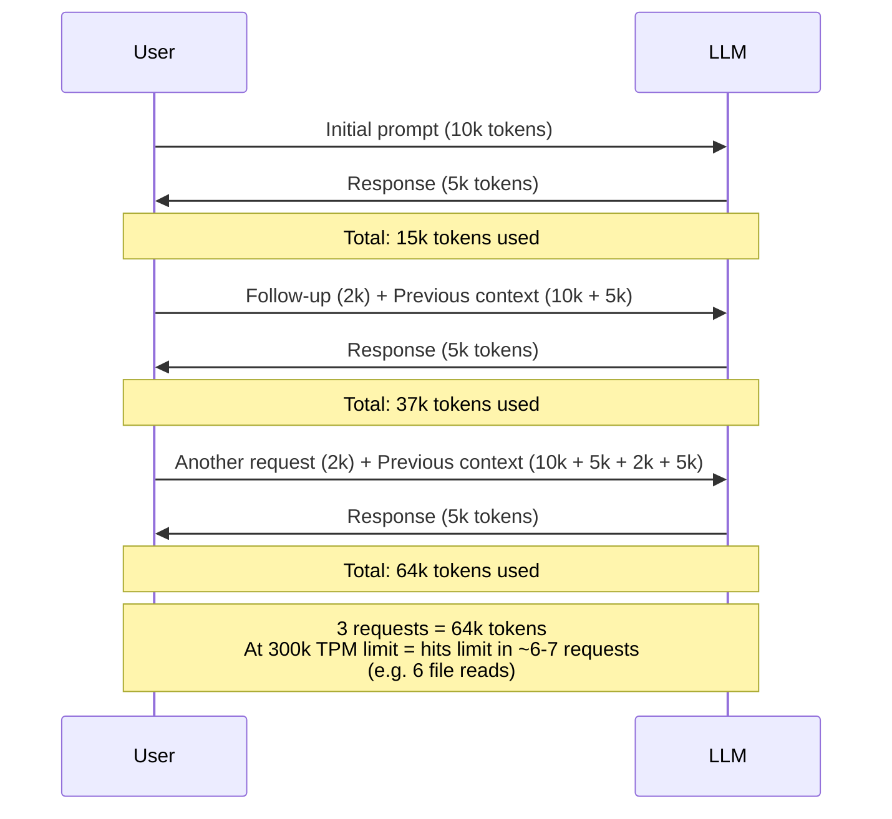
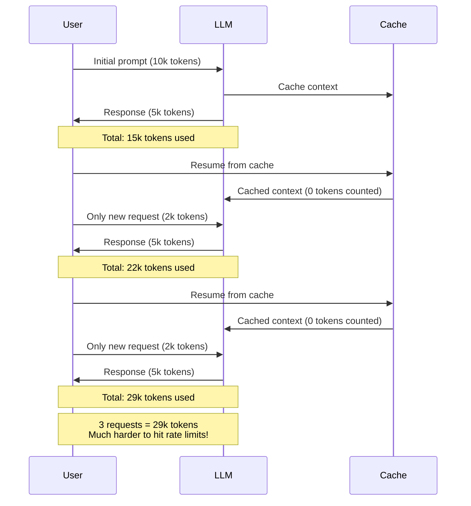

# Batching Tool Calls: Racing Against Cerebras Rate Limits & Too Fast Text Generation

!!! warning "This post talks about LLMs"

    I don't usually talk about AI or LLMs. Too much stigma, too many grifters, too much slop.
    
    Let's be clear: LLMs cannot and should not replace you today - it is a tool (like any other) that can only aid you. The quality of your code is only as good as you are; LLMs lack good 'taste' and thus will produce slop by default. That goes for writing code equally as well as other uses. I say this as someone who has to clean up that slop daily, both mine and PR'd.
    
    It's your responsibility to judge and produce good quality code at the end of the day. That includes ensuring that a dumb silicon-made machine doesn't output crap.
    
    That said, AI can be a powerful tool to speed up work - ***if you know what you're doing.*** 
    This post is about documenting an optimization experiment, that's all.

    [Graph aside (38 lines)](#the-problem), everything was (of course), written by me, Sewer, manually by hand.

Two months ago I ran an experiment to optimize LLM-based coding workflows at extreme speeds.

The findings were originally shared as a Discord post, but I never got around to posting them here. Today, with some free time, I've reformatted it as a more proper blog post with additional context.

<!-- more -->

!!! note "Originally a Discord post from September 11th, 2025"

## Introducing Cerebras

Cerebras is a hardware provider that builds their own 'wafer scale' chips. Think 900,000 cores on a chip, with a die size of 46000mm², using 23000W of power.

Traditionally you'd make many chips on a wafer; say, [72, for a high-end GPU like the 5090](https://www.tomshardware.com/pc-components/gpus/spitballing-nvidias-gb202-gpu-die-manufacturing-costs-die-could-cost-as-little-as-usd290-to-make). Some of these dies will turn out defective, so you'll either dispose them, or (if possible), reuse them for a weaker model, say, a 5080. The bigger the die, the more likely defects will occur, thus cost increases extra.

/// caption
Estimate of a wafer with GB202 RTX 5090s. red = defects. green = functional.
///

Cerebras on the other hand basically makes an entire wafer like that into one giant chip, [using redundancy to work around defects](https://www.cerebras.ai/blog/100x-defect-tolerance-how-cerebras-solved-the-yield-problem).

As a result of these huge chips, Cerebras is the world's fastest host of large language models; and it's not even close, think 8x faster than 2x Nvidia H200s commonly used for hosting LLMs on raw output speed.

!!! note "In actual agentic use/coding scenarios, this is only around ~3x faster in practice"

    Due to other overheads, e.g. tool call latency, network latency, time-to-first-token server side, local processing time, etc.

While Cerebras has historically been a Business-to-Business (B2B) provider tailored to enterprises, they have started offering more personal-focused access to their models via [Cerebras Code](https://www.cerebras.ai/code).

!!! info "The prospect of >1000 tokens/second compared to say, Sonnet 4 at 80 tokens/second was too enticing to not try."

## The Problem

!!! warning "Originally when I tried Cerebras, they had a very silly rate limit of 300,000 tokens per minute."

    ***With no prompt caching***.

Lack of prompt caching meant exhausting the limit quickly. Every single tool call, such as `editing a line of code` or `reading a file`, meant resending all previous `context` (history).

!!! info "Simplified explanation of prompt caching and its impact on rate limits"

    Numbers are arbitrary.

**Without Prompt Caching** - Every request resends all previous context:

**With Prompt Caching** - Resume from cached context:

!!! tip "Many coding tools recommend using Plan mode before using Build mode"

    You first make a detailed plan in Plan mode, then execute it in Build mode.

However, in real usage, by the time you finish planning a low-medium complexity feature you'd be at around 55-70k tokens (and that's without refinements). Once you commit to making the edits, it's just 3-5 edits (even 1-liners) before stalling.

🔥 10-15 seconds of action, ⏳ 50 seconds of waiting.  
🇫

The value proposition was gone - Cerebras was barely faster than Sonnet 4 at 80 tokens/second.

!!! success "This limit has since increased to 1M tokens per minute."

    *Most* of the time you shouldn't hit the rate limit anymore.

Tool calls also mean output stalls. Fewer tool calls = faster generation; even outside of the rate limits. (This is part why Cerebras is only ~3x faster in practice, not 8x.)

## The Experiment

To address this, I experimented with adding new multi-operation tools to [OpenCode](https://opencode.ai/) 
using a new, undocumented (at the time) [plugin feature for custom system tools](https://github.com/sst/opencode/pull/2420). 
The goal was to allow the LLM to batch multiple operations into single tool calls:

- A `MultiRead` system tool (read 1/more files at once)
- A `MultiEdit` system tool. (edit 1/more parts in 1/more files)
- A `MultiWrite` system tool. (write multiple files at once)

!!! abstract "Core Idea: Less Tool Calls == Less Stalls"

Usually in agentic coding, when the user provides a prompt- the LLM will use a lot of tool calls to gather
context required to figure out how to perform the user's request.

It is often true, when observing, that if an LLM will read 1 file, it will likely want to read 2-3
more files that are referenced from the first file.
i.e. `I know I need to edit this file, now I need to look at this file's dependencies` sort of thing.

## Observations

I experimented with both Cerebras Code (i.e. `cerebras/qwen3-coder-480b`), and on `Sonnet 4` from `Anthropic` (as sanity check).

!!! info "Remember, no GLM 4.6, Sonnet 4.5 or Minimax M2 existed at the time"

### Models aren't Keen on using the Multi-Tools out of the box

When available alongside regular `Read`/`Write`/`Edit` stool, the multi versions are very rarely used by LLMs.

!!! note "This is true for both `qwen` on Cerebras and `sonnet` on Anthropic."

This is true *even* when given precise instructions and very strong directives to use them aggressively.

For example: 

- `You MUST use if more than 1 edit is required to a file` and
- `You MUST batch file edits into one and use 'multi-edit' tool`

!!! question "What if I take away the regular `Read`/`Write`/`Edit` tools?"

    I tried giving them only the multi-tools, but most (but not all) of the
    time, the LLM will only read/write 1 file at a time.

### Models are however able to use the tools, if explicitly asked.

Models will use the tools well ***if you explicitly ask them to***.
But there is a *recency bias*, it will only do it if reminded to fairly recently.

!!! note "This is especially true for Qwen 3 Coder 480B which Cerebras used at the time"

    Because it was not always the best at following instructions; unwieldy!

Some Examples are:

- `Before you begin, use "multi-read' tool to read all files present in the user's prompt`.
    - You can add this in a slash command, or similar.

- `Group all needed changes by file and use the 'multi-edit' tool to implement the planned changes`.
    - Useful when switching from `Plan` Mode to `Build/Act` Mode

However, further down the road, the LLMs will unfortunately forget and default 
to only operating on one file at a time...

For instance, if it edits multiple files- and there's more than 1 error, it will
try to solve one error one at a time (rather than batch edit), even if trivial to fix.

## Performance Notes

### Prefetching in Plan Mode

!!! tip "Use PLAN mode directive `Before you begin, use 'multi-read' tool to read all files present in the user's prompt`"

    - ✅ Recommend for non-thinking models including `cerebras/qwen3-coder-480b` on Cerebras.
    - ❌ ***NOT RECOMMENDED*** for some thinking models like `sonnet` (thinking enabled). 

For the latter case of thinking models, normally the model would read a file via tool call, comment
on what it just read in the thinking block and then comment on it in the non-thinking output.
(At least such is the case for Sonnet 4)

The problem I encountered in Sonnet 4 is: When the files are prefetched, the remarks/content
in the `<think>` tags and non-think output is duplicated. Basically, the `<think>`
section will have the answer for the current `TODO` point in the `TODO` tools, and
then put a same or shorter version of that in the non-thinking output.

This leads to more tokens being used in the end, and more time planning, without
a discernable gain.

!!! note "I haven't verified if this is a `sonnet` specific issue"

    This was before GLM4.6, MiniMax M2, and the other cool, real capable open weight models.

Non-thinking `sonnet` does not suffer the regression, but then again, it doesn't benefit much time wise
when output is sub 100 tokens/sec.

!!! success "🔥 During one of the tests, I managed to get a working plan in my benchmark in 30 seconds (*jaw dropping!*)"

    (It usually takes `sonnet` 3:30 - 4 minutes) However, this relies on having a list of related files in your prompt for
    `MultiRead`. In my case, my `/prompt-refiner` command outputs that when I use it to make a concrete,
    well defined set of objectives from vague/incomplete information.

### Grouping Edits after Plan Mode

!!! info "I experimented with a directive `Group all needed changes by file and use the 'multi-edit' tool to implement the planned changes`"

    I would use this when switching from `Plan` mode to `Act/Edit` mode.

***This usually works well*** with limited side effects.
But, the LLM wouldn't always use it.

***I would recommend it*** in a slash command though ***if you are working with Cerebras models*** 
so you don't manually need to switch the model to qwen every time and then type out the instruction.

⚠️ Note: More complex tool calls will increase risk of failed calls.
Based on my experience so far, I'd recommend to limiting it to multiple edits per file in a single
tool call. Alternatively, edits in multiple files but all within a single 'TODO' objective.

I think it's the best tradeoff in error rate vs speed.
Also might allow it to be called more often, as more strict/explicit directives could be used.
Failed tool calls persist in the context, so you don't want to fire too huge diffs in case they fail to apply;
as you know, sometimes models fail even single edits.

📔 Note 2: I would consider this worthwhile only for Cerebras. It's a speed/error tradeoff in cases where
tool call overhead dominates. I'd probably consider something like 500 tokens/second the baseline at which
point you'd want to multiedit.

✅ Note 3: My `PLAN` tool output includes a quick summary of new/modified APIs for each file. That likely helps
the LLM group together changes it needs into multiedits.

## Conclusion

### General Conclusion

Though I found 2 good use cases above, the gains overall ***aren't that great actually.***
(It may be surprising to hear that only now.)

!!! note "For the rest of the month while I still had Cerebras Code, I did use the 2 tricks above though."

    Then I dropped it; due to a combination of factors including pricing/no prompt caching, only 128k context length, etc.

In practice, they probably save ~15s in an otherwise 2 minute session (assuming no throttling). However, at the end of the day; you're still going to have a lot of tool calls:

- Updating the `TODO` list.
- Search/Grep & File Listing.
- Single Edits to Fix Errors.
- Everything else.

### A Hypothesis

As for the LLMs not being able to efficiently use the multi read/write/edit tools without explicit
user prompting; I have a hypothesis.

From my observation; the models generally try to do the following:
- Break up complex problems into smaller objectives
- Try to solve each objective one at a time

(The `TODO` tools which they are trained to use also help them reinforce this.)

The caveat is, ***solving different steps of a bigger problem*** will often
require edits to the same files- sometimes at a very granular level,
e.g. `Add Periodic Refresh`, `Add Public API for Explicit Refresh`.

Because the LLM is trained to sequentially focus at one task at a time, it will
often miss opportunities to solve 2 tasks at once, which is now possible with
`MultiEdit` tool and the like.

It clearly can do it, *if explicitly prompted to*, but would not default to it- even if explicitly
instructed by system prompt.
