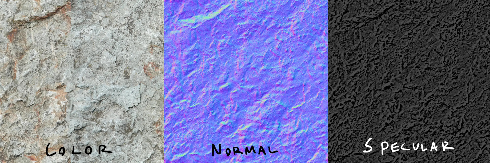

# Estimating Compressibility of Data & BC7

!!! info "Will my transform make data more compressible?"

Part 2 of [Texture Compression in Nx2.0][compression-nx20] series.

In my [previous post in the series], I've demonstrated a recipe for making BC1-BC3 texture data more
compressible, ~10% saving at a blazing ~60GB/s on the single thread.

That transform is usually beneficial, but there will be *rare* cases where it isn't.  

With more complex files, such as files ***with multiple distinct sections***, you may want to apply
transforms on a per section basis. Or even skip individual steps of a transform.

But how do we know if a transform is beneficial or not?

<!-- more -->

!!! note "Note: Rate of future development on personal projects & blog may slow down"

    For the purposes of mental health, and for 'fun' reasons 🤭.

## Why do we need to know if data is compressible?

!!! info "Summary"

    - We may have multiple sections of a file
    - Applying transforms on each section may or may not be beneficial
    - We need to know if it is.

### Recall BC1 Transform

You can imagine the [BC1][bc1-anatomy] format described in the previous part as being something like:

```rust
#[repr(C)]
struct BC1Block {
    colour0: u16,
    colour1: u16,
    indices: u32,
}

// And a 'bc1 file' would be a slice of `BC1Block`(s)
struct BC1File {
    file: &[BC1Block],
}

// Count of blocks determined by (FileSize / sizeof(BC1Block))
```

In the previous post, we've transformed this to:

```rust
#[repr(C)]
struct BC1Colours {
    colour0: u16,
    colour1: u16,
}

#[repr(C)]
struct BC1Indices {
    indices: u32,
}

struct BC1File {
    colours: &[BC1Colours],
    indices: &[BC1Indices],
}
```

We stored colours and indices separately and compression ratio improved.

More complex file formats will consist of multiple arrays and/or structures however.  
So let's have a look at such an example.  

### Example: Multiple Textures in One File

For simplicity, imagine a custom texture file which consists of 3 inner textures.  
For the purposes of this example, we can imagine them as `diffuse` texture, `normal` and
`specular`.

```rust
struct CombinedTextureFile {
    diffuse: &BC1File,  // colour
    normal: &BC1File,   // add surface detail
    specular: &BC1File, // add shine
}
```

<figure markdown="span">
  
  <figcaption>Illustration Borrowed from a <a href ="http://blog.wolfire.com/2009/06/how-to-make-a-seamless-tiling-texture/">Wolfire Games</a> blog.</figcaption>
</figure>

!!! tip "The 3 textures inside will have different compression characteristics!!"

    Although they use the same format (BC1), the colour data within each texture is of different
    nature.
    
    ***It may be better to use a different transform on each embedded texture, or not one at all!!***

Consider the middle one, ***A Normal Map!***(1).
{ .annotate }

1.  A normal map (seen above) is a texture which contains a direction vector for each pixel.  

    The RGB components store the X,Y,Z direction of a vector.  
    This is used for lighting calculations to give the appearance of a 3D surface.  

First of all, normal maps are ***famous for being very blue!!***. This is actually because blue
is used to encode the `Z` axis of the vector; by far the most common direction of light bounce, right back!  

So one of the ways you can improve ratio specific to data like this is to use a ***decorrelated*** colourspace.
(Examples: [YCoCg-R] & [YCrCb]). That is a nice variant of [delta encoding] which can 
in practice lead to better compression of the image data.

!!! info "`decorrelate` basically means subtract the other 2 colour channels from the dominant channel"

    i.e. subtract `blue` (dominant) from `red` and `green` for this example. To reverse, add back.  
    More details on this stuff in next part. ([Cool Graph Here](https://dsp.stackexchange.com/a/44313)) 

***HOWEVER!!!*** some normal maps may contain large runs of the same colour (e.g. flat reflections).
This can ***make the transform unnecessary*** (or even detrimental!), due to unneeded overhead.

***For best result, we need a slightly different transform for each inner file!!!***  
And we need to know which one is the best for each file!!

??? question "Why can the transform be detrimental? (click to expand!!)"

    If a texture (for example) contains a pattern of:  

    - Large run of the same colour.
    - Occasional small amounts of detail

    Then splitting up blocks may hurt compression, or not help at all.  
    This is because you will get shorter [LZ matches] compared to when entire successive blocks are identical.

### How this applies to BC7

!!! info "The BC7 block format has a variation of this problem contained within"

    This is in fact how I encountered it.

At a high level you can consider BC7 to be a format like this:

```rust
struct BC7Block {
    mode: u8, // 1-8 bits of mode, then data bits
    data: [u8; 15], // remaining block bits 
}

struct BC7File {
    file: &[BC7Block], // slice of blocks
}
```

It's a list of blocks, just like BC1, but at 16 bytes per block.  
However, ***unlike BC1***, each block can use a different format, the format of the remainder
of the block is determined by the first few bits.  

<figure markdown="span">
    Mode 0:
    
    Mode 1:
    
    Mode 2:
    
    <figcaption>Mode determined by first bits (top left).<br/>
    <a href="https://learn.microsoft.com/en-us/windows/win32/direct3d11/bc7-format-mode-reference">Image from MSDN BC7 Format Mode Reference</a>.</figcaption>
</figure>

!!! note "We'll skip the details of the file format for now."

    Just know that each 'mode' is basically a small variation of a BC1-like block.

When compressing data, [you want to group the same type of data together][transform-explanation],
so you can reimagine an ideal way to store a BC7 file as something similar to this:

```rust
struct BC7File {
    mode0blocks: &[Mode0Block],
    mode1blocks: &[Mode1Block],
    mode2blocks: &[Mode2Block],
    mode3blocks: &[Mode3Block],
    mode4blocks: &[Mode4Block],
    mode5blocks: &[Mode5Block],
    mode6blocks: &[Mode6Block],
    mode7blocks: &[Mode7Block],
}
```

(We grouped the blocks together by their mode.)

***As we now keep blocks with the same structs closer to each other, the compression ratio should improve!!***

And from here, if we want to maximize gains, we should apply a transform to each section;
but ***only*** if it is beneficial.  

!!! question "How can we find that out? Learn below."

## Quickly Estimating Compressibility of Data

!!! info "Recall from the previous article, [the steps taken by common LZ compressors][understanding-compressors]"

    - Matching patterns in previous data
    - Entropy coding

So need to know if one version of the data (pre transform) is more compressible than another
(post transform).

The very simple, naive method is to perform a full compression, with a real compression format
such as [ZStandard], and then compare file sizes. (Obvious, isn't it?)

However, when building a compressor that will be utilized by end users to compress mods; that will
be rather slow. *Mod authors and people making other general purpose archives would be frustrated!!*
We need a faster, more efficient way to estimate.

!!! question "So how do we do it?"

The solution is very simple, actually.  

We know the two things that make files compressible ([LZ Matches], and [Entropy]).  
***Why not just measure them?***  

!!! tip "To do this, I made a library called [`lossless-transform-utils`][lossless-transform-utils]."

### Measuring Entropy

!!! info "We can measure entropy by counting byte frequencies and doing some math"

The more predictable the data, the lower the entropy, the better it compresses.

Measuring entropy requires the following steps below:

#### 1. Histogram Analysis

!!! info "Count how many times each byte value (0-255) appears in your data!!"

```rust
use lossless_transform_utils::histogram::histogram32_from_bytes;
use lossless_transform_utils::histogram::Histogram32;

let data = [1, 2, 3, 1, 2, 1];
let mut histogram = Histogram32::default();
histogram32_from_bytes(&data, &mut histogram);

assert_eq!(histogram.inner.counter[1], 3); // Byte value 1 appears 3 times
assert_eq!(histogram.inner.counter[2], 2); // Byte value 2 appears 2 times
assert_eq!(histogram.inner.counter[3], 1); // Byte value 3 appears 1 time
```

Counting gives us the frequency distribution (a.k.a. `Histogram`).

This is the foundation for entropy calculation!!

!!! tip "Implementation is very simple"

    ```rust
    pub(crate) unsafe fn populate_histogram(bytes: &[u8], histogram: &mut Histogram32) {
        let histo_ptr = histogram.inner.counter.as_mut_ptr();
        let mut current_ptr = bytes.as_ptr();
        let ptr_end = unsafe { current_ptr.add(bytes.len()) };

        while current_ptr < ptr_end {
            let byte = *current_ptr; // Get byte
            current_ptr = current_ptr.add(1); // Get array offset for current count
            *histo_ptr.add(byte as usize) += 1; // Increment count
        }

        // We've now populated 'histogram' with frequencies
        // for each byte. yay!!
    }
    ```

    Just a for loop over all bytes, and increment right location.  
    To optimize it, [simply unroll the loop][unroll-histogram].  

#### 2. Entropy Calculation

!!! info "Use the histogram to calculate the entropy."

    That is the `code length` we've mentioned in the last part, ***the average ideal number of bits
    to represent a byte!*** 

```rust
use lossless_transform_utils::entropy::code_length_of_histogram32;
let entropy = code_length_of_histogram32(&histogram, data.len() as u64);
println!("Entropy: {} bits per byte", entropy);
```

The math behind this uses [Shannon Entropy], the most important part is:

- ***Low entropy (closer to 0 bits)***: Data is very predictable, should compress well
- ***High entropy (closer to 8 bits)***: Data is random-ish, won't compress much

!!! tip "Reference `Shannon Entropy` Implementation"

    It's that weird math formula in Rust, basically.

    ```rust
    #[inline(always)]
    fn shannon_entropy_of_histogram(counter: &[u32; 256], total: f64) -> f64 {
        let mut entropy = 0.0;
        for count in counter {
            if *count == 0 {
                continue; // don't bork log2
            }
            let probability = *count as f64 / total;
            let entropy_value = probability * probability.log2();
            entropy -= entropy_value;
        }
        entropy
    }
    ```

    Note that this isn't a very fast implementation; for speed you'd want to avoid floats.  

    However, it is an ***accurate implementation***; and because we're ***operating over a fixed size of 256
    elements***, the time taken to calculate is ***negligible***. *Trading speed for accuracy is actually worth here!*

#### An interesting observation

!!! note "You may notice an 'interesting observation' here with this code"

Recall in the previous part I said:

!!! quote

    ***When doing `entropy coding`, the compressor will periodically reset the `entropy table`
    (i.e. currently assigned 'codes').***

We're ***not*** *accounting for this at all*!!  

If you move around bits or bytes such that you separate the 🍎 and 🍐, ratio improves but
our calculated entropy over the whole buffer stays the same!! What do we do??  

***We compare the entropy of the two separate splits of data!!***

Think of it this way!!

- Entropy of `🍎🍐🍎🍐🍎🍐🍎🍐` is 1 bit; a value can be 0 or 1.

And when we split the data:

- Entropy of `🍎🍎🍎🍎` is 0 bits; a value can only be 0.
- Entropy of `🍐🍐🍐🍐` is 0 bits; a value can only be 1.

In this case, the entropy on both sides improved compared to original.  
***The data is obviously going to compress better!!***

!!! tip "If mean entropy (entropy of both splits / 2) is considerably better than the original, a split is worth doing"

-----

Another way to think about it is the following; you create a 'low entropy' and 'high entropy' section,
this means making one section very random, and the other not so random.

```rust
// Original: [(1,A), (1,B), (1,C), (1,D)]
// part1: [1, 1, 1, 1]
// part2: [A, B, C, D]
fn should_split(part1: &[u8], part2: &[u8]) -> bool {
    // Constants for determining significance
    const ENTROPY_THRESHOLD: f64 = 1.0; // Entropy difference >1 bit per byte

    // Calculate entropies
    let mut hist1 = Histogram32::default();
    let mut hist2 = Histogram32::default();
    histogram32_from_bytes(part1, &mut hist1);
    histogram32_from_bytes(part2, &mut hist2);
    
    let entropy1 = code_length_of_histogram32(&hist1, part1.len() as u64);
    let entropy2 = code_length_of_histogram32(&hist2, part2.len() as u64);

    // Split if significant difference in entropy.
    (entropy1 - entropy2).abs() > ENTROPY_THRESHOLD
}
```

So you improve ratio by making the predictable parts compressible, while the unpredictable parts
stay uncompressable. Pick the strategy best for your data.

!!! note "Usually for data split you also want to calculate [LZ matches]"

    See the [example below](#example-splitting-data) which is a better option for
    evaluating if a split is worth doing.

### Measuring LZ Matches

!!! info "Now we just gotta estimate how many repeated patterns we can find."

```rust
use lossless_transform_utils::match_estimator::estimate_num_lz_matches_fast;
let num_matches = estimate_num_lz_matches_fast(&data);
```

We do this by checking if the 3 bytes at current position matched at any previous position
and adding 1 to the count. This means an LZ match.

Since we're estimating compression ratio *we don't have to find every match*; we just have
to be consistent at finding them.

The high implementation of this is ***very fascinating***:

```rust
const HASH_BITS: usize = 15; // 2^15 = 32k (of u32s) == 128KBytes
const HASH_SIZE: usize = 1 << HASH_BITS;
const GOLDEN_RATIO: u32 = 0x9E3779B1_u32;

pub(crate) unsafe fn calculate_matches_generic(
    hash_table: &mut [u32; HASH_SIZE],
    matches: &mut usize,
    mut begin_ptr: *const u8,
    end_ptr: *const u8,
) {
    while begin_ptr < end_ptr {
        // Get the values at current position
        let data = read_4_byte_le_unaligned(begin_ptr, 0);
        begin_ptr = begin_ptr.add(1); // next byte

        // Drop the last byte we're not accounting for
        let data = reduce_to_3byte(data);

        // Convert to hash
        let hash = hash_u32(data);

        // Use HASH_MASK bits for index into HASH_SIZE table
        let index = (hash >> (32 - HASH_BITS)) as usize;

        // Increment matches if the 32-bit data at the table matches
        *matches += (hash_table[index] == data) as usize;

        // Update the data at the given index
        hash_table[index] = data;
    }
}

/// Hashes a 32-bit value by multiplying it with the golden ratio,
/// scattering the bits evenly.
#[inline(always)]
pub(crate) fn hash_u32(value: u32) -> u32 {
    value.wrapping_mul(GOLDEN_RATIO)
}
```

This is the basic, non-unrolled version of an LZ match finder based on hashing.

***There is a lot*** of beautiful nitty gritty details involved here that I cannot simply fit
into this section; it's worth a blog post all on its own!!

Be it golden ratio hashing hash distribution, how we overcome its weaknesses, speeding up by
not zero extending, optimizing for CPU cache etc. Even a working AVX512 solution that I can't
benchmark myself due to older CPU >w<.

If any of that interests you, read the source code!!  
I left ***a lot*** of info and reference material there.

!!! note "I was inspired to do this with a Stack Overflow answer I once saw"

    It was someone mentioning how zlib does it when the question was 'how to fast lz matches';
    but unfortunately I cannot find it anymore.

#### Accuracy of LZ Match Finder

!!! info "Just for fun, I wrote some code to generate data with matches at fixed offsets"

    Below is how it performed.

```
Found Matches (4K - 64K offsets):
- 4K intervals: 99.5% accuracy
- 8K intervals: 98.6% accuracy
- 16K intervals: 97.8% accuracy
- 32K intervals: 60.5% accuracy
- 64K intervals: 5.7% accuracy

False Positives:
- 128K sample: 0.052% error rate
- 16M sample: 0.071% error rate
```

Basically, the match finder is very close to perfect at matching data up to 16k bytes before
the current location. That's quite great.

I've optimized the code to be as accurate as possible with minimal speed loss.

## Making the Decision

!!! info "Once we got both the `entropy` and `matches` we can decide if to do a transformation"

Below are a few example use cases, and how to use the `entropy` and `matches` to make a decision.

!!! note "Note regarding `MATCH_RATIO_THRESHOLD` and `ENTROPY_THRESHOLD`"

    The parameters below are provided as reference only.  
    Appropriate numbers may vary depending on the nature of the input data.  

    !!! tip "Are you writing a transform optimizing for load time?"

        In that case you may want to factor in the number of clock cycles needed to transform too.

### Example: Reordering Data

In this case, you have a file composed of structures, for example 16-byte structs with bit
packed values. You want to rearrange the order of the bits to improve the compression ratio.

In this case, LZ match differences are most relevant.

```rust
use lossless_transform_utils::match_estimator::*;

fn should_reorder_data(original: &[u8], reordered: &[u8]) -> bool {
    // Constants for determining significance
    const MATCH_RATIO_THRESHOLD: f64 = 2.0;  // needs 2x more matches

    // Calculate match ratios
    let matches_orig = estimate_num_lz_matches_fast(original) as f64 / original.len() as f64;
    let matches_reordered = estimate_num_lz_matches_fast(reordered) as f64 / reordered.len() as f64;

    matches_reordered > (matches_orig * MATCH_RATIO_THRESHOLD)
}
```

!!! tip 

    If you have a struct with bitfields, you can often find compression wins by rearranging
    bits such that fields likely to repeat are byte aligned. This is what we're testing for here.

### Example: Splitting Data

When you have different types of data mixed together (e.g. 🍎 mixed with 🍐), you might want to 
split them into separate streams for compression.

You can measure if this is beneficial by comparing both matches and entropy.

```rust
use lossless_transform_utils::{
    entropy::*,
    histogram::*,
    match_estimator::*,
};

// original data: 🍎🍐🍎🍐🍎🍐🍎🍐
// split:
//     part1: 🍎🍎🍎🍎
//     part2: 🍐🍐🍐🍐
fn should_split(part1: &[u8], part2: &[u8]) -> bool {
    // Constants for determining significance
    const MATCH_RATIO_THRESHOLD: f64 = 2.0;  // One input needs 2x more matches
    const ENTROPY_THRESHOLD: f64 = 1.0;      // Or entropy difference >1 bit per byte

    // Calculate match ratios
    let matches1 = estimate_num_lz_matches_fast(part1) as f64 / part1.len() as f64;
    let matches2 = estimate_num_lz_matches_fast(part2) as f64 / part2.len() as f64;

    // Calculate entropies
    let mut hist1 = Histogram32::default();
    let mut hist2 = Histogram32::default();
    histogram32_from_bytes(part1, &mut hist1);
    histogram32_from_bytes(part2, &mut hist2);
    
    let entropy1 = code_length_of_histogram32(&hist1, part1.len() as u64);
    let entropy2 = code_length_of_histogram32(&hist2, part2.len() as u64);

    // Check for significant differences
    let significant_matches = matches1 > (matches2 * MATCH_RATIO_THRESHOLD) || 
                              matches2 > (matches1 * MATCH_RATIO_THRESHOLD);
    let significant_entropy = (entropy1 - entropy2).abs() > ENTROPY_THRESHOLD;

    significant_matches || significant_entropy
}
```

PS. This is what I'll probably be doing for BC7 blocks.

### Example: Transforming Data

In this case, you have data that is not being rearranged, but instead being transformed (mutated)
in a reversible way.

```rust
fn encode_delta_diff<T>(data: &mut [T]) 
where 
    T: Copy + std::ops::Sub<Output = T> + Default
{
    let mut prev = T::default(); // Equivalent to 0 for numeric types
    for item in data.iter_mut() {
        let v = *item;
        *item = v - prev;
        prev = v;
    }
}

fn decode_delta_diff<T>(data: &mut [T]) 
where 
    T: Copy + std::ops::Add<Output = T> + Default
{
    let mut prev = T::default();
    for item in data.iter_mut() {
        let v = *item;
        let new_v = prev + v;
        *item = new_v;
        prev = new_v;
    }
}
```

[An example from "Reorder floats + Delta" from Aras' excellent blog][aras-blog], translated to Rust.  
Another example is aforementioned [decorrelation of colours](#example-multiple-textures-in-one-file).  

Essentially, if you're encoding 'differences', then more patterns
may emerge in the data. Longer runs of bytes, or more repeated bytes.

In this case, you measure *both entropy and matches*, just like above.

### Example: Estimate the File Size

!!! info "You can also try estimating the file size outright."

!!! warning "This is a very 'rough', makeshift estimate."
    
    Don't use as estimate of actual file size, but do use with other results from this function. i.e. You can use this to know if file will be smaller than before; after compression.   

```rust
use lossless_transform_utils::{
    entropy::*,
    histogram::*,
    match_estimator::*,
};

/// Estimates the compressed size of data in bytes
/// 
/// # Arguments
/// 
/// * `data` - The input data to estimate compressed size for
/// 
/// # Returns
/// 
/// Estimated size in bytes after compression
pub fn size_estimate(data: &[u8]) -> usize {
    // Estimate number of LZ matches
    let num_matches = estimate_num_lz_matches_fast(data);

    // Calculate expected bytes after LZ
    // Not entirely accurate since we don't factor in the length of each match
    // but it's good enough for comparing against other files. In practice, many
    // matches are short, so this wouldn't even be that far off.
    let bytes_after_lz = data.len() - num_matches;

    // Calculate entropy using histogram
    let mut histogram = Histogram32::default();
    histogram32_from_bytes(data, &mut histogram);
    let bits_per_byte = code_length_of_histogram32(&histogram, data.len() as u64);

    // Calculate expected bits. Result from LZ, 
    // and now with entropy coding (multiply by bits per byte)
    let expected_bits = (bytes_after_lz) as f64 * bits_per_byte;

    // Convert to bytes, rounding up
    expected_bits.ceil() as usize / 8
}
```

As an alternative way to the ones above, you can calculate the approx size.

Then if the sum of the splits is smaller than the `size_estimate` for the original,
a split saves space.


## Performance Numbers

The code I wrote is designed for speed.  
On a Ryzen 5900X with DDR4-3200 CL16 RAM, 1 Thread:

- Histogram creation: ~6.67 GB/s
- Entropy calculation: ~900ns per histogram
- Match estimation: ~1.38 GB/s

Combined, this operation runs at about 1226.335 MB/s (single thread).  
Around same as zstd level 1, but at much higher accuracy.  

## Conclusion

!!! info "Summary"

    - We may have multiple sections of a file
    - Applying transforms on each section may or may not be beneficial
    - We need to know if it is.
    - We do that by measuring the `entropy` and `lz matches`.

*The sources and documentation for this project can be found at:*

- [GitHub Repository][lossless-transform-utils] (lossless-transform-utils)
- [Documentation](https://docs.rs/lossless-transform-utils)

[bc1-compression]: ./bc1-compression.md
[compression-nx20]: ../category/texture-compression-in-nx20.md
[previous post in the series]: ./bc1-compression.md
[bc1-anatomy]: ./bc1-compression.md#anatomy-of-the-bc1-dxt1-block
[YCrCb]: https://www.computerlanguage.com/results.php?definition=YCrCb
[YCoCg-R]: https://en.wikipedia.org/wiki/YCoCg
[LZ matches]: ./bc1-compression.md#step-a-matching-patterns-in-previous-data
[test-data]: ./bc1-compression.md#a-quick-demo
[transform-explanation]: ./bc1-compression.md#oversimplified-explanation
[understanding-compressors]: ./bc1-compression.md#understanding-compressors
[ZStandard]: https://github.com/facebook/zstd
[Entropy]: ./bc1-compression.md#step-b-replace-symbols-bytes-with-a-smaller-number-of-bits
[lossless-transform-utils]: https://github.com/Sewer56/lossless-transform-utils
[unroll-histogram]: https://github.com/Sewer56/lossless-transform-utils/blob/1ef7985e3537540182b59800b8c37e7f4fe197a7/src/histogram/histogram32.rs#L368
[delta encoding]: https://aras-p.info/blog/2023/02/01/Float-Compression-3-Filters/
[Shannon Entropy]: https://en.wikipedia.org/wiki/Entropy_(information_theory)
[aras-blog]: https://aras-p.info/blog/2023/02/01/Float-Compression-3-Filters/