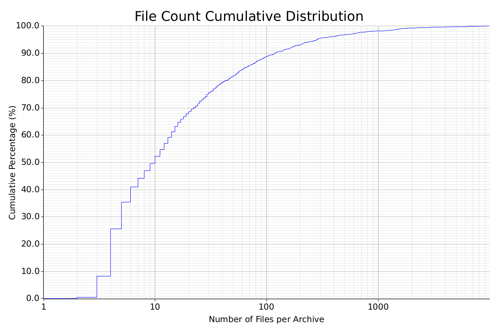
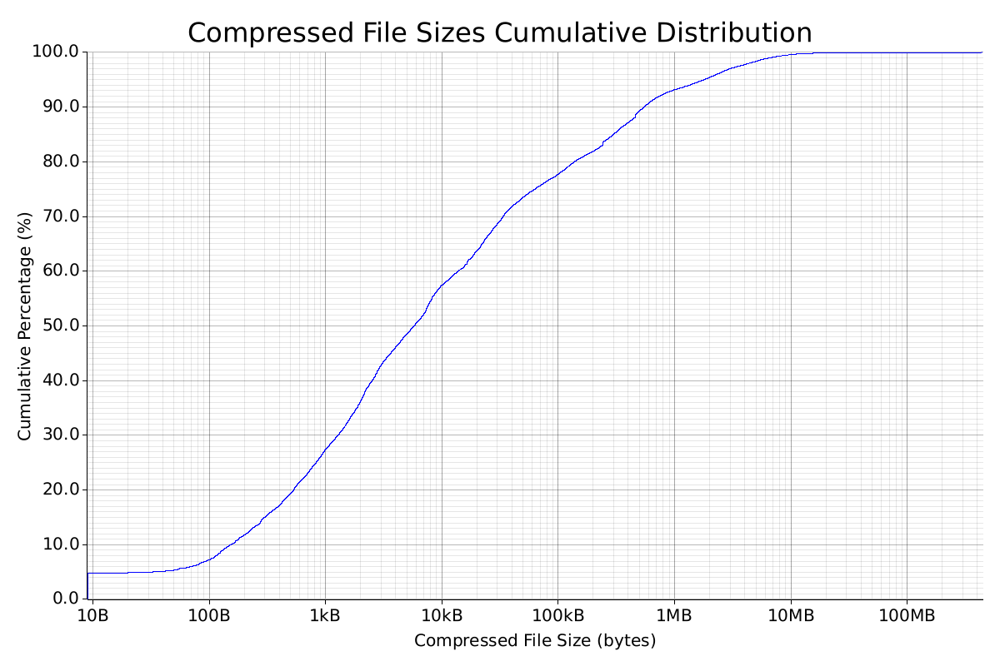

# Analyzing 2,200 Mods to Design an Archive Format For Modding

As part of the [Reloaded3] project, I am designing a [new archive format] to serve as a container for game mods, both for distribution and loading of assets.

As discussed in [my previous article on texture compression][bc1-compression], this format is built to satisfy four key requirements:

- **Read-Only Virtual Filesystem**: Make games read file from Archive as if they were on disk.
- **Efficient Distribution**: Minimizing size and supporting streaming downloads.
- **Legacy Replacement**: Capable of replacing native game archives with superior performance.
- **High-Speed Archival**: Decompression speeds matching modern NVMe drives (GB/s).

To do this, I sat down and wrote a quick tool to analyze the existing mods that are out there.
I wanted to look at all Reloaded-II mods (or as close as possible). The easiest way to do that was
the [Reloaded-II.Index], the same index where the built-in mod browser pulls its data from.

This resulted in a dataset of 2,197 unique packages; after excluding duplicates, etc.

<!-- more -->

!!! info "I estimate the total mod count in Reloaded-II ecosystem is 3,200-3,500 mods."

    This analysis excludes the ~800-1,000 mods hosted exclusively on Nexus Mods or
    within smaller isolated communities that are not tracked by the index; since
    adding a game to indexer requires manual operation.

Below is what I found.

## Why We're Looking at This Data

!!! info "A typical user may run hundreds of mods."

    When a game launches, we need to parse all of them for access. 
    Every microsecond spent parsing archive headers adds up.

Many existing formats (ZIP, 7z, RAR) suffer from issues that slow down parsing:

1. **Central Directory at end of file** - or not present at all, requiring multiple seeks.
2. **Variable-size structs** - creates data dependencies; breaks instruction level pipelining.
3. **Unnecessary overhead** - complex parsing logic, compression on tiny archive headers that don't need it.

Ideally, we want to read the archive metadata in a **single I/O operation**, and doing so as fast as possible.

Modern NVMe drives use 4KiB sectors. Since we always read the file header to check for a magic value, fitting all metadata within that same 4KiB means we only need a single read to mount the archive. 

## The Dataset

!!! info "The analysis script processed the latest versions of **2,197 unique mods** from the Reloaded registry."

Within these archives you could find:

- **Total Files**: ~196,000
- **Total Uncompressed Size**: ~227 GB
- **Total Compressed Size**: ~86 GB

!!! warning "Some mods may be missing."

    Very rare 'huge' mods which use Google Drive, etc. are not included here.

    GameBanana has file size limit (generally 1.49GB). Very, very rare mods that exceed that are not counted, as I have no way to easily autodownload from alt sources.

    Some of these 'huge' mods are also split into a few sub-mods, so a 2GB mod may be split into 4x ~500MB mods.

## Archive Sizes & Storage

!!! question "What files are we downloading anyway?"

### Archive Size Distribution

When we look at the distribution of archive sizes, a clear pattern emerges.

| Range        | Count | Percentage |
| ------------ | ----- | ---------- |
| < 1MB        | 850   | 38.69%     |
| 1MB - 10MB   | 737   | 33.55%     |
| 10MB - 100MB | 434   | 19.75%     |
| > 100MB      | 176   | 8.01%      |

At first glance, it looks like most mods are small. **72% of mods are under 10MB**.

<figure markdown="span">
  
  <figcaption>Cumulative distribution of archive sizes.</figcaption>
</figure>

### Total Space Used by Mod Size Groups

!!! info "However, when we look at *storage consumption*, the picture flips completely."

| Range        | Total Size | Percentage |
| ------------ | ---------- | ---------- |
| < 1MB        | 0.24 GB    | 0.4%       |
| 1MB - 10MB   | 3.10 GB    | 4.7%       |
| 10MB - 100MB | 14.62 GB   | 22.1%      |
| > 100MB      | 48.28 GB   | 72.9%      |

- **Small Mods (<10MB)** account for only **5.1%** (3.34 GB) of total disk usage.
- **Large Mods (>100MB)** account for **72.9%** (48.28 GB) of total disk usage.

!!! question "What are those very big mods?"

    Think texture overhauls, HD cutscenes, etc.

## Files Per Archive

!!! question "How many files are inside?"

Given our goal of single-read mounting, how big do file tables actually get?

<figure markdown="span">
  
  <figcaption>Most mods have very few files.</figcaption>
</figure>

| Range   | Count | Percentage |
| ------- | ----- | ---------- |
| 1       | 1     | 0.05%      |
| 2-5     | 778   | 35.41%     |
| 6-10    | 369   | 16.80%     |
| 11-25   | 441   | 20.07%     |
| 26-50   | 207   | 9.42%      |
| 51-100  | 157   | 7.15%      |
| 101-200 | 93    | 4.23%      |
| 201+    | 151   | 6.87%      |

The data shows **~93%** of mods have **200 files or fewer**.

If we assume a highly optimized file entry takes roughly 21 bytes (hash, size, algorithm, path), about `4000 / 21 ≈ 190 files` can fit within 4KB. According to our graph, that's still `~93%`.

!!! note "21 bytes per file is current estimate"

    Based off of my original `nx` format from which `r3a`/`nx2` is derived.

## Compression Efficiency

Finally, I looked at how well files compress based on their size.

| File Size Range | Savings | % Files with Excellent Compression (<10% Size) | % Files with Poor Compression (>80% Size) |
| --------------- | ------- | ---------------------------------------------- | ----------------------------------------- |
| < 1KB           | 46.9%   | 28.4%                                          | 18.2%                                     |
| 1KB - 10KB      | 59.7%   | 1.9%                                           | 6.3%                                      |
| 10KB - 100KB    | 49.1%   | 3.6%                                           | 32.9%                                     |
| 100KB - 1MB     | 63.0%   | 13.8%                                          | 14.2%                                     |
| 1MB - 10MB      | 69.9%   | 30.0%                                          | 15.2%                                     |
| 10MB+           | 51.9%   | 12.4%                                          | 18.3%                                     |

And a graph of files under `X` bytes:

<figure markdown="span">
  
</figure>

I figured this would be useful to find out how many bytes I can get away with; but with a small redesign, this is no longer a concern. But cool nonetheless!

## Conclusion

That's about it.

No super serious conclusions here, I just figured this data was too cool not to share.

This specific dataset is only Reloaded-II's , but you'll find that on larger sets,
say, the entirety of a modding website; you'll find the file size and count patterns to be quite similar. 

## Extra Links

You can find the raw data [here](./assets/mod-stats+analysis.7z).  
The code that was used to generate it is available in the 'research' folder of [the new archive format](https://github.com/Sewer56/sewer56-archives-nx).

[Reloaded3]: https://reloaded-project.github.io/Reloaded-III/
[Reloaded-II]: https://github.com/Reloaded-Project/Reloaded-II
[Reloaded-II.Index]: https://github.com/Reloaded-Project/Reloaded-II.Index
[bc1-compression]: ./bc1-compression.md
[new archive format]: https://sewer56.dev/sewer56-archives-nx/
