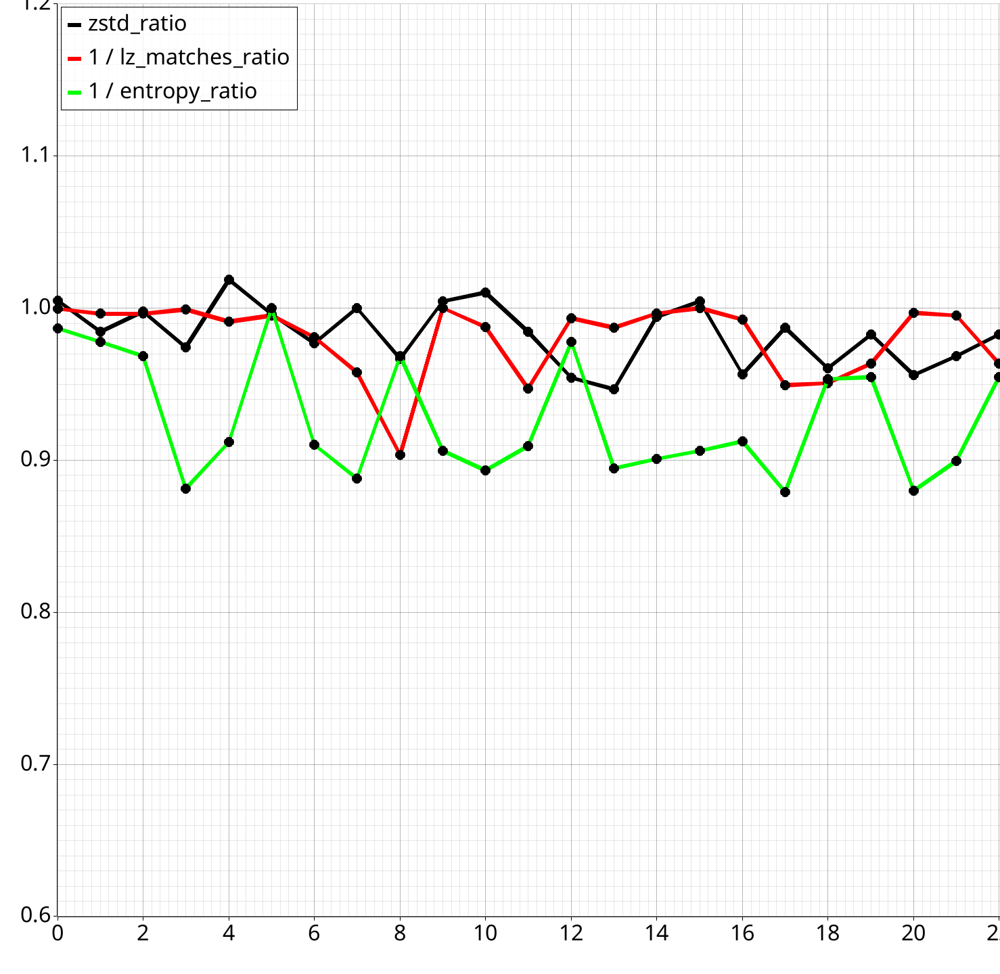
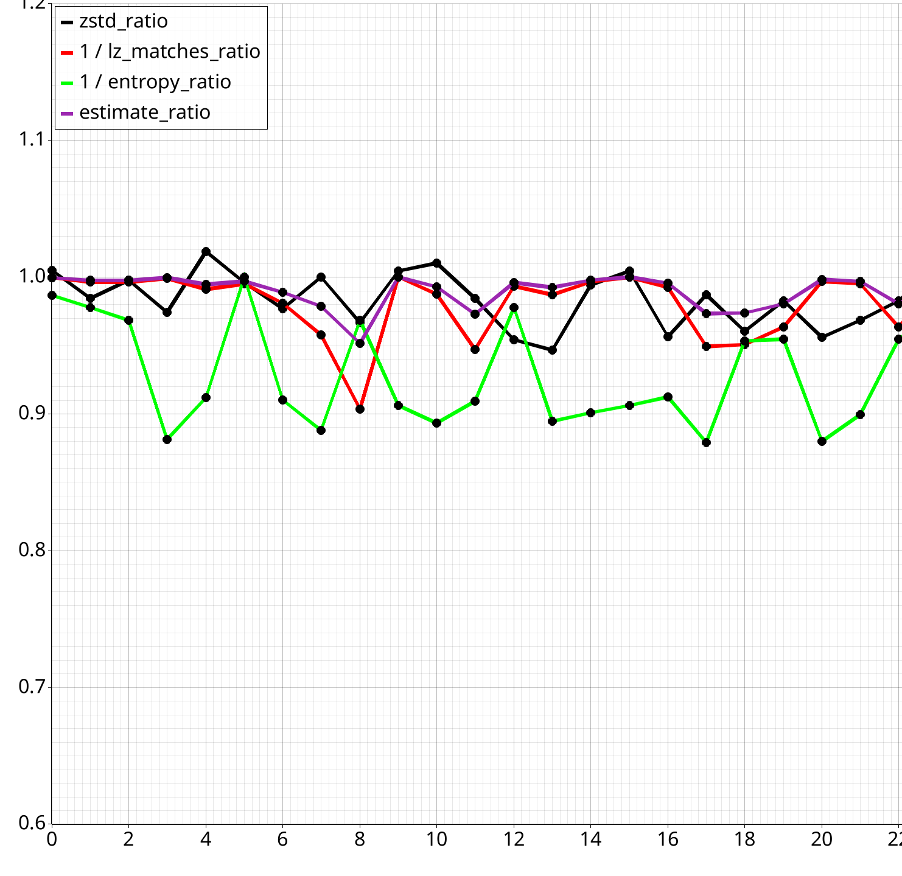
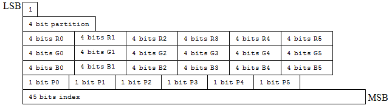
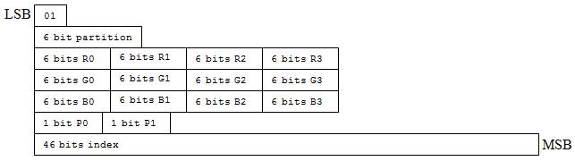
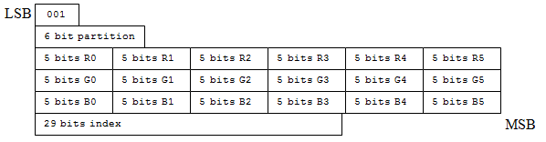

# A Program for Helping Create Lossless Transforms

!!! info "Making the whole process easier with a tool."

Part 3 of [Texture Compression in Nx2.0 series][compression-nx20].

This one is a bit of a detour; in the previous parts we've talked about:

- [A transform to improve compression ratio][bc1-compression]
- [A quick estimate to find out if a file will compress better][lossless-transform-utils]

While the BC1-BC3 transforms were fairly simple and straight forward, formats like BC6h and BC7
massively increase complexity. Experimenting with different ways to transform them takes a lot of
time.

To help with those formats, any many others, I built a tool for defining and comparing transforms.

<!-- more -->

## The Tool

!!! info "The tool is named `struct-compression-analyzer`"

    And is used for creating lossless transforms, like the ones earlier in this series!!

It simply boils down to the following:

- You define a 'schema' with the layout of the file.
- You run it on a directory or file.
- The tool provides you individual per field/group stats.
  - And much, much more.

And this is useful for optimizing:

- Huge files where disk space is precious.
  - `Textures`, `3D Models`, `Audio Data`
- Small data where bandwidth is limited.
  - e.g. Network packets in 64-player game.

## A Quick Demo

!!! note "[Full schema available here!][dxt1-schema]"

    With DDS support, included!!  
    This is for the BC1 block format [from the first post in the series][bc1-compression].

    [Documentation for making schemas][format-schema].

Schema:

```yaml
version: '1.0'
metadata:
  name: DXT1/BC1 Block
  description: Analysis schema for DXT1/BC1 compressed texture block format
root:
  type: group
  fields:
    colors:
      type: group
      fields:
        # Group/full notation
        color0:   
          type: group
          description: First RGB565 color value
          fields:
            r0: 5  # Red component
            g0: 6  # Green component
            b0: 5  # Blue component
        
        color1:
          type: group
          description: Second RGB565 color value
          fields:
            r1: 5  # Red component
            g1: 6  # Green component
            b1: 5  # Blue component

    # Shorthand notation
    indices: 32 # 32-bit indices for each texel (4x4 block = 16 texels)
```

Command: 

```bash
cargo run --release analyze-directory --schema schemas/dxt1-block.yaml "202x-architecture-10.01" -f concise
```

Output:

```plaintext
Schema: DXT1/BC1 Block
File: 6.78bpb, 9429814 LZ, 13420865/20015319 (67.05%/100.00%) (zstd/orig)

Field Metrics:
colors: 5.50bpb, 9340190 LZ (99.05%), 3567275/10007659 (26.58%/50.00%) (zstd/orig), 32bit
  color0: 5.42bpb, 4689715 LZ (50.21%), 1864829/5003829 (52.28%/50.00%) (zstd/orig), 16bit
    r0: 6.97bpb, 483853 LZ (10.32%), 1276640/1563697 (68.46%/31.25%) (zstd/orig), 5bit
    g0: 6.20bpb, 1333745 LZ (28.44%), 1088687/1876436 (58.38%/37.50%) (zstd/orig), 6bit
    b0: 6.64bpb, 859181 LZ (18.32%), 1078998/1563697 (57.86%/31.25%) (zstd/orig), 5bit
  color1: 4.96bpb, 4864159 LZ (52.08%), 1646466/5003829 (46.15%/50.00%) (zstd/orig), 16bit
    r1: 6.47bpb, 685486 LZ (14.09%), 1174668/1563697 (71.34%/31.25%) (zstd/orig), 5bit
    g1: 5.65bpb, 1538888 LZ (31.64%), 950598/1876436 (57.74%/37.50%) (zstd/orig), 6bit
    b1: 6.17bpb, 1042397 LZ (21.43%), 976376/1563697 (59.30%/31.25%) (zstd/orig), 5bit
indices: 6.66bpb, 2010712 LZ (21.32%), 8199754/10007659 (61.10%/50.00%) (zstd/orig), 32bit
```

!!! note "The above results are an aggregate of all files, per CLI command"

    Some percentages, etc. may not add up due to averaging; this is expected.

This is quite a lot of stats, isn't it?
Let's break it down a bit.

## Interpreting the Results

!!! note "This is the 'concise' layout"

    There is a 'detailed' layout that may be a bit more user friendly, depending on your personal preferences.

### File Level Stats

First header has the file level info.

```
File: 6.78bpb, 9429814 LZ, 28322604/44739256 (63.31%/100.00%) (zstd/orig)
```

- The [entropy] of the file is `6.78` bits per byte.
- There are `9429814` 3 byte [LZ Matches].
    - This is a fast (but pretty accurate) estimate, using [lossless-transform-utils] (from previous post).
    - [Accuracy numbers here][lz-match-accuracy]. Close to high end LZ compressors.
- `28322604` bytes after compressing with ZStandard (level 16 by default).
    - 63.31% of original size.
- `44739256` bytes original file.

The other thing I left out is `30165973` bytes in size after using a `size predictor function`  
([last blog][size-predictor-function]). In this case I used the following function: 

### Field Level Stats

!!! info "The format of these is the same as the file level"

    Except that it also shows you the size of each field, at the end of each row.

The ***field level stats show you*** stats ***only*** for the bits of each field or ***group of fields***.

Recall the [format of a BC1 block][bc1-anatomy]:

```
Offset:  0       2       4   4       6       8
         +-------+-------+   +-------+-------+
Data:    |Colour0|Colour1|   | I0-I3 | I4-I8 |
         +-------+-------+   +-------+-------+
```

And the field results from above:

```
colors: 5.50bpb, 9340190 LZ (99.05%), 3567275/10007659 (26.58%/50.00%) (zstd/orig), 32bit
  color0: 5.42bpb, 4689715 LZ (50.21%), 1864829/5003829 (52.28%/50.00%) (zstd/orig), 16bit
    r0: 6.97bpb, 483853 LZ (10.32%), 1276640/1563697 (68.46%/31.25%) (zstd/orig), 5bit
    g0: 6.20bpb, 1333745 LZ (28.44%), 1088687/1876436 (58.38%/37.50%) (zstd/orig), 6bit
    b0: 6.64bpb, 859181 LZ (18.32%), 1078998/1563697 (57.86%/31.25%) (zstd/orig), 5bit
  color1: 4.96bpb, 4864159 LZ (52.08%), 1646466/5003829 (46.15%/50.00%) (zstd/orig), 16bit
    r1: 6.47bpb, 685486 LZ (14.09%), 1174668/1563697 (71.34%/31.25%) (zstd/orig), 5bit
    g1: 5.65bpb, 1538888 LZ (31.64%), 950598/1876436 (57.74%/37.50%) (zstd/orig), 6bit
    b1: 6.17bpb, 1042397 LZ (21.43%), 976376/1563697 (59.30%/31.25%) (zstd/orig), 5bit
```

The field data for `colors` is:

```
Offset:  0       2       4   4       6       8
         +-------+-------+   +-------+-------+
Data:    |Colour0|Colour1|   |Colour0|Colour1| ...
         +-------+-------+   +-------+-------+
```

!!! tip "The indices are skipped"

So the size of just the colours is `10007659` bytes.
The size after compressing that data with ZStandard is `3567343` bytes.

## Observations from Summary

Sometimes you may make some useful observations from the summary; let's go back to the field results.

### Always Splitting Fields

```
colors: 5.50bpb, 9340190 LZ (99.05%), 3567275/10007659 (26.58%/50.00%) (zstd/orig), 32bit
indices: 6.66bpb, 2010712 LZ (21.32%), 8199754/10007659 (61.10%/50.00%) (zstd/orig), 32bit
```

Remember our criteria for [splitting fields][splitting-fields-last] from the previous post?

- `LZ Matches Ratio`
- `Entropy Difference`

You can observe it here.  
Colours have a massively greater number of LZ matches in an average file, and a lower entropy.  

This means splitting these fields is beneficial in *basically* all files.

!!! note "Also note the size discrepancy after compression, despite both fields being 32-bit in size."

### Splitting Sub-Fields Too?

!!! tip "If you want to maximize compression ratio, you may even want to split sub-fields."

    After splitting once, split again!!

```
colors: 5.50bpb, 9340190 LZ (99.05%), 3567275/10007659 (26.58%/50.00%) (zstd/orig), 32bit
  color0: 5.42bpb, 4689715 LZ (50.21%), 1864829/5003829 (52.28%/50.00%) (zstd/orig), 16bit
  color1: 4.96bpb, 4864159 LZ (52.08%), 1646466/5003829 (46.15%/50.00%) (zstd/orig), 16bit
```

Notice the sum of `color0` and `color1` in size is less than of `colors`.

```
(1864829 + 1646466) < 3567275
```

More specifically, sum of `color0` and `color1` is 98.4% of `colors` in size, on average.

This indicates that in ***some files***, it is beneficial to split up `color0` and `color1`; so when
writing a transform, you may want to consider that. Let's represent this with a [Split Comparison](#adding-a-split-comparison).

## Adding a Split Comparison

!!! tip "Think splitting a field is beneficial? Add it to the schema!"

```yaml
analysis:
  split_groups:
    - name: split_colors
      group_1: [colors]          # Base group to compare against.
      group_2: [color0, color1]  # Derived group to compare with.
      description: Compare regular interleaved colour format `colors` against their split components `color0` and `color1`.
```

This gets you the following in the output:

```
split_colors: Compare regular interleaved colour format `colors` against their split components `color0` and `color1`.
  Original Size: 10007659
  Base LZ, Entropy: (9340190, 5.50)
  Comp LZ, Entropy: (9560716, 5.50)
  Base Group LZ, Entropy: ([9340190], ["5.50"])
  Comp Group LZ, Entropy: ([4689715, 4864159], ["5.42", "4.96"])
  Base (est/zstd): 3985184/3567275
  Comp (est/zstd): 3891164/3498364
  Ratio (zstd): 98.06824536936458
  Diff (zstd): -68911
  Est/Zstd Agreement on Better Group: 72.8%
  Zstd Ratio Statistics:
  * min: 0.937, Q1: 0.963, median: 0.979, Q3: 1.002, max: 1.161, IQR: 0.038, mean: 0.985 (n=125)
```

According to the split comparison, on average, separating the 2 colour channels produces a file
that is 98.5% of the size, compared to keeping the colours together. And a median of 97.9% of the
size.

This is a 0.5% reduction in total file size after compression roughly, once we factor in the much
less compressible indices.

!!! question "Only 0.5% of final file? Is this really beneficial?"

    ***YES!!*** Sometimes even a mean of 0% can be a ***great*** result!!
    Look at the `min` and `Q1` values!!

Let's demonstrate with a graph!

<figure markdown="span">
  
  <figcaption>A slice of a generated plot. Comparison (black) shows is ratio of split colours relative to base group (grouped colours).</figcaption>
</figure>

***Use the extra split when the files are smaller!!***

If you're optimizing for compression ratio only (e.g. file downloads), then always apply if smaller.
Otherwise, only apply if the difference is significant enough as to not outweigh decompression speed.

!!! tip "Use the `Est/Zstd Agreement on Better Group` field"

    It tells you how often the 'estimate' function agrees with actual `zstd` results on whether the
    split group is better than non-split. Above we get `72.8%`, so it guesses it right 3/4 of the time, roughly.

## Adding a Custom Comparison

!!! tip "For more advanced transformations, you can define custom comparisons!"

    By using the `compare_groups` feature.

### Simple Example

!!! info "The previous transformations can be defined as the following"

```yaml
analysis:
  compare_groups:
    - name: dxt1_transforms
      description: Compare different arrangements of DXT1 block data
      baseline: # Original block format: Each block is [color0, color1, indices]
        - type: struct
          fields:
            - type: field
              field: color0
            - type: field
              field: color1
            - type: field
              field: indices
      comparisons:
        colors_then_indices: # All colors first, then all indices
          - { type: array, field: colors } # Same as original blog post
          - { type: array, field: indices }
        color0_color1_indices: # All (split) colors first, then all indices
          - { type: array, field: color0 } # Introduced in this post.
          - { type: array, field: color1 }
          - { type: array, field: indices }
```

Which gives you the following output in the tool:

```
dxt1_transforms: Compare different arrangements of DXT1 block data
  Overall Est/Zstd Agreement on Best Group: 79.2%
  Base Group:
    Size: 20015319
    LZ, Entropy: (9429814, 6.78)
    Base (est/zstd): 13505214/13420865

  colors_then_indices Group:
    Size: 20015319
    LZ, Entropy: (11350940, 6.78)
    Comp (est/zstd): 11840362/11767256
    Ratio (zstd): 87.7%
    Diff (zstd): -1653608

  color0_color1_indices Group:
    Size: 20015319
    LZ, Entropy: (11571464, 6.78)
    Comp (est/zstd): 11743347/11698334
    Ratio (zstd): 87.2%
    Diff (zstd): -1722530
```

### Example 1: Interleaving Colours with Mixed Representations

!!! info "Convert from `[R0 R1] [G0 G1] [B0 B1]` to `[R0 G0 B0] [R1 G1 B1]` format."

```yaml
compare_groups:
  colour_conversion:
      description: "Rearrange interleaved colour channels from [R0 R1] [G0 G1] [B0 B1] to [R0 G0 B0] [R1 G1 B1]."
      baseline: # Original colour format
        - { type: array, field: R } # reads all 'R' values from input
        - { type: array, field: G } # reads all 'G' values from input
        - { type: array, field: B } # reads all 'B' values from input
      comparisons: 
        split_components: # R0 G0 B0. Repeats until no data written.
          - type: struct
            fields:
              - { type: field, field: R } # reads 1 'R' value from input
              - { type: field, field: G } # reads 1 'G' value from input
              - { type: field, field: B } # reads 1 'B' value from input
```

In this case, interleaved format is usually better with regards to compression.

### Example 2: Converting 7-bit to 8-bit Colours with Padding

!!! info "Convert a 7-bit color value to an 8-bit representation by adding a padding bit."

```yaml
compare_groups:
  convert_7_to_8_bit:
    description: "Adjust 7-bit color channel to 8-bit by appending a padding bit."
    baseline: # Original 7-bit format (R, R, R)
      - { type: array, field: color7 } # reads all '7-bit' colours from input
    comparisons:
      padded_8bit: # 8-bit format with padding (R+0, R+0, R+0)
        - type: struct
          fields:
            - { type: field, field: color7 } # reads 1 '7-bit' colour from input
            - { type: padding, bits: 1, value: 0 } # appends padding bit
```

In this case, counterintuitively, extending to 8 bits often improves compression ratio;
since compressors work on byte aligned data.

### Example 3: Aligning Color Bits

!!! info "Truncating 18-bit colours to 16-bit"

    Another case of byte aligning to improve compression ratio.

```yaml
compare_groups:
  - name: convert_666_to_655
    description: "Convert colours from 666 to 655 format with lossy and lossless options"
    baseline: # 18-bit 666 colour
      - { type: array, field: color666 }
    comparisons:
      lossy_655: # 16-bit 655 colour (dropping '1' bit)
        - type: struct
          fields:
            - { type: field, field: color666, bits: 6 } # R (6-bit)
            - { type: field, field: color666, bits: 5 } # G (5-bit)
            - { type: skip, field: color666, bits: 1 }  # Discard remaining G bit
            - { type: field, field: color666, bits: 5 } # B (5-bit)
            - { type: skip, field: color666, bits: 1 }  # Discard remaining B bit
      lossless_655: # 16-bit 655 colour plus dropped bits stored separately
        - type: struct # Main 655 colour data
          fields:
            - { type: field, field: color666, bits: 6 } # R (6-bit)
            - { type: field, field: color666, bits: 5 } # G (5-bit)
            - { type: skip, field: color666, bits: 1 }  # Skip G low bit
            - { type: field, field: color666, bits: 5 } # B (5-bit)
            - { type: skip, field: color666, bits: 1 }  # Skip B low bit
        - { type: array, field: color666, offset: 11, bits: 1 } # All G low bits
        - { type: array, field: color666, offset: 17, bits: 1 } # All B low bits
```

This example shows two approaches to converting from 666 to 655 color format:

1. A lossy conversion that drops two '1' bits.
2. A lossless conversion that preserves the remaining bits in separate arrays after the array
   of 655 colour values.

## Automatic Starting Offset & Length Detection

!!! info "Up till now we've assumed that the input data consists of only what we're analyzing"

    This may not always be the case.

For example, you may want to skip a file header, or only handle a certain known part of a file.
In our case, for `.DDS` files, we can define a simple set of checks for BC1 format.

```yaml
conditional_offsets:
  - offset: 0x80  # DXT1 data starts at 128 bytes
    conditions:
      - byte_offset: 0x00  # file magic
        bit_offset: 0
        bits: 32
        value: 0x44445320  # DDS magic

      - byte_offset: 0x54  # fourCC field position
        bit_offset: 0
        bits: 32
        value: 0x44585431  # 'DXT1' fourCC code
```

This will automatically set the starting offset of the data being analyzed to 0x80, if bytes or bits at
specific locations match. The length should run till the end of the data.

!!! note "There are `offset` and `length` parameters in the CLI"

    We've just conveniently left them out of the examples, and this is why.

!!! note "Need a way to set fixed length? Submit a PR!"

    Chances are it'll be a while till I'll need it, so I haven't added it yet.

### More Advanced Example

!!! info "This checks multiple locations among the headers, and accepts either SRGB or regular format."

```yaml
conditional_offsets:
  # BC7 format detection (UNORM)
  - offset: 0x94  # BC7 data starts at 148 bytes
    conditions:
      - byte_offset: 0x00 # file magic
        bit_offset: 0
        bits: 32
        value: 0x44445320 # DDS magic
      - byte_offset: 0x54 # ddspf.dourCC
        bit_offset: 0
        bits: 32
        value: 0x44583130 # DX10 header
      - byte_offset: 0x80 # ds_header_dxt10.dxgiFormat
        bit_offset: 0
        bits: 32
        value: 0x62000000 # DXGI_FORMAT_BC7_UNORM
  # BC7 format detection (UNORM_SRGB)
  - offset: 0x94  # BC7 data starts at 148 bytes
    conditions:
      - byte_offset: 0x00 # file magic
        bit_offset: 0
        bits: 32
        value: 0x44445320 # DDS magic
      - byte_offset: 0x54 # ddspf.dourCC
        bit_offset: 0
        bits: 32
        value: 0x44583130 # DX10 header
      - byte_offset: 0x80 # ds_header_dxt10.dxgiFormat
        bit_offset: 0
        bits: 32
        value: 0x63000000 # DXGI_FORMAT_BC7_UNORM_SRGB
```

## Per File Statistics

!!! tip "When analyzing a directory, you may add the `--output` flag to output per-file statistics."

For example:

```
cargo run --release analyze-directory --output reports --schema schemas/dxt1-block.yaml "202x-architecture-10.01" -f concise
```

Will output per-file statistics in the `reports` directory.
These come in the form of CSV files and plots.

### Plot Generation

!!! tip "Plots are generated for every `split_comparison` and `custom_comparison`."

<figure markdown="span">
  
  <figcaption>The same picture as above. A slice of a generated plot.</figcaption>
</figure>

<figure markdown="span">
  
  <figcaption>A variant with the result of the 'estimate' function plotted.</figcaption>
</figure>

There may be multiple variants per comparison, e.g. like the one above with the 'estimate' function.
This helps with readability, sometimes you want to exclude some info.

### CSV Output

!!! tip "Per-file statistics are output in CSV format."

For example you can find...

#### Stats for Each Field

!!! tip "Same as in CLI output, but not aggregated."

| name   | full_path | depth | entropy  | lz_matches | lz_matches_pct | estimated_size | zstd_size | original_size | estimated_size_pct | zstd_size_pct | original_size_pct | zstd_ratio | lenbits | unique_values | bit_order | file_name             |
| ------ | --------- | ----- | -------- | ---------- | -------------- | -------------- | --------- | ------------- | ------------------ | ------------- | ----------------- | ---------- | ------- | ------------- | --------- | --------------------- |
| colors | colors    | 0     | 4.874987 | 22330102   | 0.9679138      | 8528692        | 5871479   | 22369628      | 0.2827256          | 0.2073072     | 0.5               | 0.2624755  | 32      | 0             | Msb       | winterholdwall02.dds  |
| colors | colors    | 0     | 4.876666 | 22254764   | 0.9761022      | 8548851        | 5504367   | 22369628      | 0.2832391          | 0.1943305     | 0.5               | 0.2460643  | 32      | 0             | Msb       | winterholdfloor01.dds |
| colors | colors    | 0     | 5.127527 | 22183499   | 0.9949356      | 9005741        | 6532419   | 22369628      | 0.2932818          | 0.2247291     | 0.5               | 0.2920218  | 32      | 0             | Msb       | winterholdfloor02.dds |

#### Bit Statistics

!!! info "This shows how often each bit in a field is set to zero or one"

index0:

| bit_offset | zero_count | one_count | ratio     |
| ---------- | ---------- | --------- | --------- |
| 0          | 140489327  | 172250038 | 0.4492218 |
| 1          | 167653801  | 145085564 | 0.5360815 |

#### Value Statistics

!!! info "This shows the probability of each value occurring in a given field"

index0:

| value | count    | ratio     |
| ----- | -------- | --------- |
| 3     | 86242725 | 0.2757655 |
| 2     | 86007313 | 0.2750128 |
| 0     | 81646488 | 0.2610688 |
| 1     | 58842839 | 0.1881530 |

#### Split/Custom Comparisons

!!! tip "Same as in CLI output, but with a bit more info and not aggregated."

| name         | file_name              | size     | base lz  | comp lz  | base est | base zstd | comp est | comp zstd | ratio est | ratio zstd | diff est | diff zstd | base group lz | comp group lz      | base group entropy | comp group entropy | max comp lz diff | max comp entropy diff |
| ------------ | ---------------------- | -------- | -------- | -------- | -------- | --------- | -------- | --------- | --------- | ---------- | -------- | --------- | ------------- | ------------------ | ------------------ | ------------------ | ---------------- | --------------------- |
| split_colors | winterholdwall02.dds   | 22369628 | 22330102 | 22337863 | 8528692  | 5871479   | 8526919  | 5900243   | 0.9997921 | 1.0048989  | -1773    | 28764     | 22330102      | 11173030\|11162725 | 4.87               | 4.64\|4.70         | 1.00             | 0.06                  |
| split_colors | winterholdfloor01.dds  | 22369628 | 22254764 | 22328220 | 8548851  | 5504367   | 8532059  | 5417979   | 0.9980358 | 0.9843056  | -16792   | -86388    | 22254764      | 11157143\|11166978 | 4.88               | 4.69\|4.58         | 1.00             | 0.10                  |
| split_colors | winterholdfloor02.dds  | 22369628 | 22183499 | 22263057 | 9005741  | 6532419   | 8986619  | 6517815   | 0.9978767 | 0.9977644  | -19122   | -14604    | 22183499      | 11118891\|11136522 | 5.13               | 4.77\|4.92         | 1.00             | 0.16                  |
| split_colors | winterholdrubble01.dds | 22369628 | 22317563 | 22339474 | 8018446  | 6212103   | 8013740  | 6051193   | 0.9994131 | 0.9740973  | -4706    | -160910   | 22317563      | 11157699\|11178604 | 4.58               | 4.30\|3.79         | 1.00             | 0.51                  |
| split_colors | riftenlogsiding01.dds  | 22369628 | 21827972 | 22025297 | 9701135  | 7449007   | 9650526  | 7587915   | 0.9947832 | 1.0186479  | -50609   | 138908    | 21827972      | 10955631\|11055353 | 5.47               | 5.66\|5.17         | 1.01             | 0.50                  |

## Filtering of Input Data

!!! note "Sometimes you want to only analyze structures that fit a certain criteria."

For example, when dealing with BC7 Texture, each 'block' starts off with a number of bits that defines its mode.

<figure markdown="span">
    Mode 0:
    
    Mode 1:
    
    Mode 2:
    
    <figcaption>Mode determined by first bits (top left).<br/>
    <a href="https://learn.microsoft.com/en-us/windows/win32/direct3d11/bc7-format-mode-reference">Image from MSDN BC7 Format Mode Reference</a>.</figcaption>
</figure>

```yaml
root:
  type: group
  # Filter out to only Mode0 blocks, with start with a single '1' bit.
  # https://learn.microsoft.com/en-us/windows/win32/direct3d11/bc7-format-mode-reference#mode-0
  skip_if_not: 
  - byte_offset: 0
    bit_offset: 0
    bits: 1
    value: 1

  # Note: We filter out at root, so `mode0_block` reports the correct size of only Mode0 blocks
  #       in the file.
  fields:
    mode0_block:
      # rest of block...
```

## Size Predictor / Estimator

!!! info "Certain parts of the output refer to an 'estimate'"

    You would have seen this in [Split Comparisons](#adding-a-split-comparison),
    [Custom Comparisons](#adding-a-custom-comparison), and [Plots](#plot-generation).

This estimate is based on the [***quickly*** estimate the file size][quickly-estimate-file-size]
segment of the previous blog post. Using the following function.

```rust
pub fn size_estimate(params: SizeEstimationParameters) -> usize {
    // Calculate expected bytes after LZ
    let bytes_after_lz = params.data_len 
        - (params.num_lz_matches as f64 * params.lz_match_multiplier) as usize;

    // Calculate expected bits and convert to bytes
    (bytes_after_lz as f64 * params.entropy * params.entropy_multiplier).ceil()
        as usize / 8
}
```

It takes file size, subtracts a multiple of `lz_matches`, and then estimates gains from entropy
coding step; by applying a multiplier to the file's entropy.

Stats such as `lz_matches` are provided by [lossless-transform-utils] (from last blog post).

!!! tip "Use an estimate like this to determine if to apply a lossless transform"

    Is the estimated size smaller? If so, apply the transform.

!!! note "Size estimator function can be replaced via API"

### Brute Forcing The Parameters

!!! info "Pass `--brute-force-lz-params` to directory analysis (in CLI) to auto find optimal parameters"

This will give you a printout like: 

```markdown
=== Split Comparison Parameter Optimization Results ===
| Comparison Name | Group | LZ Multiplier | Entropy Multiplier |
| --------------- | ----- | ------------- | ------------------ |
| split_colors    | G1    | 0.5809        | 1.1670             |
|                 | G2    | 0.5727        | 1.1650             |

=== Custom Comparison Parameter Optimization Results ===
| Comparison Name | Group | LZ Multiplier | Entropy Multiplier |
| --------------- | ----- | ------------- | ------------------ |
| dxt1_transforms | BASE  | 0.533         | 1.000              |
|                 | 0     | 0.598         | 1.045              |
|                 | 1     | 0.586         | 1.038              |
```

Which shows you the best parameters for each split and group comparison.
These are brute forced on all threads.

When the `brute force` option is set in the CLI, the results of analysis will automatically use the computed results.

```yaml
split_colors: 'Compare regular interleaved colour format `colors` against their split components `color0` and `color1`'
  Base (est/zstd): 3634154/3567275 # 👈 updated
  Comp (est/zstd): 3503905/3498364 # 👈 updated
  Est/Zstd Agreement on Better Group: 72.8% # 👈 updated

dxt1_transforms: 'Compare different arrangements of DXT1 block data'
  Overall Est/Zstd Agreement on Best Group: 79.2% # 👈 updated
  Base Group:
    Base (est/zstd): 13505214/13420865 # 👈 updated

  colors_then_indices Group:
    Comp (est/zstd): 11840362/11767256 # 👈 updated

  color0_color1_indices Group:
    Comp (est/zstd): 11743347/11698334 # 👈 updated
```

!!! note "The brute force is optimized to maximize the `Est/Zstd Agreement on Better Group` statistic"

    We compromise on size accuracy (a miniscule amount) to get a better overall prediction of
    when a transform will be beneficial by applying a 'penalty'.

    ```rust
    // If the ratios are on the opposite side of 1.0
    // (i.e.) estimate thinks its worse, when its better, impose a 'killing'
    // penalty by giving it max error.
    let zstd_is_bigger = zstd_size > original_size;
    let estimate_is_bigger = estimated_size as u64 > original_size;
    if zstd_is_bigger != estimate_is_bigger {
        return f32::MAX as f64;
    }
    ```

    This is not adjustable as it's on a hot path; analysis time would increase significantly if made
    replaceable.

### Estimator Accuracy (High Compression Level)

!!! warning "Small sample size, 125 files"

!!! info "Below is a reference set of results for `split_colors`."

    On `"202x-architecture-10.01"`, as per previous examples.

We compress the input with `zstd level 19`, then check the result of `Est/Zstd Agreement on Better Group`,
marking that result as `Accuracy`.

In this example, `Accuracy` result marks how often the estimate function agrees with `zstd level 19`
on whether ratio will improve as a result of splitting the colour channels.

| Method       | Speed (MB/s) | Accuracy |
| ------------ | ------------ | -------- |
| Estimator    | 1610-1700    | 74.4%    |
| ZStd (lv 1)  | 600-1250     | 79.2%    |
| ZStd (lv 2)  | 340-530      | 81.6%    |
| ZStd (lv 3)  | 183          | 84.0%    |
| ZStd (lv 4)  | 154          | 84.8%    |
| ZStd (lv 5)  | 100          | 86.4%    |
| ZStd (lv 6)  | 81           | 88.0%    |
| ZStd (lv 7)  | 75           | 90.4%    |
| ZStd (lv 8)  | 69           | 91.2%    |
| ZStd (lv 9)  | 64           | 90.4%    |
| ZStd (lv 10) | 48           | 93.6%    |

The `Speed` column is a single threaded estimate, I don't have an exact benchmark for this; it will
vary very, very slightly between files.

In general, as a general rule of thumb, the accuracy of the estimator is generally comparable to that of
using `ZStd level 1`; but at double the speed. Use it for 'real-time' compression/decompression scenarios 
(see below).

!!! tip "You can replace estimator in `CompressionOptions` struct."

    This is how we measured for zstd here.

!!! tip "When compressing at high levels, use low levels of same algorithm as the estimator."

    Although fast, the 'estimate' lacks accuracy for high compression levels.  
    [Keep the estimate for low compression levels.](#estimator-accuracy-mid-compression-level)

    Using low compression levels you can still achieve <10% overhead, while having much more accurate
    results.

### Correct Positives & False Positives (High Compression Level)

!!! tip "Another useful statistics are `false positives` and `correct positives`"

    A `'correct positive'` is when we predicted `group2 / comp group` is better, and it indeed was.  
    A `'false positive`' is when we predicted it was better, but it was not.  

!!! tip "Another, perhaps better statistic is 'false positives'"

    This is the amount of times the estimator thought the ratio would improve (with `group2 / comp group`)
    , but it did not actually improve.

| Method      | Speed (MB/s) | False Positives | Correct Positives |
| ----------- | ------------ | --------------- | ----------------- |
| Estimator   | 1610-1700    | 24.8%           | 72.8%             |
| ZStd (lv 1) | 600-1250     | 20.0%           | 72.8%             |
| ZStd (lv 7) | 75           | 9.6%            | 73.6%             |

The idea here is 'you may disagree if ratio improves', but being wrong, saying the ratio will improve,
when it in fact won't is more dangerous than being wrong.

### Estimator Accuracy (Mid Compression Level)

!!! info "Below is a reference set of results for `split_colors`."

    On my entire BC1 data set. Not just the mod above.

!!! tip "For low compression levels, the 'estimate' function is competitive with level 1."

This time we're compression with `ZStd level 9`, and measuring the results.

| Method      | Speed (MB/s) | Accuracy |
| ----------- | ------------ | -------- |
| Estimator   | 1610-1700    | 80.0%    |
| ZStd (lv 1) | 600-1250     | 83.8%    |
| ZStd (lv 2) | 340-530      | 85.9%    |
| ZStd (lv 3) | 183          | 89.9%    |

!!! info "Level 3 provided for completeness; it has too much overhead in practice."

### Correct Positives & False Positives (Mid Compression Level)

!!! note "The estimate function tends to produce less false positives."

    Which evens out the less correct positives.

| Method      | Speed (MB/s) | False Positives | Correct Positives |
| ----------- | ------------ | --------------- | ----------------- |
| Estimator   | 1610-1700    | 10.0%           | 60.2%             |
| ZStd (lv 1) | 600-1250     | 13.5%           | 67.5%             |
| ZStd (lv 2) | 340-530      | 13.0%           | 69.0%             |
| ZStd (lv 3) | 183          | 9.2%            | 69.2%             |

### Estimator Accuracy vs BZip3

!!! question "What if we estimate against something that isn't LZ based?"

!!! info "Comparing effectiveness on `BZip3` instead of `ZStandard`"

    This requires a simple code edit, to change `get_zstd_compressed_size` to
    a different compression algorithm.

    May expose this via function pointer in future.

| Method      | Speed (MB/s) | Accuracy |
| ----------- | ------------ | -------- |
| Estimator   | 1610-1700    | 84.8%    |
| ZStd (lv 1) | 600-1250     | 10.4%    |
| ZStd (lv 3) | 183          | 15.2%    |
| BZip3       | 12           | 100.0%   |

| Method      | Speed (MB/s) | False Positives | Correct Positives |
| ----------- | ------------ | --------------- | ----------------- |
| Estimator   | 1610-1700    | 12.8%           | 2.4%              |
| ZStd (lv 1) | 600-1250     | 88.8%           | 4.0%              |
| ZStd (lv 3) | 183          | 84.8%           | 4.8%              |
| BZip3       | 12           | 0%              | 100%              |

Using LZ Based solutions, including ZStandard on non-LZ Based `bzip3` does not yield good results.
Because the `Burrows Wheeler Transform` is fundamentally different than an LZ based algorithm.

Always tread with caution. Splitting here often hurts bz3.

----

Results on entire data set (1943 files):

| Method    | Speed (MB/s) | Accuracy |
| --------- | ------------ | -------- |
| Estimator | 1610-1700    | 84.9%    |

| Method    | Speed (MB/s) | False Positives | Correct Positives |
| --------- | ------------ | --------------- | ----------------- |
| Estimator | 1610-1700    | 5.0%            | 5.6%              |

### Alternate Method (Mid Compression Level)

!!! tip "We can also compare sizes of just the separate `color0`, `color1` fields being split."

| Method      | Speed (MB/s) | Accuracy |
| ----------- | ------------ | -------- |
| Estimator   | 1610-1700    | 94.4%    |
| ZStd (lv 1) | 600-1250     | 98.0%    |

| Method      | Speed (MB/s) | False Positives |
| ----------- | ------------ | --------------- |
| Estimator   | 1610-1700    | 2.3%            |
| ZStd (lv 1) | 600-1250     | 0.6%            |

You can subtract the sizes of the 2 split segments, and decide to split if they differ significantly
enough as a rule of thumb. But I would not suggest, rather look at raw LZ and entropy numbers here.

## API Usage

!!! info "A Rust crate is provided, though bear in mind this is primarily a CLI tool."

```toml
# Cargo.toml
[dependencies]
struct-compression-analyzer = "0.1.0"
```

Example usage:

```rust
use struct_compression_analyzer::results::PrintFormat;
use struct_compression_analyzer::schema::Schema;
use struct_compression_analyzer::analyzer::SchemaAnalyzer;
use struct_compression_analyzer::analyzer::CompressionOptions;
use std::path::Path;

fn main() -> anyhow::Result<()> {
    // Load the schema
    let schema = Schema::load_from_file(Path::new("schema.yaml"))?;
    
    // Set the options
    let options = CompressionOptions::default();

    // Create an analyzer
    let mut analyzer = SchemaAnalyzer::new(&schema, options);
    
    // Add data to analyze
    analyzer.add_entry(&[0x01, 0x02, 0x03])?;
    
    // Generate results
    let results = analyzer.generate_results()?;
    
    // Print the results
    results.print(&schema, PrintFormat::Concise, false);
    
    Ok(())
}
```

For more detailed API documentation, see the [rust docs](https://docs.rs/struct-compression-analyzer).  
Each module has its own documentation, so use the sidebar 😉.

No API stability is guaranteed whatsoever, this is a one-off few weekend project; and is primarily
a CLI tool.

## Missing Features?

!!! note "A few, possibly."

    Will add them as needed in future endeavours.  
    If you need them, please PR them!! ***Don't wait!!***

- Custom lengths for conditional offsets
- Ability to handle variable sized structs.
  - e.g. Length prefixed arrays within structs.

---------
*The sources and documentation for this project can be found at:*
- [GitHub Repository](https://github.com/Sewer56/struct-compression-analyzer)
- [Documentation](https://docs.rs/struct-compression-analyzer)

[bc1-compression]: ./bc1-compression.md
[bc1-anatomy]: ./bc1-compression.md#anatomy-of-the-bc1-dxt1-block
[compression-nx20]: ../category/texture-compression-in-nx20.md
[lossless-transform-utils]: ./lossless-transform-utils.md
[lz-match-accuracy]: ./lossless-transform-utils.md#accuracy-of-lz-match-finder
[size-predictor-function]: ./lossless-transform-utils.md#example-estimate-the-file-size
[LZ matches]: ./bc1-compression.md#step-a-matching-patterns-in-previous-data
[dxt1-schema]: https://github.com/Sewer56/struct-compression-analyzer/blob/main/schemas/dxt1-block.yaml
[entropy]: ./bc1-compression.md#step-b-replace-symbols-bytes-with-a-smaller-number-of-bits
[quickly-estimate-file-size]: ./lossless-transform-utils.md#quickly-estimating-compressibility-of-data
[splitting-fields-last]: ./lossless-transform-utils.md#example-splitting-data
[format-schema]: https://github.com/Sewer56/struct-compression-analyzer/blob/main/format-schema.md
[bc7-formats]: https://learn.microsoft.com/en-us/windows/win32/direct3d11/bc7-format-mode-reference#mode-0