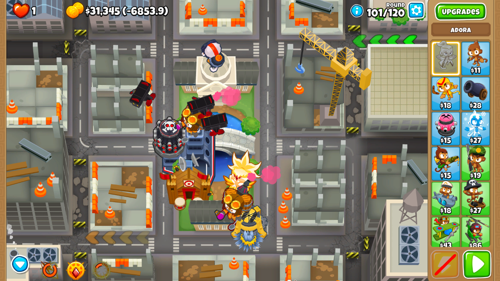
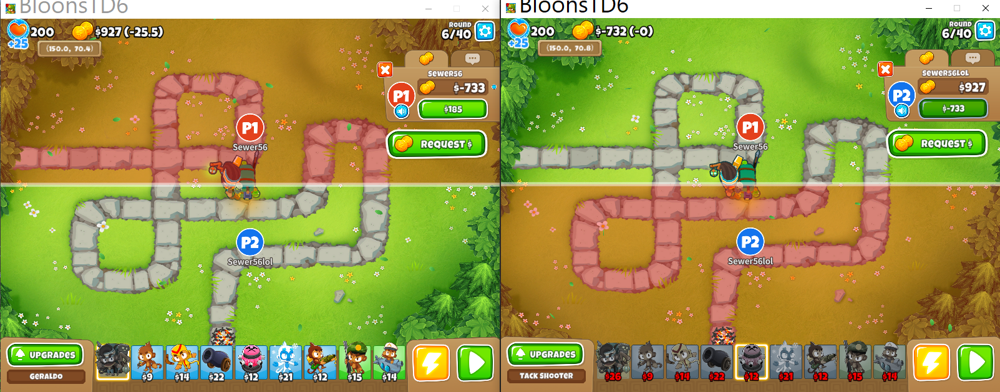

# Bloons TD 6

!!! info

    - Platform: PC  
    - Release Date: 2004  

## Salaried Monkeys

!!! about

    - Summary: Pay your monkeys a per-round salary, rather than buying them up front!  
    - Release Date: 2022 [[Source & Readme]](https://github.com/Sewer56/BloonsTD6.Mod.SalariedMonkeys).  
    - Most advanced custom game mode at release.  
    - First Bloons mod with CI/CD and Unit Testing.  
    - ***First Bloons mod with full co-op multiplayer integration/support!***  
        - Responsible for adding multiplayer functionality to [Bloons Mod Helper](https://github.com/gurrenm3/BTD-Mod-Helper).  
        - Responsible for creation of [Multi User Mod](https://github.com/Sewer56/BloonsTD6.Mod.MultiUser).  
        - Responsible for *bug fix in a MelonLoader component* [Assembly Unhollower].  
    - Significant portions of game code had to be rewritten to enable this mod since it changes the game so fundamentally.  
        - Including all UI elements with prices.  
        - Game save logic.  
        - And special behaviours based on cost, e.g. Ball of Light.  

Top left displays current cash and salary to be paid next round.  

## Multi User

!!! about

    - Summary: Allows you to run multiple instances of the game!  
    - Release Date: 2022 [[Source]](https://github.com/Sewer56/BloonsTD6.Mod.MultiUser).  
    - Allows you to sign in with multiple game accounts without conflicts.  

