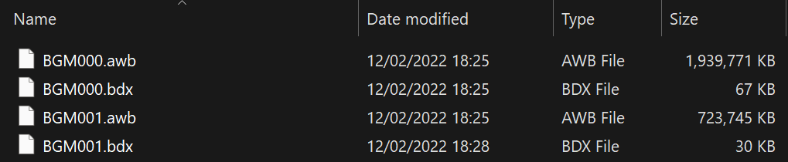
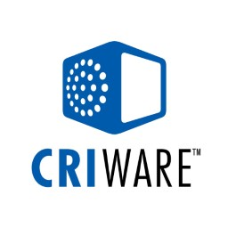
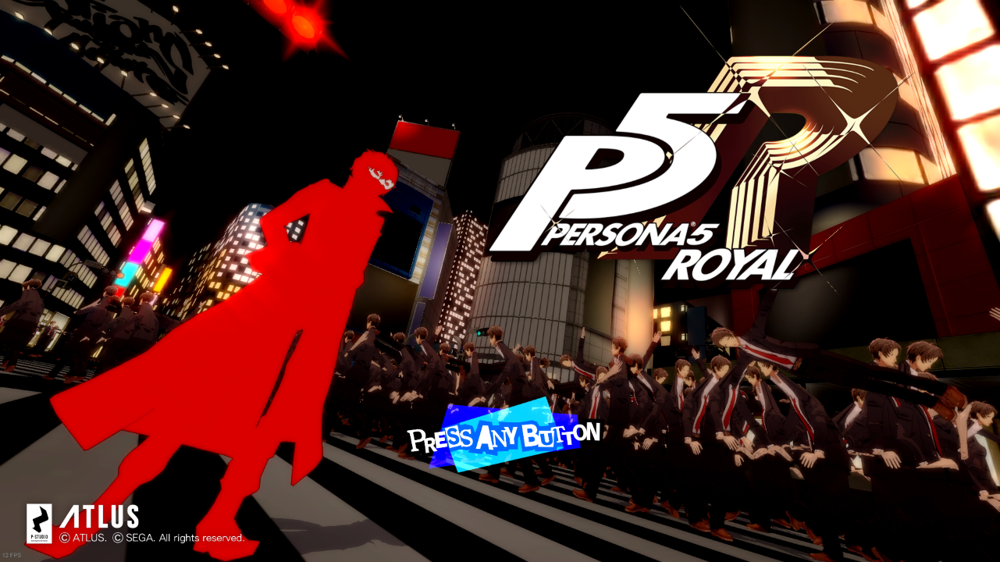

# Games: Common & General

!!! about

    - Contains anything generic that is game related, but is generic and applies multiple games.  

## SEGA PRS Compressor (2024 / Rust)

!!! about "prs-rs"

    - Summary: High performance custom compressor/decompressor for SEGA's PRS compression format used since the Sega Saturn.  
    - Release Date: 2024 [Source Code](https://sewer56.dev/prs-rs/)  
    - Fastest PRS Compressor/Decompressor with best compression ratio (at time of writing).  

Rewritten in Rust to incorporate new compression/encoding tricks I learned over the years, and to
make the library more portable. (e.g. No GC, custom allocators, etc.)

## Reloaded-II (Mod Loader)


!!! about 

    - The most advanced .NET based Mod Loader & Manager Combo for native games.  
    - Full [Set of Game Hacking Libraries](../index-libraries.md#c-reloaded-core-libraries).  
    - Full [Dedicated Wiki](https://reloaded-project.github.io/Reloaded-II/).  
    - Very High Performance.  
    - Modular And Extensible.  
    - Supports any 32 or 64-bit game.  
    - Integrated Logging.  
    - Dependency System.  
    - Execute Code before Game Runs a single Line.  
    - Load & Unload mods at runtime.  
    - Full Debugging Support including Edit & Continue.  
    - Automatic Installer & Updates.  
    - Support for Delta Compression in Updates.  
    - Mod Sets/Mod Collections.  
    - **Does Not Modify Game Directory!** Clean Uninstall!  
    - Disk Friendly: No file duplication, no extra residue.  
    - Controller Support.  
    - [and much more...](https://reloaded-project.github.io/Reloaded-II/)  

!!! info 

    - Below are individual universal mods for Reloaded that don't fit any other category in this index.  

### File Redirector

!!! about "Reloaded Universal File Redirector"

    - Summary: Allows adding/replacing game files without physically modifying game folder.  
    - Release Date: 2019 [Source Code](https://github.com/Reloaded-Project/reloaded.universal.redirector)  
    - Features:  
        - API (dynamically add files etc.)  
        - Log all files accessed by application.  
        - Log replaced files.  


What is Sonic Heroes loading right now? And what file is it being replaced with?  

### DirectInput Hotkey Fix

!!! about "DInput Please Cooperate"

    - Summary: Fixes cases where a DirectInput application prevents you from using your hotkeys.  
    - Release Date: 2020 [Source Code](https://github.com/Reloaded-Project/Reloaded.Universal.DInputPleaseCooperate)  

### File Emulation Framework

!!! about "File Emulation Framework"

    - Summary: Framework for emulating archive files at Windows API level to enable modding of games without repacking massive (2GB+) archives.  
    - Release Date: 2022 [Source Code](https://sewer56.dev/FileEmulationFramework/)  
    - Another crucial component to Reloaded's Core Philosophy. Don't touch game folder. No performance loss. Run anywhere.  
    - Features:  
        - Works with any application, game or tool even console emulators.  
        - Supported recursive/nested emulation of files, e.g. archive inside archive.  
        - Negligible (unnoticeable) overhead.  
        - Currently supports 5 archive formats (and counting!!).  
        - Extensive Unit Tests & asserts for runtime bug avoidance.  



Imagine adding/removing/replacing files in these archives without requiring any unpacking or repacking, without using any additional disk space and with zero overhead in a way that works even with emulated games.  

Yes, that's a thing now!  

### Dear ImGui Hook

!!! about "Reloaded.Imgui.Hook"

    - Summary: Library to add Dear ImGui into your game mod.  
    - Release Date: 2020 [Source Code](https://github.com/Sewer56/Reloaded.Imgui.Hook)  
    - Features:
        - Inject Dear ImGui into any D3D9/11 game, x86 or x64.  
        - Extensible. Can add support for other APIs without recompiling.  
        - Supports viewports and docking. You can drag ImGui windows outside game window!!  
        - No Pause on Focus Loss [Universal, for any game].  


## CRI Middleware



!!! info 

    - The items below apply to all games using CRI Middleware between 2000 and 2021.  
    - It is particularly popular among developers from Japan.  

### CRI FileSystem V2 Hook

!!! about "CRI FileSystem V2 Hook"

    - Summary: Adds Mod Support to Modern Games using CRI .CPK Archives.  
    - Release Date: 2022 [Source Code](https://github.com/Sewer56/CriFs.V2.Hook.ReloadedII)  
    - Features:  
        - Should support games from 2017 onwards, maybe older.  
        - Hot Reload (Add/Replace files without app restart).  
        - API (dynamically add files etc.)
        - Log files accessed by application.
        - Replace music in AWB music Archives inside CPKs without using additional disk space, [via an extension mod](https://sewer56.dev/CriFs.V2.Hook.ReloadedII/usage-awb).  



Well, this mod certainly enables some interesting use cases...

### .CPK Reading Library

!!! about "CriFsV2Lib"

    - Summary: Low level library for unpacking files from .CPK Archives.  
    - Release Date: 2022 [Source Code](https://github.com/Sewer56/CriFsV2Lib)  
    - Features:  
        - Minimalist, self contained in 25KiB.  
        - Maximum performance, all code hand tuned for best x64 assembly output.  
            - Faster than original CRI code present in retail games (in all parsing, decompression & descrambling).  


Included GUI tool for extraction.  

### ADX w/ ID3

!!! about "ADX ID3"

    - Summary: Custom variant of CRI's ADX Audio Format, with support for ID3 Meta Tags.  
    - Release Date: 2022 [Source Code](https://github.com/Sewer56/ADX-ID3)  
    - Intended for displaying information about current music track in-game with support mod(s).  
    - Features:  
        - Backwards compatible (games unaware of ID3 can still playback ADX).  
        - Reference ID3 Data Embedder/Extractor.  
        - Losslessly add ID3 metadata to existing files.  
        - Full stable specification on reading/writing ID3 data.  

```csharp
# dotnet Sewer56.Adx.Id3.Tool.dll view --source "Digital Circuit.adx" 

Title: Digital Circuit (original version)
Artist(s): 瀬上純
Album: Shadow the Hedgehog: Original Soundtrax
Year: 2006
Genre(s): Soundtrack
Track: 44
Disc No: 1
```

Reading info from a custom ADX with ID3 support.  

### .AFS Library

!!! about "AfsLib"

    - Summary: Library for parsing, unpacking & packing CRI .AFS archives.  
    - Release Date: 2019 [Source Code](https://github.com/Sewer56/AfsLib)  
    - Features:  
        - Fast file previewer (parse metadata near zero overhead).  
        - Low allocation.  

```csharp
var data = File.ReadAllBytes(afsFilePath);
if (AfsFileViewer.TryFromFile(data, out var afsViewer)) 
{
	// Do stuff. This easy to use!
};
```

### CRI FileSystem Hook

!!! about "CRI FileSystem Hook"

    - Summary: Mod for CRI games roughly between 2000-2010 that fixes a number of issues.  
    - Release Date: 2019 [Source Code](https://github.com/Sewer56/CriFsHook.ReloadedII)  
    - Features:  
        - Fast cold startup times (~5 seconds to 0).  
        - Allows file replacement.   
        - Allows launching files not present during game launch.  

## SEGA PRS Compressor (2018 / D)

!!! warning "Superseded by [prs-rs](#sega-prs-compressor-2024-rust)"

!!! about "dlang-prs"

    - Summary: High performance custom compressor/decompressor for SEGA's PRS compression format used since the Sega Saturn.  
    - Release Date: 2018 [Source Code](https://github.com/Sewer56/dlang-prs)  
    - Fastest PRS Compressor/Decompressor with best compression ratio (at time of writing).  