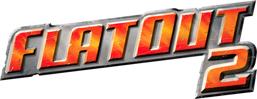
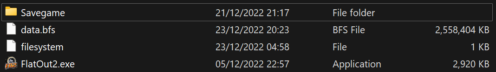
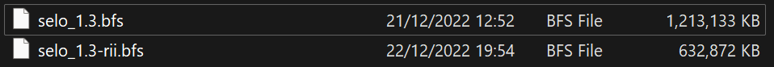
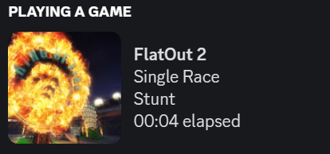

# FlatOut 2

!!! info

    - Platform: PC  
    - Release Date: 2004  

<figure markdown="span">
  { width="700" }
  <figcaption>Some of my mod code below is now part of the official game distribution on Steam.</figcaption>
</figure>

## FlatOut 2 Mod Loader

!!! about "FlatOut 2 Mod Loader"

    - Summary: A [Reloaded-II](https://reloaded-project.github.io/Reloaded-II/) based solution for loading mods.  
    - Release Date: 2022 [[Source Code]](https://github.com/Sewer56/FlatOut2.SDK).  
    - Features:  
        - Load mods from outside game folder.  
        - Load mods without modifying `patch` file in game folder.  
        - Log all files loaded by game.  
        - Improved load times (~2x for file data).  
        - Make game size smaller (optional).  
        - Added support for custom compressed (ZStandard) BFS archives.  

Cleaned up game folder with mod, faster loads, much smaller file size:  

File size of a game mod before, and after mod loader compression + packing enhancements:  

### Deduplication and ZStandard Support in bfstool

Forked [xNyaDev/bfstool][bfstool]; adding support for:

- ZStandard compression (custom).
- File alignment.
- File deduplication in BFS archives. 

## FlatOut SDK

!!! about "FlatOut SDK"

    - Summary: Library for modifying FlatOut from inside game process.  
    - Release Date: 2022 [[Source Code]](https://github.com/Sewer56/FlatOut2.SDK).  
    - Updated periodically as I update my mods.  
    
## Discord Rich Presence

!!! about "FlatOut2.Utils.RichPresence"

    - Summary: Adds Rich Presence support to FlatOut 2.  
    - Release Date: 2022 [[Source Code]](https://github.com/Sewer56/FlatOut2.Utils.RichPresence).  
    - Displays current stage, mode, multiplayer lobby, custom stages and cars.  
    - Supports Discord's Join and Invite Features.  

## Multiplayer Name Changer

!!! about "FlatOut2.Utils.MPNameChange"

    - Summary: Change your multiplayer name without making new singleplayer profile.  
    - Release Date: 2022 [[Source Code]](https://github.com/Sewer56/FlatOut2.Utils.MPNameChange).  
    - Allows you to names longer than game normally allows, up to 64 characters.  
    - Can update name by exiting and re-joining lobby, game restart not required.  

[bfstool]: https://github.com/Sewer56/bfstool