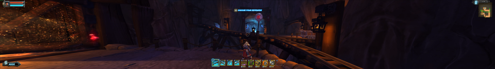

# Orcs Must Die 2

!!! info

    - Platform: PC
    - Release Date: 2012

<figure markdown="span">
  
  <figcaption>Preview at 64:9 (7680x1080)</figcaption>
</figure>

## omd2.basics

!!! about

    - Summary: A Reloaded-II mod for Orcs Must Die 2
    - Release Date: 2026 [[Source]](https://github.com/Sewer56/omd2.basics).
    - Resolution Override - Force any resolution (defaults to desktop resolution)
    - Window Dock Position - Position window at screen edges or center (top-left, bottom-center, etc.)
    - D3D9Ex Upgrade - Upgrades the game from D3D9 to D3D9Ex
    - Aspect Ratio Fix - Hor+ FOV scaling for ultrawide (21:9, 32:9, etc.)
    - Additional FOV Slider - Fine-tune field of view
    - VSync Override - Force VSync on/off (default: ON)
    - FPS Limit Override - Set a custom FPS limit (default: 0 = no limit, use VSync)
