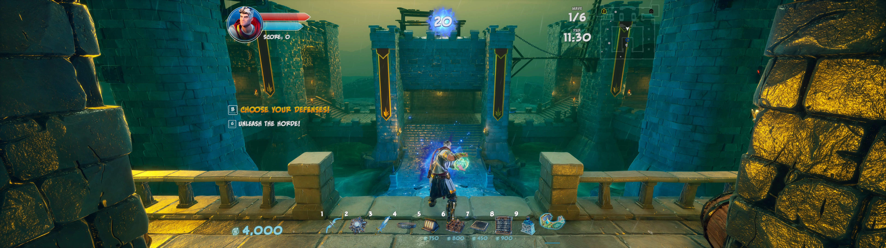

# Orcs Must Die 3

!!! info

    - Platform: PC
    - Release Date: 2020

## omd3.basics

!!! about

    - Summary: A Reloaded-II mod for Orcs Must Die 3 - FOV and aspect ratio fixes
    - Release Date: 2026 [[Source]](https://github.com/Sewer56/omd3.basics).
    - Aspect Ratio Fix - Hor+ FOV scaling for ultrawide (21:9, 32:9, etc.)
    - Additional FOV Slider - Fine-tune field of view
    - HUD Centering - Centers HUD to 16:9 width (customizable)

FOV behaves just like in 16:9. HUD is centered to 16:9 (exact width customizable).
