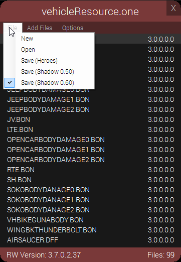

# Shadow The Hedgehog

!!! info

    - Platform: GameCube  
    - Release Date: 2005  

## Discord Rich Presence

!!! about "ShadowTheHedgehog.RPC"

    - Summary: Rich Presence... for a GameCube Game!  
    - Release Date: 2018 [[Original]](https://github.com/Sewer56/ShadowTheHedgehog-RPC), 2019 [[Current]](https://github.com/Sewer56/ShadowTheHedgehog.RPC.ReloadedII).  

Reading memory from an emulated GameCube game [that works with any emulator version] was an interesting challenge.  

## Archive Packer/Unpacker

!!! about "HeroesONE Reloaded"

    - Summary: Packer and Unpacker for Shadow .ONE Archives.  
    - Release Date: 2018 [[Source]](https://github.com/Sewer56/HeroesONE-Reloaded).  
    - Massive improvement over previously existing packer, [HeroesONE](https://github.com/sonicretro/HeroesONE).  
    - Uses fastest & most optimal compressor available, [made by yours truly](https://github.com/Sewer56/dlang-prs).  
    - Automatic Windows Explorer file associations [doubleclick `.one` file and it works].  
    - Caching for improved repacking speeds.  
    - and more...

## Sound Effect Packer & Unpacker

!!! about "PACTool"

    - Summary: Import and Export Sound Effects from Xbox version of the game.    
    - Release Date: 2018 [[Source]](https://github.com/Sewer56/PACTool).  

## Documenting Unused Assets

!!! about "Documenting Unused Assets"

    - Summary: Hacking game files and code to re-enable unused content within the game.  
    - A lot of my data mining work is [documented on TCRF](https://tcrf.net/Shadow_the_Hedgehog).  

<video loop autoplay>
  <source src="../videos/shadow-stages.mp4" type="video/mp4">
</video>

An unused level 'STG9900' present only on GameCube, accessed via hacking. 

## Various Character Mods

!!! about "Character Mods"

    - Summary: World's first character mods with custom animations.  
    - Release Date: 2017  
    - Most mods are archived under the [following GitHub repository](https://github.com/ShadowTheHedgehogHacking/CharacterMods).  
    - Did the reverse engineering work to make proper model blending & animation replacement possible.  

<video loop autoplay>
  <source src="../videos/shadow-model.mp4" type="video/mp4">
</video>

## Animation Archive Repacker

!!! about "ShadowMTPSharp"

    - Summary: Library for unpacking/repacking animation archives to enable editing animations.  
    - Release Date: 2017 [Original/Deprecated](https://github.com/Sewer56/ShadowMTP), 2019 [Current](https://github.com/Sewer56/ShadowMTPSharp)  
    - Reverse engineering work also done from scratch.  

<video loop autoplay>
  <source src="../videos/shadow-animation.mp4" type="video/mp4">
</video>

Using a modified idle animation.  