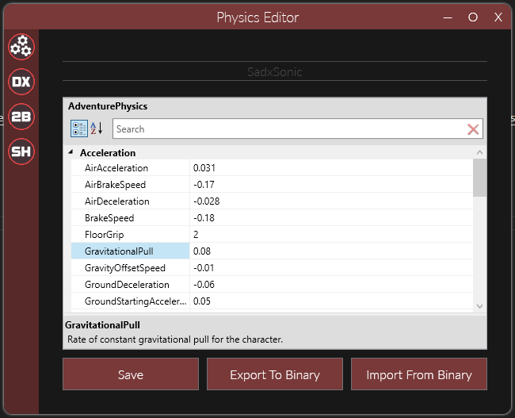
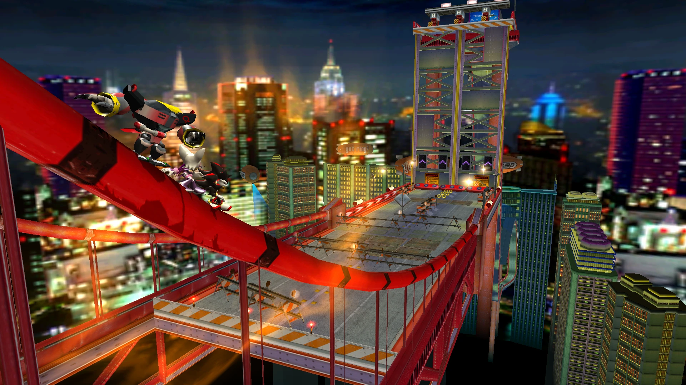
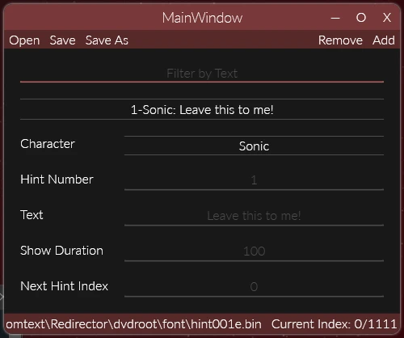
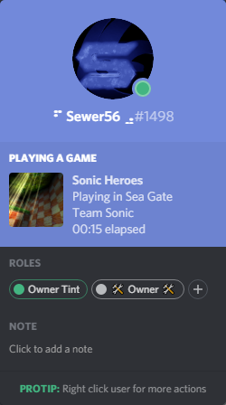
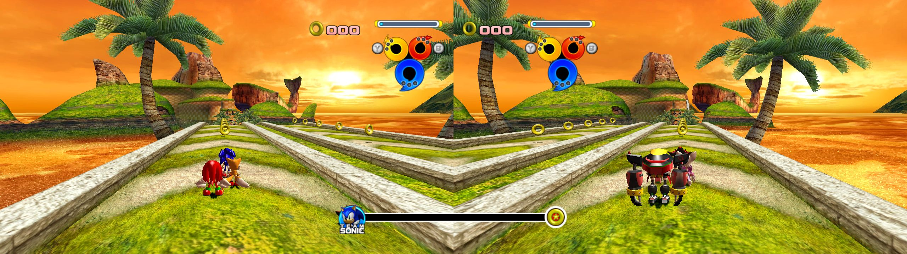
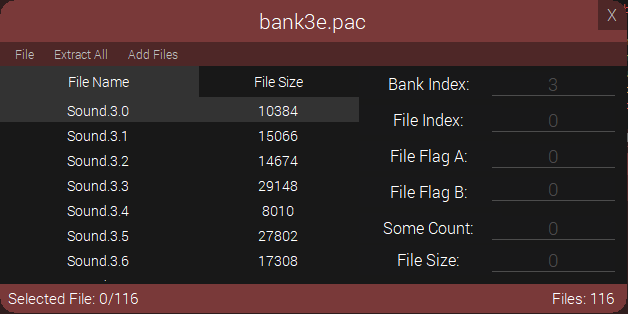
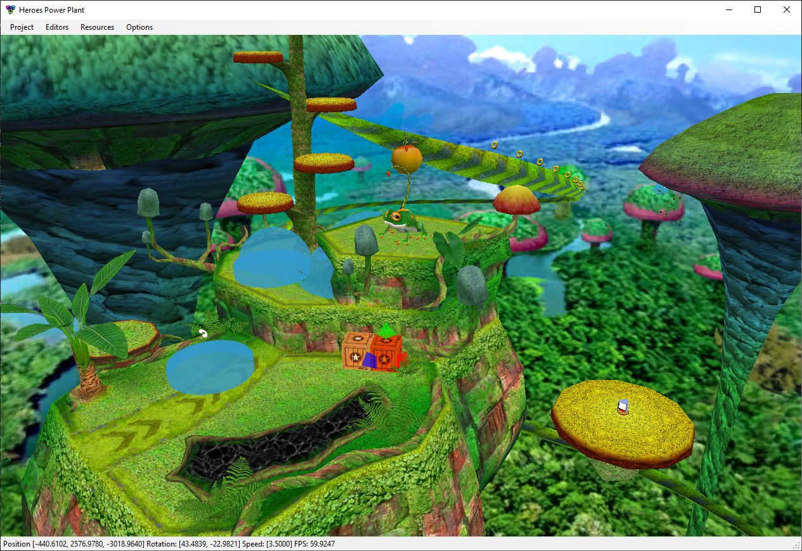
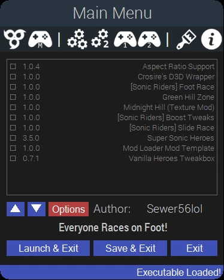

# Sonic Heroes


!!! info

    - Platform: PC  
    - Release Date: 2004  

## PS2 Beta Toolkit

!!! about "PS2 Beta Toolkit"

    - Summary: Scripts for working with PS2 Releases of Sonic Heroes.  
    - Release Date: 2020 [Original](https://github.com/Sewer56/HeroesPS2BetaToolkit)  
    - Used for documenting the Sep 28, 2003 prototype released on [Hidden Palace].
        - Which contains Debug symbols useful for modding 💜.
        - And was funded by me. (I donated 999 AUD to HiddenPalace who bought and dumped the prototype).

## ONE Archive Merger

!!! about "ONE Archive Redirector"

    - Summary: Allows you to merge .ONE archives ***at runtime***, allowing for mods to be better mixed.  
    - Release Date: 2020 [Original/Deprecated](https://github.com/Sewer56/Heroes.Utils.OneRedirector.ReloadedII), 2022 [Current](https://sewer56.dev/FileEmulationFramework/emulators/one-heroes.html)  
    - Imagine merging 2 zip files at runtime but with virtually 0 overhead. It's that sort of deal.  

## Physics Editor

!!! about "Adventure.Physics.Swap"

    - Summary: Fully Featured Physics Editor  
    - Release Date: 2019 [Source Code](https://github.com/Sewer56/Adventure.Physics.Swap.ReloadedII)  
    - Changes physics in real time, for testing.   
    - Also supports Sonic Adventure DX & 2.  



## Stage Injector

!!! about "Heroes.StageInjector"

    - Summary: Allows importing custom stages from external Reloaded mods without having to write any code.  
    - Release Date: 2019 [Source Code](https://github.com/Sewer56/Heroes.StageInjector.ReloadedII)  
    - Features:
        - Load custom stages.  
        - Allow overwriting spawn points for custom stages.  
        - Allow overwriting grindable rails for custom stages.  
        - Play 2P stages in 1P without crashing.  



Radical Highway in Sonic Heroes by [Shadowth117](https://github.com/Shadowth117).  

## Fast Boot

!!! about "Heroes Debug Boot"

    - Summary: Boot the game straight into a level or one of the debug menus.  
    - Release Date: 2019 [Source Code](https://github.com/Sewer56/Heroes.Utils.DebugBoot.ReloadedII)  

<video loop autoplay>
  <source src="../../videos/debug-boot.webm">
</video>

## Hint Editor

!!! about "Heroes.Hint.Editor"

    - Summary: Allows you to edit messages displayed by various triggers throughout the game.  
    - Release Date: 2019 [Source Code](https://github.com/Sewer56/Heroes.Hint.Editor)  
    - Originally created to display custom messages in [TAS videos](https://youtu.be/zzI2q_JelrM?t=43) without desyncing them.  



## Heroes RGB Mod

!!! about "Heroes.Colourizer"

    - Summary: Adds RGB lighting effects to various parts of the game.  
    - Release Date: 2019 [Source Code](https://github.com/Sewer56/Heroes.Colourizer.ReloadedII)  

<video loop autoplay>
  <source src="../../videos/heroes-colourizer.webm">
</video>

Colourizer with enabled RGB gates and jump balls.  

## Heroes SDK & Disassembly

!!! about "Heroes.SDK"

    - Summary: Library containing low level code to mod the game as well as read/write the game's file formats.  
    - Release Date: 2019 [Source Code](https://github.com/Heroes-Hacking-Central/Heroes.SDK)  
    - All other current non-deprecated mods on this list use this library under the hood.  
    - The level editor uses it too!  

```csharp
Camera.IsCameraEnabled = false; // Takes away camera control from the game.
if (State.IsInLevel()) 
{
    /* Do Stuff with Camera */
    ref var camera = ref Camera.Cameras[0];
    camera.MoveBy(new Vector3(1, 0, 0));
}
```

High level API like this, allows for easy access of various game internals.  

## Discord Rich Presence

!!! about "Discord Rich Presence"

    - Summary: Presents your current play status on Discord.  
    - Release Date: 2018 [Original/Deprecated](https://github.com/Sewer56/Heroes-RPC), 2019 [Current](https://github.com/Sewer56/SonicHeroes.Utils.DiscordRPC.ReloadedII)  
    - Features:  
        - Show your current activity on Discord.  
        - Supports multiplayer modes, including score tracking.  
        - Time elapsed syncs to stage timer.  



## Free Camera Mod

!!! about "About Free Camera"

    - Summary: Allows you to move your camera freely.  
    - Release Date: 2018 [Original/Deprecated](https://github.com/Sewer56/Heroes-Freecam), 2019 [Current](https://github.com/Sewer56/Heroes.Freecam.ReloadedII)  
    - Features:  
        - Freeze game world.  
        - Rotation on all 3 axis (including roll).  
        - Teleport player to camera.  
        - Toggle HUD visibility.  
        - No culling issues. Stuff away from player character will render.  

<video loop autoplay>
  <source src="../../videos/heroes-free-camera.mp4" type="video/mp4">
</video>

## Heroes Essentials

!!! about "About Heroes Essentials"

    - Summary: Set of modifications for running Sonic Heroes on Modern Machines.  
    - Release Date: 2018+  

### Heroes Graphics Essentials 
!!! about "Heroes Graphics Essentials"

    - Summary: Provides general essentials related to graphics and overall game configuration.  
    - Release Date: 2018 [Original/Deprecated](https://github.com/Sewer56/Heroes-Graphics-Essentials), 2019 [Current](https://github.com/Sewer56/Heroes.Graphics.Essentials.ReloadedII)  
    - Features:  
        - Add support for borderless and resizable windowed.  
        - Adds widescreen support for any aspect ratio.  
        - Instant stage load times (from 5 to 1 second in fullscreen mode).  
        - Remove framerate cap from 2P.  
        - Don't slow down game when window is unfocused.  
        - Remove subtitles & character voices.  
        - Fixes loading crashes at certain aspect ratios.  
        - and more...



Multiplayer with custom aspect ratio.  

### Modern Controller Support
!!! about "Heroes Controller Hook"

    - Summary: Adds support for modern Game Controllers to Sonic Heroes.  
    - Release Date: 2018 [Original/Deprecated](https://github.com/Sewer56/Heroes-Controller-Hook), 2019 [Current](https://github.com/Sewer56/Heroes.Controller.Hook.ReloadedII.git)  
    - Adds support for remapping controllers.  
    - Adds support for controller hotplugging.  
    - Adds support for XInput (360) based controllers.  
    - Allows for deadzone adjustment, inverting axis etc.  
    - Restores ability to rotate camera using triggers missing from PC version.  
    - Restores ability to control 3P/4P, used in some debug functions.
    - Provides an API for mods to inject their own inputs.  
    - and much more...


### Cold Boot Time Fix
!!! about "CRI FileSystem Hook" 
    - Summary: Fixes long game start times after a PC reboot or long idle period.  
    - Release Date: 2018 [Heroes Only/Deprecated](https://github.com/Sewer56/Heroes-CRI-FileTable-Hook), 2019 [All CRI Games/Current](https://github.com/Sewer56/CriFsHook.ReloadedII)  
    - Cold boot start improved from ~10 seconds to 1 second.  

### Bypass File Size Limits
!!! about "TONER" 
    - Summary: Allows you to bypass hardcoded limits and load `.one` archives with any file size.  
    - Release Date: 2018 [Original/Deprecated](https://github.com/Sewer56/TONER), 2019 [Current](https://github.com/Sewer56/TONERR.ReloadedII)  
    - The developers hardcoded file size limits for each file type in archives.  
    - This mod allows you to circumvent that.  

### Draw Distance Unlimiter
!!! about "Draw Distance Unlimiter" 
    - Summary: Allows you to extend object render distance by a fixed scale.  
    - Release Date: 2020 [Source Code](https://github.com/Sewer56/Heroes.Utils.UnlimitedObjectDrawDistance.ReloadedII.git)  

## Sound Effect Packer & Unpacker

!!! about "PACTool"

    - Summary: Import and Export Sound Effects from PC & Xbox versions of the game.    
    - Release Date: 2018 [[Source]](https://github.com/Sewer56/PACTool).  



## Level Editor

!!! about "Heroes Power Plant"

    - Summary: A Level Editor for Sonic Heroes and Shadow the Hedgehog.  
    - Collaboration between [Igor Seabra](https://github.com/igorseabra4), [dreamsyntax](https://github.com/dreamsyntax) and myself.  
    - Cleaned up some code, implemented camera system.  
    - Helped with a lot of file format reverse engineering on Sonic Heroes side.  
    - Features Culling, Collision, Object Layout, Camera, Spawn Position, Spline, Particle and Texture Animation editors.  



## Collision File Generator

!!! about "Collision File Generator"

    - Summary: Generates Collision files for Custom Stages.  
    - Release Date: 2017 [[Source Code]](https://github.com/Sewer56/Heroes-Collision-Library).  
    - Converts Wavefront `.obj` files into collision `.cl` files.  
    - Fastest collision generator, performs conversion including Quadtree generation in under a second on a 4790k.  

## All-In-One Mod: Heroes Tweakbox

!!! about "Heroes Tweakbox"

    - Summary: All in one mod. Celebration of 2017's community achievements. 
    - Release Date: 2017 [[Source Code]](https://github.com/Sewer56/Heroes-Mod-Loader-Archive/tree/master/Heroes-Tweakbox).  
    - Collaboration with [Igor Seabra](https://github.com/igorseabra4), [YouTube Release Trailer](https://www.youtube.com/watch?v=4O3IDXzU5L8).  
    - Features:  
        - World's first custom level.  
        - World's first hub world hack (using custom collision detection code).  
        - Experimental .NET Framework based Mod Loader.  
        - Advanced widescreen hack, FOV Slider.  
        - Custom In-Game Debug Tools.  
        - and more... all in 30000+ lines of code.  
    - Status: Deprecated in favour of Reloaded, features re-released as separate modular mods.  

<video loop autoplay>
  <source src="../../videos/tweakbox-features.mp4" type="video/mp4">
</video>



[Hidden Palace]: https://hiddenpalace.org/News/New_Years_2024_-_Sonic_Heroes