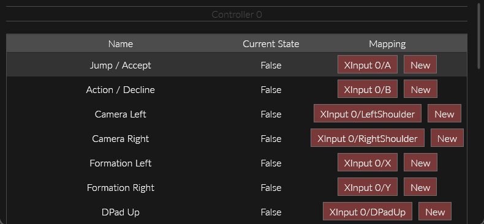
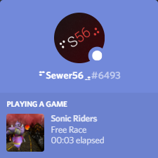
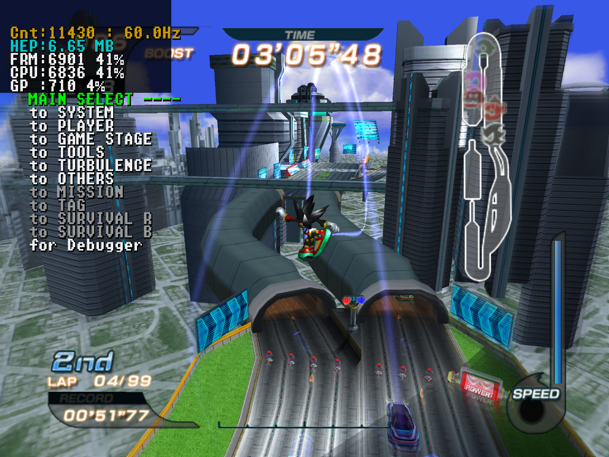
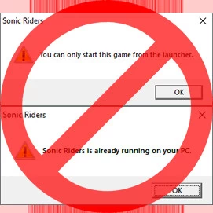

!!! about

    - Platform: PC  
    - Release Date: 2006  

## All in One Mod: Riders Tweakbox

!!! about "Riders Tweakbox"

    - Summary: An all in one mod that does *literally* just about everything AND MORE.  
    - Status: Active Development (Slow)  
    - Features:
        - Too many to list here. [See wiki](https://sewer56.dev/Riders.Tweakbox/features/). Highlights below.  
        - ***Online Multiplayer***: Fully featured with server browser, spectator, no port forward needed etc.  
        - Widescreen Support.  
        - Fixed Frame Pacing.  
        - Discord Rich Presence Support.  
        - Boot to Menu/Race.  
        - Inject Custom Music.  
        - Custom Texture Injection/Replacement incl. Animated Textures.  
        - Massively Improved Load & Startup Times.  
        - Massively Improved Performance (>5x !!).  
        - Lots of debug tools & file format editors.  
        - and many more... 

Online Multiplayer:  


Gear Editors:  


## Riders Hacking Tools (& Wiki)

!!! about "Riders Hacking Wiki" 

    - Summary: A wiki for all knowledge and tools, by yours truly.  
    - Release Date: 2021 [Website](https://sewer56.dev/SonicRiders.Index/)  
    - Features:  
        - All game modding tools are hosted on this wiki.  
        - All modding knowledge is hosted on this wiki.  
        - Contains listing of all game files and their corresponding file formats.  
        - Contains listing of all game archives and files inside with corresponding names and formats.  
        - Contains listing of all tools.  

Below are information on various tools present in the wiki/repo.  

!!! info "IndexTool" 

    - Summary: Tool that recognises any known file format in the game and generates documentation for wiki.  
    - Tells you which tools to use for this file format.  
    - Very useful considering game has no file names inside archives.  

!!! info "RidersArchiveTool" 

    - Summary: Extracts files from the game's archive format.  
    - Features fastest compressor/decompressor by yours truly.  
    - Used by just about every Sonic Riders mod.  
  
!!! info "RidersTextureArchiveTool" 

    - Summary: Extracts textures from texture archives.  
    - Used in mods like [SRDX](https://www.exgearlabs.org) and [SRTE](https://www.sonicriders.org) to add new character textures.  

!!! info "MenuLayoutToJson" 

    - Summary: Converts menu animations and item placement to human readable JSON, and back.  
    - Used in mods like [SRDX](https://www.exgearlabs.org) and [SRTE](https://www.sonicriders.org) to add new characters to menu.  

!!! info "GcaxDatInjector" 

    - Summary: Can be used to edit sound effects in .DAT files in the GameCube version of Riders.

## Riders SDK & Disassembly

!!! about "Sewer56.SonicRiders"

    - Summary: Library containing low level code to mod the game as well as read/write the game's file formats.  
    - Release Date: 2020 [Source Code](https://github.com/Sewer56/Sewer56.SonicRiders)  
    - All Riders PC mods and tools use this library under the hood.  

```csharp
_blockInputsHook = Functions.GetInputs.Hook(BlockGameInputsIfEnabled).Activate();

private int BlockGameInputsIfEnabled()
{
	// Skips game controller input obtain function if condition is true.
    if (!_isEnabled)
    	return _blockInputsHook.OriginalFunction();

    return 0;
}
```

High level API like this, allows for easy access of various game internals.  

## Modern Controller Support

!!! about "Riders Controller Hook"

    - Summary: Adds support for modern Game Controllers to Sonic Riders.  
    - Release Date: 2020 [Source](https://github.com/Sewer56/Riders.Controller.Hook)  
    - Adds support for remapping controllers.  
    - Adds support for controller hotplugging.  
    - Adds support for XInput (360) based controllers.  
    - Allows for deadzone adjustment, inverting axis etc.  
    - Restores ability to drift using triggers missing from PC version.  
    - Restores ability to control 3P/4P [missing from PC port].  
    - Provides an API for mods to inject their own inputs.  
    - and much more...



## Discord Rich Presence

!!! about "Rich Presence" 

    - Summary: Presents your current play status on Discord.  
    - Release Date: 2020 [Source](https://github.com/Sewer56/Riders.Utils.DiscordRPC)  
    - Status: Deprecated. Superseded by Tweakbox.  
    - Features:  
        - Show your current activity on Discord.  
        - Supports multiplayer modes, including score tracking.  
        - Time elapsed syncs to stage timer.  



## Trick Text Translator

!!! about "Trick Text Translator"

    - Summary: Creates custom trick names by translating coordinates of trick font sprites to ASCII and back.   
    - Release Date: Tool unreleased, source release only.  
    - Source Code: [[Available in Riders SDK]](https://github.com/Sewer56/Sewer56.SonicRiders/tree/master/Sewer56.SonicRiders/Parser/TrickSprite).  


## Prototype 0.931 Restoration

!!! about "Prototype 0.931 Restoration"

    - Summary: Made debug executable of beta version work with files from retail game.  
    - Release Date: 2020 [[Release Thread, Learn More Here]](https://forums.sonicretro.org/index.php?threads/proto-ps2-sonic-riders-0-931-07-oct-2005-restoration.39828/).  
    - Creating this was a complicated process involving reverse engineering multiple archive formats and hacking around crashes in game code.  
    - Features:  
        - Partial Symbols (Function, Variable Names).  
        - Re-enabled a lot of debug functionality disabled in this build.  
        - A lot of unique bugs, glitches and other minor code features.  



!!! info "Riders PS2 Tools"

    - Summary: Tools that were used to create the prototype restoration.  
    - Release Date: 2020 [[Source Code]](https://github.com/Sewer56/RidersPS2Tools).  
    - A lot of code from this repo was moved to [Riders SDK](https://github.com/Sewer56/Sewer56.SonicRiders).  

## Startup Restriction Killer

!!! about "Startup Restriction Killer"

    - Summary: Allows you to launch game from outside launcher, and multiple instances too.  
    - Release Date: 2019 [[Source Code]](https://github.com/Sewer56/Riders.RestrictionKill.ReloadedII).  
    - Status: Deprecated. Superseded by Tweakbox.  

