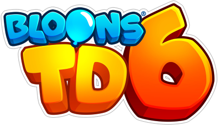
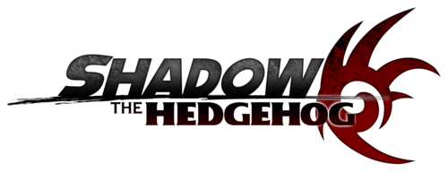
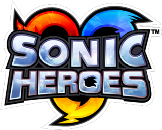
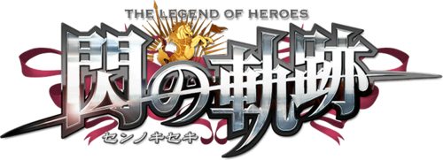
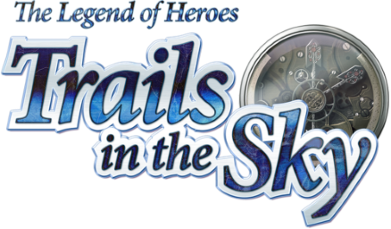
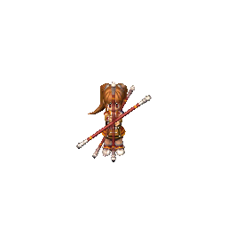

# Games Index

This page lists the various *original* game related libraries, modifications, reverse engineering works and tools I've created, i.e. projects where I am the main author [unless specified].  

!!! info

    This page acts as a general hub that links towards individual projects I've made for each game.  
    A summarised shortlist of my work is listed in `About` box for each game.  

    All trademarks, logos and brand names are the property of their respective owners.  

## Common/General

!!! about

    - Contains anything generic that is game related, but is generic and applies multiple games.  

[Dedicated Page](./games/common.md).  

## Bloons TD 6

!!! about

    - PC Game, 2018.  
    - Run multiple instances of the game at the same time.  
    - Mod that implements a custom game mode 'Salaried Monkeys'.  
    - Contributions to community modding libraries.  

[Dedicated Game Page](./games/btd6.md).  

## FlatOut 2

!!! about

    - PC Game, 2006.  
    - Change multiplayer without new savefile.  
    - Discord Rich Presence support.  
    - Loading mods without editing game folder.  
    - Logging all files loaded by game.  
    - Improved load times (~2x for file data).  
    - Added support for custom compressed (ZStandard) BFS archives.  
    - and more...  

[Dedicated Game Page](./games/flatout-2.md).  

## Persona 3/4/5 PC

!!! about

    - PC Games, 2021/2022.  
    - Created [Persona Essentials](https://github.com/Sewer56/p5rpc.modloader), the [Reloaded-II](https://reloaded-project.github.io/Reloaded-II/) based mod loading solution for Persona Ports.  
        - Supports replacing archives without repacking archives.  (CRI API Hook)
        - Supports replacing music archives inside archives without repacking.  (File Emulation)
        - Supports automatic merging of `.tbl` binary files to combine mods.  
        - Skip game intro/fast boot.  
        - Toggle pause on focus loss.  
    - A lot of contributions to community created mods.  

## Shadow The Hedgehog

!!! about

    - GameCube Game, 2005.
    - Archive Packing Tools (General, Sound, Animation).  
    - Discord (Rich Presence) Support.  
    - Documenting Unused Assets.
    - Various Character Mods.  
    - General File Reversing Work. (Contributions to level editor etc.)  

[Dedicated Game Page](./games/shadow-the-hedgehog.md).  

## Sonic Heroes

!!! about

    - PC Game, 2004.  
    - Fixing Load Times & Startup Times.  
    - Archive Packing Tools (General, Sound, Text).  
    - Fully Featured Modding API.  
    - Stage Editor.  
    - Widescreen Support.  
    - Modern Controller Support.  
    - Boot To Stage/Debug.  
    - Fixing Crashes & File Size Limits.  
    - Discord (Rich Presence) Support.  
    - Free Camera.  
    - Reverse Engineering/Disassembly Work.  
    - and more...

[Dedicated Game Page](./games/sonic-heroes.md).  

## Sonic Riders

!!! about

    - PC Game, 2006.  
    - ***Online Multiplayer***: Fully featured with server browser, spectator, no port forward needed etc.  
    - Archive Packing Tools (General, Sound, Texture, Text etc.).    
    - Fully Featured Modding API.  
    - Widescreen Support.  
    - Fixed Frame Pacing. No more microstutter.  
    - Discord Rich Presence Support.  
    - Boot to Menu/Race.  
    - Inject Custom Music.  
    - Custom texture injection/replacement incl. Animated Textures.  
    - Massively improved load & startup times.  
    - Massively improved performance (>5x !!).  
    - Lots of debug tools & file format editors.  
    - Fully restored unbootable prototype build of the game.  
    - Launch game outside launcher & multiple instances.  
    - and many more things...

[Dedicated Game Page](./games/sonic-riders.md).  

## Sonic 3 Angel Island Revisited

<video loop autoplay>
  <source src="./videos/s3-air.webm">
</video>

!!! about

    - PC Game, 2019.  
    - Improved frame pacing massively on Windows [(Tweet)](https://twitter.com/TheSewer56/status/1452104947420569605?s=20), [(Source Code)](https://github.com/Sewer56/sonic3air).  
    - People will no longer have to suffer microstutters 😀.

This is one of the games where my changes were merged and are now part of the official game.  

Everyone can enjoy them, even with an unmodded client 💜.  

## Tokyo Xanadu eX+

!!! about

    - PC Game, 2017.  
    - Reverse Engineered .BRA archive format and wrote unpacker [(Source)](https://github.com/Sewer56/Xanadu-BRA-Decompress), [Release Thread](https://heroesoflegend.org/forums/viewtopic.php?f=38&p=3416&sid=5f95ddd8bdb5aaff5d48bfb67c91aced).  
        - Wrote this program on game's release day.  
        - With this you can extract data for porting to other games.  

## Trails of Cold Steel

!!! about

    - PC Game, 2017.  
    - Wrote unpacker & (de)compressor for .PKG Archives [(Source)](https://github.com/Sewer56/Sen-no-Kiseki-PKG-Sharp).  
    - General reverse engineering of binary `.tbl` files.  [Source](https://github.com/Sewer56/tocs-stuff)
    - This research allowed for creation of mods such as [HD Texture Pack](https://steamcommunity.com/app/538680/discussions/0/2579854400755735260/) and character replacements.  

## Trails in The Sky

!!! about

    - PC Game, 2014.  
    - Reverse Engineered & Wrote Converter for Textures and Sprite Animations [(Source)](https://github.com/Sewer56/Sen-no-Kiseki-PKG-Sharp).  
    - This applies to all games in series (i.e. SC [2016] and 3rd [2017] too).  

Converter can both extract and produce new sprites that are 1:1 with the original game.  