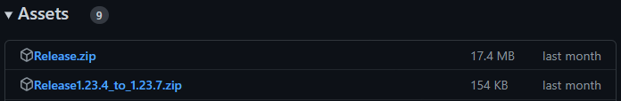
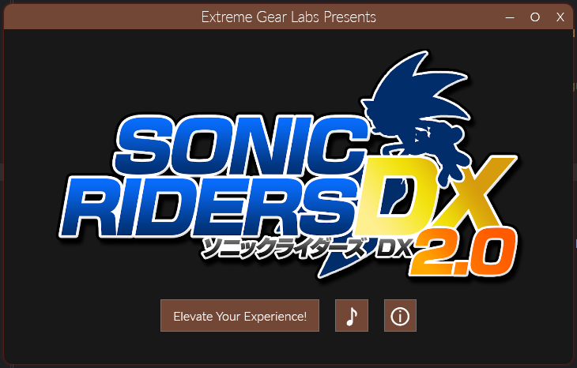
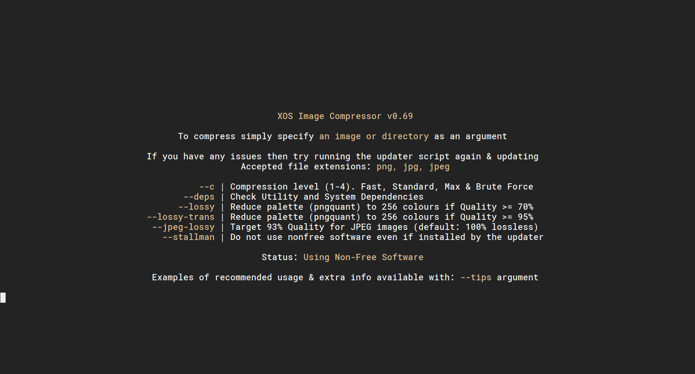
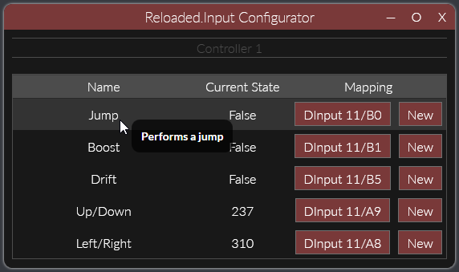
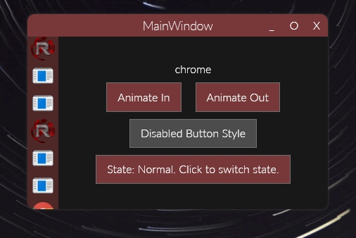
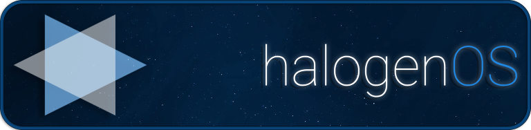
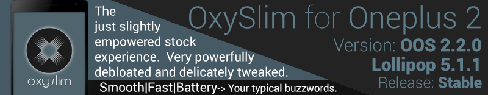
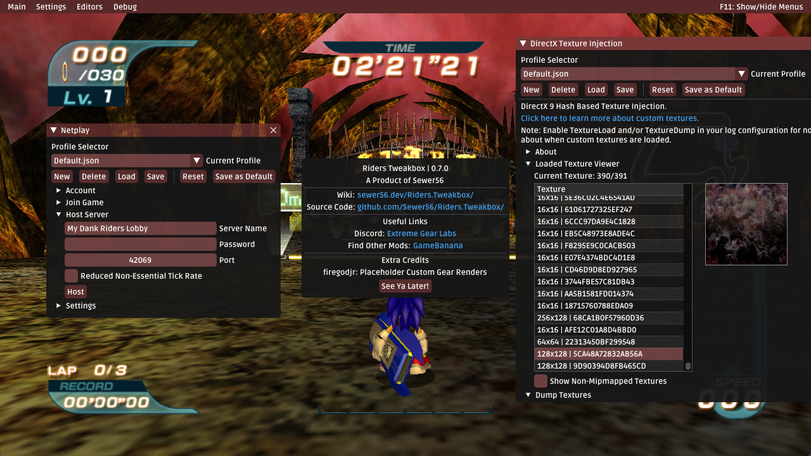
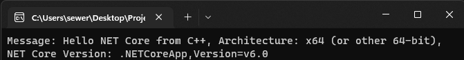
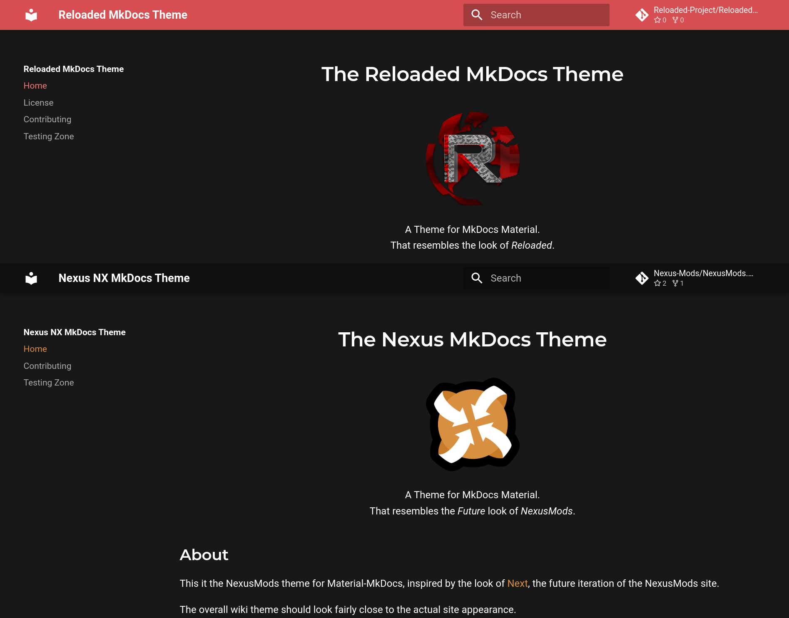

# Libraries, Tools & Software

This page lists the various *original* released general purpose libraries & tools I've created,
i.e. projects where I am the main author. Does not include contributions to external projects.

This list is mostly complete, but I cannot guarantee every project is listed between here and
the other page.

Many of the projects here I still actively maintain, hence I don't create projects as fast as I
used to due to maintenance overhead.

!!! info "This page contains only general purpose projects."

    Any game related library/tool will be listed under the [Games section](./index-games.md).  

## Category Links

- [Compression & Archiving](#compression-archiving)
- [General Purpose](#general-purpose-libraries)
- [Android ROMs & Friends](#android-roms-friends)
- [Code Injection / Game Hacking](#code-injection-game-hacking)
- [Miscellaneous](#miscellaneous)

Items within each category are shown in roughly chronological order.  

## Compression & Archiving

### [Rust] LZMA-SDK Bindings

!!! about "About `lzma-sdk-sys`"

    - Summary: Rust Bindings for LZMA-SDK (7-zip), exposing the LZMA encoder/decoder.  
    - Release Date: 2024, [Source](https://github.com/Sewer56/lzma-sdk-sys)  
    - Used in the successor of [Nexus .nx Archive Format](#nexus-nx-archive-format) for high compression mode for file downloads.  
    - Supports hand crafted assembly LZMA decode routines for maximum performance.  
    - Works on all platforms supported by 7z (and more).  
    - LZMA-SDK is usually quite hard to compile, especially across platforms.  
        - This library makes it very easy to compile and consume the decoder/encoder from a Rust environment.  

### [C#] Nexus (.nx) Archive Format

!!! about

    - Summary: High Performance Archive Format; bottlenecked by RAM.  
    - Release Date: 2023, [Source](https://nexus-mods.github.io/NexusMods.Archives.Nx/)  
    - Semi-SOLID archive format based on chunked ZStandard files.  
    - Archive sizes halfway between `.zip` and `.7z` ultra; with >10GB/s extraction speed that bottlenecks any NVMe.  
        - On a 2023 mid-range PC.  
    - Used in the [Nexus Mods App](https://github.com/Nexus-Mods/NexusMods.App).  
    - Capable of deduplicating files at near zero cost, repacks using data in existing archives and more.  
    - Open source, under GPLv3.  
    - Archive format entirely, designed, documented, written and implemented entirely by me.  
        - Written at work/on company hours.  

Successor currently in development during my own time.

### [C#] Structured Binary Diff Library

!!! about

    - Summary: Creates diffs of binary data with known structure.  
    - Release Date: 2022, [Source](https://github.com/Sewer56/Sewer56.StructuredDiff)  
    - Uses SIMD Intrinsics, achieving ~16GB/s single thread on my 2014 i7-4790k machine.  
    - Used to merge e.g. Item placement layouts in games, arrays of item parameters, etc. across multiple mods. 
    - [Learn More](https://github.com/Sewer56/Sewer56.StructuredDiff)  

### [C#] Update: A Self-Update Library

!!! about "Sewer56.Update"

    - Summary: Lightweight library that adds update support to your applications.  
    - Release Date: 2021, [Source](https://github.com/Sewer56/Update)  
    - Can be used for more than just main application, e.g. plugins.  
    - Supports delta compression using [Delta Patch Generator](#delta-patch-generator) under the hood.  
    - Supports full Semantic Versioning.  
    - Can clean up unused files from application folder after updates.  



Example: [Reloaded-II](https://reloaded-project.github.io/Reloaded-II/) update shipped using delta compression. 

### [C#] Sewer's Riders Patcher

!!! about "Sewer56.Patcher.Riders"

    - Summary: Custom patcher for game ROM files; to replace xdelta3.  
    - Release Date: 2021, [Source](https://github.com/Sewer56/Sewer56.Patcher.Riders)  
    - Originally made for `Sonic Riders: Regravitified`, in 2021.  
    - Uses an [optimized port of VCDiff](https://github.com/SnowflakePowered/vcdiff/pull/6) that I personally contributed towards.  
        - Smaller downloads than xdelta3, with faster patching.  
    - Supports the `NKit` format.  
    - Supports all region release & versions of the games, via chaining patch files.  
    - Has Cross-Platform CLI version.  
    - Easy to extend to add support for additional games.  
    - Patches 2GiB ISO in ~3 seconds on typical machine in 2021.  
    - Can play `.xm` music files during installs like good old keygen tools for style.  



### [C#] Delta Patch Generator

!!! about "Sewer56.DeltaPatchGenerator"

    - Summary: Creates patches that transform one version of a folder into another version, with delta compression.  
    - Release Date: 2021, [Source](https://github.com/Sewer56/Sewer56.DeltaPatchGenerator)  
    - Uses optimised port of VCDiff as base algorithm, with my own performance improvements.  
    - Only data that has changed within the files is stored, and any new files.  
    - This means download sizes are very small!  

### [C#] Dolphin Image Optimizer

!!! about "DolphinImageOptimizer"

    - Summary: Batch converter of textures to use with Dolphin Emulator (or any PC Games).  
    - Release Date: 2021, [Source](https://github.com/Sewer56/NumberUtilities)  
    - Automatically converts a source folder of PNG textures to GPU optimised DDS files.  
    - Can create dummy textures for fully transparent textures.  
    - Automatically scales images based on target resolution e.g. 1440p, 4K.  
        - This way you can make multiple 'versions' of your texture packs.  
        - The resulting output uses less RAM, space and downloads faster.  

```
DolphinImageOptimizer 1.0.0
Created by Sewer56, licensed under GNU LGPL V3

  --source             Required. The folder to optimize.

  --target             Required. (Default: P960) Target resolution to optimize
                       image size to. Set to first option greater than desired
                       screen resolution. Valid values: P960, P1920, P3840

  --optimization       (Default: Medium) PNG Optimization Level. Use Maximum if
                       releasing as PNG, Medium for testing. This is auto set to
                       Minimal when Publishing as DDS. Valid values: Maximum,
                       Medium, Minimum

  --publish            (Default: None) Converts textures to DDS and deletes
                       original. Recommended BC7 for Dolphin. DXTAuto uses 
                       DXT1 when no transparency, DXT5 when transparency. 
                       If you know better, use PublishAdvanced instead. 
                       Valid values: None, DXT1, DXT5, DXTAuto, R8G8B8A8, BC7

  --publishadvanced    Custom format to pass to TexConv. e.g. BC5_UNORM
```

### [Bash] XOS Image Compressor

!!! about

    - Summary: Bash script for efficient batch compression of images.  
    - Release Date: 2016, 2017, [Source Code](https://github.com/Sewer56/XOS-Image-Compressor).  



## General Purpose Libraries

### [Rust] Lightweight Memory Map

!!! about "lightweight-memory-map"

    - Summary: Zero overhead memory mapping for common platforms in Rust.  
    - Release Date: 2024, [Source Code](https://github.com/Sewer56/lightweight-mmap).  
    - Supports POSIX based systems (Linux, BSD, macOS etc.) and Windows.  
    - Supports reading of files, and writing to preallocated files.  
    - Supports mapping to unaligned file offsets.  
    - Supports zero sized mappings.  
    - Can map any offset + length.  
    - Memory advice hints to say 'this data will be accessed soon' etc.  
    - Saves around 3-8KB compared to Rust's `std`, calls straight to OS with zero overhead.  

### [Rust] Safe allocator_api library

!!! about "safe-allocator-api"

    - Summary: Safe wrapper around the nightly `allocator_api` feature for custom allocators.  
    - Release Date: 2024, [Source Code](https://github.com/Sewer56/safe-allocator-api).  
    - Automatically disposes raw allocations when they go out of scope.  
    - This is ***useful for safely making aligned*** memory allocations.  
    - Supports thread-safe allocators, growing, shrinking and zeroing.  

### [Rust] Fast Structure Reader & Writer w/ Endian Support

!!! about "endian-writer-rs"

    - Summary: Efficient reading and writing of structures to raw memory in a given endian.  
    - Release Date: 2024, [Source Code](https://github.com/Sewer56/endian-writer-rs).  
    - Utilities for unsafe reading and writing of raw structures from/to memory.  
    - Endian agnostic, effortlessly write code that works on either endian.  
        - Perfect for reading/writing game file formats across platforms.  
    - Generates optimal machine code. Unrolling friendly.  
    - Can auto convert structures at read/write time for different implementation in file and memory.  
    - Easy to use. [Even with automated proc-macro.](https://github.com/Sewer56/endian-writer-derive)
    - Unsafe for max speed.  

### Advanced GitHub Action Workflows

!!! about "Reloaded3 Devops Actions"

    - Summary: GitHub Actions for CI/CD of my projects. Mostly centered around Rust.  
    - [mkdocs]: Deploy latest version of MkDocs Material to GitHub Pages.  
    - [changelog]: Auto generates a changelog based on commit history.  
    - [publish]: Streamlines publishing Rust, C# and other artifacts.  
    - [rust-test-in-wine]: Runs Rust unit tests inside Wine on Linux.  
    - [rust-cbindgen]: Generates C/C++ bindings for Rust during CI/CD.  
    - [rust-c-library-to-dotnet]: Generates C# bindings for Rust during CI/CD.  
    - [rust-test-and-coverage]: Runs unit tests for Rust projects, including coverage, cross-compilation, custom toolchain, build result caching and more.  
    - [rust-lightweight-binary]: Builds and test Rust binaries; with advanced features like PGO, Cross Compilation, Self-Built `std` etc.  
    

### [Rust] Nanokit: Code Size / Perf Optimization

!!! about "nanokit"

    - Summary: Miscellaneous reusable utility methods that improve code size and performance.  
    - Release Date: 2024, [Source](https://github.com/Sewer56/nanokit-rs)  
    - Has various utility methods such as:
        - Fast String Concatenation
        - Math Operations without Panicking
        - Unsafe Implementations of Some Operations
    - Intended to use in tiny programs and mods to shave off a few kilobytes.  

### [Rust] Minimal Portable Executable (EXE) Parser

!!! about "min-pe-parser"

    - Summary: Optimized routines for parsing certain parts of the PE Header found in EXE files.  
    - Release Date: 2024, [Source](https://github.com/Sewer56/min-pe-parser)  
    - Reads only the various parts of PE header useful for modding games; skipping all other parts.  
        - Example Usage includes:
            - Calling DLL exports.  
            - Detecting Steam DRM (`.bind` section, necessary for Mod Loaders).  
            - Finding available DLL names to drop in game folder.  
    - Made because most PE parsers go over the whole file, making them slow, bloated on code size and overkill.  
        - This one has optimized routines for getting only the data you want and nothing else.  
    - Supports parsing already mapped files (i.e. DLL/EXE files already loaded into memory).  

### [Rust] Derive All Values Macro

!!! about "derive-enum-all-values"

    - Summary: A simple procedural macro to export a field with all members of an enum.
    - Release Date: 2023, [Source](https://github.com/Sewer56/derive-enum-all-values)  
    - My first proc macro, created because one didn't exist before.  
    - Useful for code optimisation and code cleanliness, since compiler will know all values ahead of time.  

### [Rust] Advanced Project Templates

!!! about "reloaded-templates-rust"

    - Summary: Project templates for cross-platform development with Rust, fully featured.  
    - Release Date: 2023, [Source](https://github.com/Reloaded-Project/reloaded-templates-rust)  
    - Standardized README, Project Layout, Guidelines, Issue Templates.  
    - Support for advanced features like Profile Guided Optimization (PGO), Code Coverage, LTO, no-std etc.  
    - Integration for VSCode + rust-analyzer.  
    - Support for exports including C & C#.  
    - CI with Cross platform testing, including WINE on Linux.  
        - Successfully identified, reported and patched 2 WINE bugs so far (in 2023) with this!!  

### [C#] Controller Support for WPF

!!! about "Sewer56.UI.Controller"

    - Summary: Adds controller support for XInput & DInput controllers to WPF applications.  
    - Release Date: 2022, [Source](https://github.com/Sewer56/Sewer56.UI.Controller)  
    - Zero Allocation.  

<video loop autoplay>
  <source src="../videos/wpf-controller.mp4" type="video/mp4">
</video>

[Reloaded-II](https://reloaded-project.github.io/Reloaded-II/) operated using an Xbox Controller.

### [C#] BitStream

!!! about "Sewer56.BitStream"

    - Summary: Fastest .NET Bitstream Library, Zero Allocation, No Virtual Function Calls  
    - Release Date: 2021, [Source](https://github.com/Sewer56/Sewer56.BitStream)  

### [C#] Number Utilities

!!! about "Sewer56.NumberUtilities"

    - Summary: Low level math extensions. e.g. Generic math, zero overhead lossy number compression etc.  
    - Release Date: 2020, [Source](https://github.com/Sewer56/NumberUtilities)  
    - Partially superseded by newer .NET Runtime features (e.g. Static Abstracts in Interfaces)  

### .NET Core Install Checker

!!! about "NetCoreInstallChecker"

    - Summary: Library to detect missing .NET (core) installations & (optionally) installs the runtime.  
    - Release Date: 2020, [Source](https://github.com/Sewer56/NetCoreInstallChecker)  

```csharp
// runtimeConfigPath: Path to runtimeconfig.json
var finder    = new FrameworkFinder(is64Bit);
var resolver  = new DependencyResolver(finder);
var result    = resolver.Resolve(RuntimeOptions.FromFile(runtimeConfigPath));

// Check if dependencies are missing.
if (!result.Available) 
{
    // Do something with missing dependencies.
    // For example:
    foreach (var dependency in result.MissingDependencies)
    {
        var downloader = new FrameworkDownloader(dependency.NuGetVersion, dependency.FrameworkName);
        Console.WriteLine($"Framework {dependency.Name} required to run this application is missing.");
        Console.WriteLine($"You can download it using the following URL {await downloader.GetDownloadUrlAsync(Architecture.x86)}");
    }
}
```

### [C#] Network Messaging Library

!!! about "Reloaded.Messaging"

    - Summary: Near zero overhead library for packing, unpacking and handling messages sent over network.  
    - Release Date: 2019, [Source](https://github.com/Reloaded-Project/Reloaded.Messaging)  
    - Throughput of 10+ Million messages per second (unpack + pack) on a 2014 4790k based machine.  
    - Provides integration for popular serializers, such as `MessagePack` & `System.Text.Json`.  
    - Optimised down to assembly/JIT level. Allocation free.  


Among other uses, this library is used in [Reloaded-II](https://reloaded-project.github.io/Reloaded-II/)
to communicate with mod loader and perform actions like loading and unloading game modifications at runtime.  

### [C#] Controller Input Library

!!! about "Reloaded.Input"

    - Summary: Library for managing USB game controllers that wraps around DInput and XInput.  
    - Release Date: 2020, [Source](https://github.com/Sewer56/Reloaded.Input)  
    - Supports Remapping, Hotplugging, Configurator and many other essential features.  
    - Zero allocation.  



Screenshot of default configurator application (embeddable in your program) with sample controller bindings.

### [C#, WPF] Reloaded Theme

!!! about

    - Summary: Custom WPF theme/style, for [Reloaded-II](https://reloaded-project.github.io/Reloaded-II/).  
    - Release Date: 2019, [Source](https://github.com/Sewer56/Reloaded.WPF)



Includes styles for almost every control in WPF and fits in under 500kB, including space taken by custom font. Supports extra theming, animated window borders, custom controls, animations and more.

## Android ROMs & Friends

### HalogenOS: Art

!!! about

    - Summary: Artwork for HalogenOS (XOS), a custom Android ROM/Distribution. 
    - Release Date: 2016, [Source](https://github.com/Sewer56/XOS-Art-Templates)  
    - My work included logo, phone wallpapers, forum banners, announcement images, boot logo, charging logo, OS theme and more.  



### [ROM] OxySlim

!!! about

    - Summary: Custom OxygenOS based Android ROM for the OnePlus 2.  
    - Release Date: 2015, [XDA Forums](https://forum.xda-developers.com/t/unofficial-sewers-mods-a-k-a-gin2jellybean-1-9-9-extended-rc1-2-3-7-addons.1934281/)  



Notable for being the first stock-based ROM to bring working theme(s) to OxygenOS, and removing OnePlus' Excessive Telemetry (Spying), [which I originally shared some details about here](https://forum.xda-developers.com/t/indefinitely-postponed-oxyslim-23-02-2016-2-2-2.3278169/post-64497485). 

### [ROM] Gin2JellyBean Extended

!!! about

    - Summary: A Custom Android ROM for the Xperia Play based on 2.3.7 stock firmware.  
    - Release Date: 2012, [XDA Forums](https://forum.xda-developers.com/t/unofficial-sewers-mods-a-k-a-gin2jellybean-1-9-9-extended-rc1-2-3-7-addons.1934281/)  


A enhanced version of another popular custom ROM on the Xperia Play. Notably this one brought another set of popular enhancements such as skipping tracks by holding volume key, a centred clock and the AC!D Audio Engine pre-baked. Was the first stock-based Multiboot Supported ROM.  

Additional enhancements were available through extra downloadable zips for customisation.  

## Code Injection / Game Hacking

!!! info "Tools for augmenting how applications, processes etc. work"

!!! note "I don't do multiplayer stuff."

    I'm an advocate of fair play.

### [C#] Dear ImGui .NET Bindings

!!! about

    - Summary: .NET Binding for Dear ImGui, w/ features not present in other bindings.  
    - Release Date: 2020, [Source](https://github.com/Sewer56/DearImguiSharp)  
    - Exposes `Internal` ImGui API omitted from other wrappers.  
    - As well as Win32, D3D9/11/12, OGL2/3, GLFW, SDL2 & Vulkan backends other bindings lack.  
    - Operates with minimal code changes/fixes, low maintenance library.  



DearImGuiSharp is used by my modification of a commercial game [Sonic Riders].  

### [C#] Dolphin Emulator Memory Access

!!! about "Dolphin.Memory.Access"

    - Summary: Access Dolphin Emulator's Emulated Memory from C# code.  
    - Release Date: 2019, [Source](https://github.com/Sewer56/Dolphin.Memory.Access)  


Can be used to e.g. show state of Dolphin Emulator's currently played application.  

### [C#] Reloaded Core Libraries

!!! about

    - Summary: Set of low level, high performance libraries for manipulating applications.  
    - Release Date: 2019+, [Source](https://github.com/Reloaded-Project)  
    - Actively maintained. Supports all latest .NET features including Assembly Trimming etc.  
    - Originally created for [Reloaded-II](https://reloaded-project.github.io/Reloaded-II/).  


Consists of libraries including but not limited to:

!!! info "Reloaded.Memory"

    - Summary: General purpose low level high performance memory and IO manipulation library.  
    - Example Features:  
        - Abstractions over memory & pointers, e.g. Convert pointers to refs, use LINQ over unmanaged memory.   
        - High performance streams for reading binary files, >10x read perf over .NET 5 `FileStream`.  
        - Memory utilities, e.g. Circular Buffers, Generic Read Extensions for Streams, Fixed Endian Stream Readers etc.  

!!! info "Reloaded.Memory.Buffers"

    - Summary: Efficiently allocate memory shared between different external applications that lasts lifetime of the current process.  
    - Note: Basically for allocating memory to be used by [Reloaded.Hooks] for the native code it generates.  
    - 2023: Now Available in Rust

!!! info "Reloaded.Injector"

    - Summary: A DLL Injection library that supports injecting DLLs into a 32-bit process from a 64-bit process.  
    - Eliminates the need for 2 separate 'injector' programs and, has some nice features like calling native functions in other processes with parameters too.  

!!! info "Reloaded.Assembler"

    - Summary: Wrapper over [Flat Assembler] for .NET. Zero allocation.  
    - When making this library, I contributed towards getting FASM [written in assembler] to work on Windows x64.  
    - First open source assembler solution for .NET that supported x64.  

!!! info "Reloaded.Hooks"

    - Summary: The most advanced .NET hooking library at time of release. Managed (.NET) alternative to native libraries like [Detours], and [Minhook]. 
    - Supports infinite stacking of hooks, patching other hooks, etc.  
    - Supports custom calling conventions e.g. Function params. in custom registers. Only library to do so at release.  
    - Extremely high compatibility. At time of writing was only library that could hook Direct3D9's `EndScene` with Steam Overlay ***without Steam specific hacks***.  

!!! info "Reloaded.Memory.Sigscan"

    - Summary: High performance SIMD based scanner for byte patterns, with support for masking.  
    - Fastest .NET library at time of writing.  
    - Hits over 300GB/s on Ryzen 5000 systems, limited by RAM speeds.  
    - Mainly used in Malware analysis/scanning (AV Software) and game hacking.    

### [C++] .NET Runtime Bootstrapper

!!! info "Reloaded.Core.Bootstrap"

    - Summary: Library to easily load .NET Runtime (CoreCLR) into native process.  
    - Release Date: 2019, [Source](https://github.com/Reloaded-Project/Reloaded.Core.Bootstrap)  
    - Created when runtime hosting became first available in .NET Core 3 Preview 6.  



### [C#] libReloaded

!!! warning "Deprecated in favour of [Reloaded Core Libraries]"

!!! about

    - Summary: Set of low level libraries for manipulating processes [modifying games].  
    - Release Date: 2018, [Source](https://github.com/Sewer56/Reloaded-Mod-Loader).  
    - Status: Rewritten and in favour of above listed core libraries.  

## Miscellaneous

!!! info "Items which don't fit into any of the above categories"

### MkDocs Wiki Themes



!!! about "Reloaded-II, Reloaded3 and Nexus Wiki Themes"

    - Summary: Themes for MkDocs. You're looking at one of them right now.  
    - Released in 2023.  
    - Available here, [Reloaded Theme] & [Nexus Theme].  

### [C#] Live Text Dumper: YouTube Like it's 2009

!!! about

    - Summary: Record YouTube tutorials without a microphone.  
    - Release Date: 2017, [Source Code](https://github.com/Sewer56/Live-Text-Dumper).  

<video loop autoplay>
  <source src="../videos/live-text-dumper.mp4" type="video/mp4">
</video>

A simple .NET program that allows you to write text to a text file in the background as if typing
to a text editor. Combine with a video recorder like OBS and you can make tutorials without a microphone.  

[Reloaded Core Libraries]: #reloaded-core-libraries
[Detours]: https://github.com/microsoft/Detours
[Minhook]: https://github.com/TsudaKageyu/minhook
[Flat Assembler]: https://flatassembler.net
[Reloaded.Hooks]: https://github.com/Reloaded-Project/Reloaded.Hooks
[Reloaded Theme]:https://reloaded-project.github.io/Reloaded.MkDocsMaterial.Themes.R2/Pages/index.html
[Nexus Theme]: https://nexus-mods.github.io/NexusMods.MkDocsMaterial.Themes.Next/Pages/
[mkdocs]: https://github.com/Reloaded-Project/devops-mkdocs
[rust-test-in-wine]: https://github.com/Reloaded-Project/devops-rust-test-in-wine
[rust-cbindgen]: https://github.com/Reloaded-Project/devops-rust-cbindgen
[rust-c-library-to-dotnet]: https://github.com/Reloaded-Project/devops-rust-c-library-to-dotnet
[changelog]: https://github.com/Reloaded-Project/devops-changelog
[publish]: https://github.com/Reloaded-Project/devops-publish-action
[rust-test-and-coverage]: https://github.com/Reloaded-Project/devops-rust-test-and-coverage
[rust-lightweight-binary]: https://github.com/Reloaded-Project/devops-rust-lightweight-binary