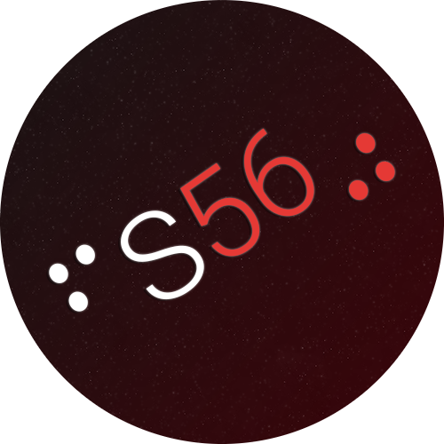
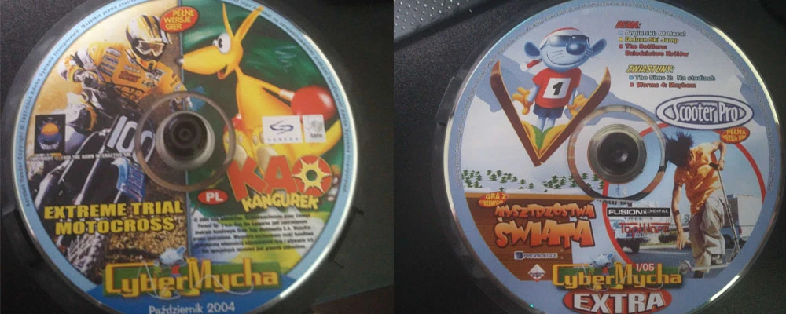
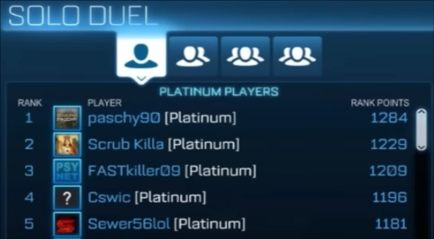
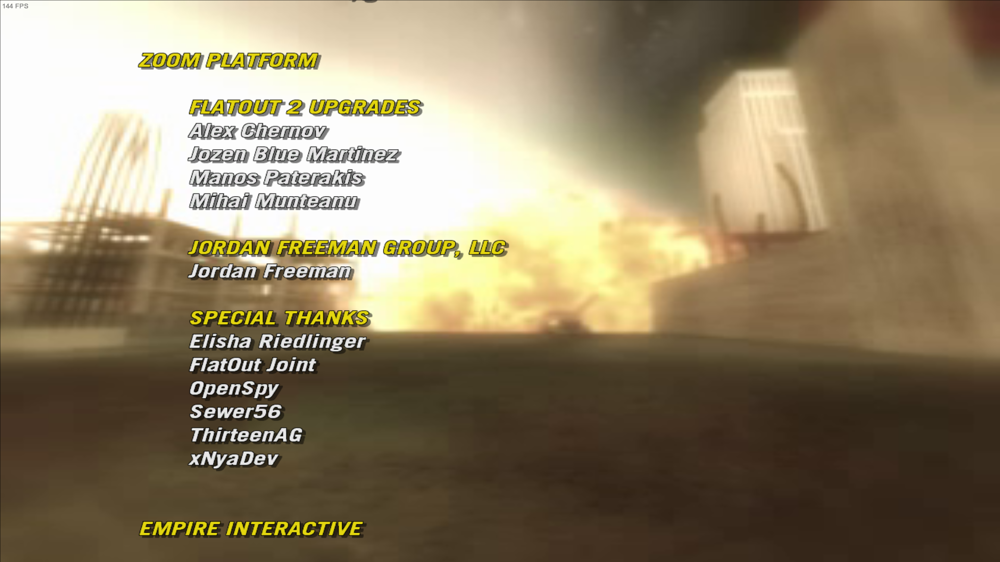

	<h1>Sewer's Front Page</h1>
	 
	<strong>A software dev by day and game modder/hacker by night.</strong>
    
Find all of my stuff here.

# About

This page contains an about me, an easy to search index of a vast majority of my public,
open source projects, as well as a small blog.  

- [My Open Source Software, Tools & Libraries](./index-libraries.md).  
- [My Game Fixes and Reverse Engineering Work](./index-games.md).  

!!! tip "Search can be quickly accessed by pressing `/` key on keyboard."

# About Me

Hi, I'm Seweryn (aka Sewer56), a "full-stack modder" and open source library author.

I mainly specialize in creating high quality modding tools and utilities that help users and developers
create game mods. My work can be found in various projects, from my own '[Reloaded]' modding
suite to 3rd party modding frameworks such as [Dalamud] (Final Fantasy XIV).

I've been tinkering with both software and hardware for as long as I can remember. Growing up in a
small Polish village, I was very fortunate to be one of the few kids to even have a PC in the 2000s.
Those days, I would collect games from monthly magazines and plop them into my PC. By age 9, I was
already overclocking my Pentium CPU 😅, I suppose the writing was on the wall.

<figure markdown="span">
  { width="600" }
  <figcaption>The kinds of discs I'd collect as a kid.</figcaption>
</figure>

Nowadays I spend most of my life in a small comfy room in the UK.

## From Competitive Gaming to Programming

!!! info "Back in the day I used to be quite competitive in games."

Although nowadays I'm known for software development, growing up I did have some success in
various games competitively.

<figure markdown="span">
  { width="300" }
  <figcaption>Rocket League 1v1 World Rankings, Circa 3 October 2015.</figcaption>
</figure>

However, the demands of real life; including national exams, a lot of travel (no gaming), unsuitable
tournament schedules and a looming uncertainty of the future (competitive gaming is volatile)
made me switch to programming as a more flexible (and sustainable) hobby.

So I've stuck with more casual gaming. Being someone who always tinkered with software,
i.e. by running games with mods, or messing around with Cheat Engine, I eventually wound up
learning a bit of lower level programming through working with existing games.

My two hobbies somewhat combined.

## Early Development Work

I've always been tinkering with things; but if I were to place a starting marker, I'd say my
journey into software development actually began a bit earlier around 2012 with 
Android ROM development.

!!! info "Back in the day, mobile OSes were still quite new and lacking."

	Many of the things we now have for granted you could only find in Custom ROMs. 
	Including things as simple as a dark theme and notification toggles.

At 13, I created custom ROMs like [Gin2JellyBean Extended][gin2jb-extended] for the Xperia Play and
later [OxySlim][oxyslim] for the OnePlus 2. I even contributed to [halogenOS][halogenOS],
primarily providing artwork.

<figure markdown="span">
  { width="700" }
  <figcaption>One of my few Android projects from my teenage days.</figcaption>
</figure>

My first serious programming project came in 2015 when I began reverse engineering Sonic Heroes'
[object placement format]; that led me to learn C#. That summer as a teenager, I slowly went from
dataminer using existing tools to programmer, creating my own.

Later that year I collaborated with 
[Igor Seabra] culminating in the release of [Heroes Tweakbox] and other (Sonic) Heroes
modding tools.

Ever since I've mostly been focused on game related tooling centered around modding.

<figure markdown="span">
  { width="700" }
  <figcaption>Sometimes you might find my name in a 'special thanks'. 
  (In game remasters, updates for old games etc.)
  </figcaption>
</figure>

## Current Work

!!! info "I do modding related stuff in and out of work."

Professionally, I work as a developer on the App Team at [Nexus Mods] (👈 interview) while continuing
my personal projects that can be found here. Modding tool dev continues, on and off the clock.

When I'm not working on my own stuff, I contribute to other open source projects, 
random examples of small contributions include [BZip3], [DotNetCorePlugins], [LiteNetLib],
[SharpGenTools], [Avalonia] and [.NET Runtime][dotnet-pr]. There are many, many more, I've lost track.

I'll try to add a blog here with future updates 🤞.

## Why I do what I do?

Ever since the very beginning, I have researched and worked with games which in itself were
older and niche. No existing mod community, very few tools, etc.

Having gone the full way 'stack', from making:

- Libraries
- Mod loaders
- Mod managers
- Mods/Fixes (widescreen, controller support etc.)
- Modding tools

etc. The effort to bootstrap a fully fledged, integrated modding ecosystem for new games can
often be an overwhelming challenge without a dedicated team.

*I want to help others overcome this barrier.*

Game modding and [TCRF]-style research was my gateway into programming.
I learned by experimenting, breaking things, and eventually creating tools for games I loved.
I want to give others this opportunity, too.

It's a unique and engaging way to learn software development, but the barrier to entry can be
intimidatingly high, ***especially*** for niche games without established modding communities.

<figure markdown="span">
  { width="100" }
  <figcaption>I made the 'Reloaded' suite to give small, unknown games and modders a chance.</figcaption>
</figure>

## The Reality

!!! info "This is a thankless endeavour."

Pretty much all my projects are solo endeavours, which I still maintain, years later.

Like many other tool authors out there, ***I work tirelessly*** and ***without financial gain***
to create what I do for the wider community. Delivering projects like the upcoming [Reloaded3]*
and its surrounding ecosystem of low-level libraries on top of my professional work demands that my lifestyle
is ~65-70 hours of coding weekly (every week!).

It is two full time jobs, except that I only get paid for one.

!!! warning "Do as I say, not as I do."

    Living like this is ***very unhealthy*** for your mental health.
	It is ***unsustainable***; it will put you into ***depression***.

I share this not to glorify the workload, but to be transparent about the effort required.
While the work is rewarding, it's important to acknowledge the challenges of balancing own projects
with personal well-being. I'm not very good at it.

Think twice before glorifying someone like me.

<figure markdown="span">
  
  <figcaption>A commit graph for a typical year. I don't really get to take breaks.</figcaption>
</figure>

[gin2jb-extended]: https://forum.xda-developers.com/t/unofficial-sewers-mods-a-k-a-gin2jellybean-1-9-9-extended-rc1-2-3-7-addons.1934281/
[oxyslim]: https://forum.xda-developers.com/t/indefinitely-postponed-oxyslim-23-02-2016-2-2-2.3278169/
[Sonic Heroes]: ./games/sonic-heroes.md
[sh-object-editing]: https://info.sonicretro.org/SCHG:Sonic_Heroes/Object_Editing
[halogenOS]: https://halogenos.org
[Reloaded]: https://reloaded-project.github.io/Reloaded-II/
[Dalamud]: https://github.com/goatcorp/Dalamud
[Igor Seabra]: https://github.com/igorseabra4
[Heroes Tweakbox]: https://www.youtube.com/watch?v=4O3IDXzU1L8
[DotNetCorePlugins]: https://github.com/natemcmaster/DotNetCorePlugins/pull/164
[LiteNetLib]: https://github.com/RevenantX/LiteNetLib/pull/416
[SharpGenTools]: https://github.com/SharpGenTools/SharpGenTools/pull/222
[Avalonia]: https://github.com/AvaloniaUI/Avalonia/pull/16033
[BZip3]: https://github.com/kspalaiologos/bzip3/pull/144
[dotnet-pr]: https://github.com/dotnet/runtime/pull/76559
[Reloaded-II]: https://reloaded-project.github.io/Reloaded-II/
[Nexus Mods]: https://www.nexusmods.com/news/15105
[object placement format]: https://info.sonicretro.org/SCHG:Sonic_Heroes/Object_Editing
[Reloaded3]: https://reloaded-project.github.io/Reloaded-III/ "Coming Soon (TM), Hopefully in 2027 after 4 years of development from the ground up."
[TCRF]: https://tcrf.net